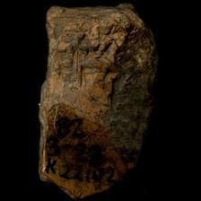

# Prediction demo: text-only vs vision (provenience) model

20 random test-split tablets, seed=42. Both models see the exact same masked positions per example (`[MASK]` shown at every chosen position, 15% of eligible tokens) -- differences in restoration come only from the two models' separately trained weights, not from the image itself (the image only reaches `provenience_head`, see module docstring). The metadata table's `provenience` row is where the image can actually change an answer.

## Example 1 — `P109423` (has photo: False)

**Original text:**
> 1eše₃ GAN2 1u - ta a - ša₃ geš ma - nu 1bur₃ GAN2 9diš - ta a - ša₃ la₂ - mah 2bur ' u 1bur₃ 2eše₃ 4iku 1 / 2iku GAN2 ka - gu₄ - ku₆ - sag 1bur₃ 1iku GAN2 1u 1 / 2diš - ta a - ša₃ a - geštin - su₃ 1bur ' u 3bur₃ 2eše₃ 5iku 1 / 2iku GAN2 1bur₃ GAN2 1u 2diš - ta

**Masked input (18 positions):**
> 1eše₃ GA [MASK]2 1u - ta [MASK] - ša₃ geš ma - nu 1bur₃ GAN2 9diš - ta a - ša₃ la₂ - mah 2bur ' u 1bur₃ 2eše₃ 4 [MASK] 1 [MASK] 2iku [MASK]N [MASK] [MASK] - gu [MASK] - ku₆ [MASK] sag 1 [MASK]₃ 1iku [MASK] [MASK]2 1u 1 / [MASK] - [MASK] a - ša₃ a - geštin - su₃ [MASK]bur ' [MASK] 3bur₃ 2eše₃ 5iku 1 [MASK] 2iku GAN2 1bur₃ GA [MASK]2 1u 2diš - ta

### Restoration (masked-token predictions)

| # | true token | text-only top-1 | text-only top-3 | vision top-1 | vision top-3 | text-only correct | vision correct |
|---|---|---|---|---|---|---|---|
| 1 | `##N` | `##N` | `##N`, `##R`, `##NE` | `##N` | `##N`, `##R`, `##G` | ✅ | ✅ |
| 2 | `a` | `a` | `a`, `i`, `A` | `a` | `a`, `i`, `A` | ✅ | ✅ |
| 3 | `##iku` | `##iku` | `##iku`, `##u`, `##ku` | `##iku` | `##iku`, `##u`, `##ku` | ✅ | ✅ |
| 4 | `/` | `/` | `/`, `##barig`, `##iku` | `/` | `/`, `##barig`, `##iku` | ✅ | ✅ |
| 5 | `GA` | `GA` | `GA`, `##GA`, `KA` | `GA` | `GA`, `BA`, `GE` | ✅ | ✅ |
| 6 | `##2` | `##2` | `##2`, `##₂`, `##3` | `##2` | `##2`, `##₂`, `##3` | ✅ | ✅ |
| 7 | `ka` | `a` | `a`, `ur`, `lugal` | `a` | `a`, `ur`, `lugal` | ❌ | ❌ |
| 8 | `##₄` | `##₂` | `##₂`, `##₄`, `##₇` | `##₂` | `##₂`, `##₄`, `##₇` | ❌ | ❌ |
| 9 | `-` | `-` | `-`, `geš`, `dumu` | `-` | `-`, `dumu`, `geš` | ✅ | ✅ |
| 10 | `##bur` | `##bur` | `##bur`, `##ban`, `##še` | `##bur` | `##bur`, `##še`, `##ban` | ✅ | ✅ |
| 11 | `GA` | `GA` | `GA`, `KA`, `##GA` | `GA` | `GA`, `BA`, `KA` | ✅ | ✅ |
| 12 | `##N` | `##N` | `##N`, `##R`, `##G` | `##N` | `##N`, `##R`, `##G` | ✅ | ✅ |
| 13 | `2diš` | `2diš` | `2diš`, `3diš`, `4diš` | `2diš` | `2diš`, `3diš`, `4diš` | ✅ | ✅ |
| 14 | `ta` | `ta` | `ta`, `kam`, `a` | `ta` | `ta`, `kam`, `na` | ✅ | ✅ |
| 15 | `1` | `1` | `1`, `2`, `3` | `1` | `1`, `2`, `3` | ✅ | ✅ |
| 16 | `u` | `u` | `u`, `U`, `a` | `u` | `u`, `U`, `a` | ✅ | ✅ |
| 17 | `/` | `/` | `/`, `##barig`, `##iku` | `/` | `/`, `##barig`, `##iku` | ✅ | ✅ |
| 18 | `##N` | `##N` | `##N`, `##R`, `##NE` | `##N` | `##N`, `##R`, `##G` | ✅ | ✅ |

Top-1 accuracy on this example: text-only 16/18 (89%), vision 16/18 (89%)

### Metadata predictions

| head | ground truth | text-only prediction | vision prediction |
|---|---|---|---|
| period | Ur III | Ur III (0.90) | Ur III (0.93) |
| genre | Administrative | Administrative (0.92) | Administrative (0.93) |
| language | Sumerian | Sumerian (0.93) | Sumerian (0.95) |
| provenience | Umma | Umma (0.73) | Girsu (0.67) **<- differs** |

---

## Example 2 — `P349433` (has photo: False)

**Original text:**
> UL MUL % sux u ṣe - e - ri % sux s - si ṣe - e - ri % sux l - lu - lu - u₂ - a

**Masked input (6 positions):**
> UL MUL % [MASK] [MASK] u ṣe [MASK] e - ri % [MASK]x s - si ṣe [MASK] e - ri % sux l - lu - lu [MASK] u₂ - a

### Restoration (masked-token predictions)

| # | true token | text-only top-1 | text-only top-3 | vision top-1 | vision top-3 | text-only correct | vision correct |
|---|---|---|---|---|---|---|---|
| 1 | `su` | `su` | `su`, `s`, `sa` | `su` | `su`, `s`, `a` | ✅ | ✅ |
| 2 | `##x` | `##x` | `##x`, `-`, `##₂` | `##x` | `##x`, `-`, `##₂` | ✅ | ✅ |
| 3 | `-` | `-` | `-`, `##₂`, `##₃` | `-` | `-`, `##₂`, `##₃` | ✅ | ✅ |
| 4 | `su` | `su` | `su`, `s`, `sa` | `su` | `su`, `s`, `a` | ✅ | ✅ |
| 5 | `-` | `-` | `-`, `##₂`, `##₃` | `-` | `-`, `##₂`, `##₃` | ✅ | ✅ |
| 6 | `-` | `-` | `-`, `##₂`, `##m` | `-` | `-`, `##₂`, `##m` | ✅ | ✅ |

Top-1 accuracy on this example: text-only 6/6 (100%), vision 6/6 (100%)

### Metadata predictions

| head | ground truth | text-only prediction | vision prediction |
|---|---|---|---|
| period | Neo-Babylonian | Neo-Babylonian (0.57) | Neo-Babylonian (0.45) |
| genre | Literary & Scholarly | Literary & Scholarly (0.81) | Literary & Scholarly (0.87) |
| language | (no label) | Bilingual (0.58) | Bilingual (0.71) |
| provenience | (no label) | Nippur (0.42) | Nineveh (0.51) **<- differs** |

---

## Example 3 — `P407691` (has photo: False)

**Original text:**
> ša₃ - bi - ga pu₃ - šu 1ban₂ kaš 1ban₂ ninda puzur₄ - ma - ma šunigin 1barig 5diš sila₃ kaš šunigin 4ban₂ 4diš sila₃ ninda

**Masked input (7 positions):**
> ša₃ [MASK] bi - ga pu₃ - šu 1ban₂ kaš 1ban₂ ninda puzur₄ - ma [MASK] ma šunigin 1barig 5diš sila₃ ka [MASK] šunig [MASK] 4 [MASK]₂ [MASK] sila₃ nin [MASK]

### Restoration (masked-token predictions)

| # | true token | text-only top-1 | text-only top-3 | vision top-1 | vision top-3 | text-only correct | vision correct |
|---|---|---|---|---|---|---|---|
| 1 | `-` | `-` | `-`, `geš`, `ki` | `-` | `-`, `a`, `ki` | ✅ | ✅ |
| 2 | `-` | `-` | `-`, `:`, `##₂` | `-` | `-`, `:`, `/` | ✅ | ✅ |
| 3 | `##š` | `##š` | `##š`, `##₃`, `##₂` | `##š` | `##š`, `##₃`, `##₂` | ✅ | ✅ |
| 4 | `##in` | `##in` | `##in`, `##i`, `##n` | `##in` | `##in`, `##n`, `##i` | ✅ | ✅ |
| 5 | `##ban` | `##ban` | `##ban`, `##geš`, `##barig` | `##ban` | `##ban`, `##geš`, `##barig` | ✅ | ✅ |
| 6 | `4diš` | `5diš` | `5diš`, `2diš`, `1diš` | `5diš` | `5diš`, `2diš`, `4diš` | ❌ | ❌ |
| 7 | `##da` | `##da` | `##da`, `##a`, `##₂` | `##da` | `##da`, `##a`, `##dan` | ✅ | ✅ |

Top-1 accuracy on this example: text-only 6/7 (86%), vision 6/7 (86%)

### Metadata predictions

| head | ground truth | text-only prediction | vision prediction |
|---|---|---|---|
| period | Ur III | Ur III (0.94) | Ur III (0.94) |
| genre | Administrative | Administrative (0.93) | Administrative (0.93) |
| language | Sumerian | Sumerian (0.94) | Sumerian (0.93) |
| provenience | Umma | Umma (0.87) | Umma (0.89) |

---

## Example 4 — `P125001` (has photo: True)

**Original text:**
> 1geš₂ 3u 1diš u₈

**Masked input (1 positions):**
> 1geš₂ 3u [MASK] u₈

### Restoration (masked-token predictions)

| # | true token | text-only top-1 | text-only top-3 | vision top-1 | vision top-3 | text-only correct | vision correct |
|---|---|---|---|---|---|---|---|
| 1 | `1diš` | `5diš` | `5diš`, `1diš`, `3diš` | `5diš` | `5diš`, `1diš`, `2diš` | ❌ | ❌ |

Top-1 accuracy on this example: text-only 0/1 (0%), vision 0/1 (0%)

### Metadata predictions

| head | ground truth | text-only prediction | vision prediction |
|---|---|---|---|
| period | Ur III | Ur III (0.93) | Ur III (0.91) |
| genre | Administrative | Administrative (0.91) | Administrative (0.91) |
| language | Sumerian | Sumerian (0.94) | Sumerian (0.92) |
| provenience | Puzriš-Dagan | Puzriš-Dagan (0.92) | Puzriš-Dagan (0.90) |

---

## Example 5 — `P251690` (has photo: True)

**Original text:**
> 1bur₃ @ c GAN2 e₂ - hur - sag 1eše₃ @ c 1 / 2iku @ c 1 / 4iku @ c ur - D gidri

**Masked input (5 positions):**
> [MASK]bur₃ @ c GA [MASK]2 e₂ - hur - sag [MASK]še [MASK] @ c 1 / 2iku @ c 1 / [MASK]iku @ c ur - D gidri

### Restoration (masked-token predictions)

| # | true token | text-only top-1 | text-only top-3 | vision top-1 | vision top-3 | text-only correct | vision correct |
|---|---|---|---|---|---|---|---|
| 1 | `1` | `1` | `1`, `2`, `3` | `1` | `1`, `2`, `3` | ✅ | ✅ |
| 2 | `##N` | `##N` | `##N`, `##G`, `##R` | `##N` | `##N`, `##G`, `##R` | ✅ | ✅ |
| 3 | `1e` | `1e` | `1e`, `2e`, `an` | `1e` | `1e`, `2e`, `an` | ✅ | ✅ |
| 4 | `##₃` | `##₃` | `##₃`, `2u`, `1aš` | `##₃` | `##₃`, `1aš`, `1u` | ✅ | ✅ |
| 5 | `4` | `2` | `2`, `4`, `3` | `2` | `2`, `4`, `3` | ❌ | ❌ |

Top-1 accuracy on this example: text-only 4/5 (80%), vision 4/5 (80%)

### Metadata predictions

| head | ground truth | text-only prediction | vision prediction |
|---|---|---|---|
| period | Third Millennium | Third Millennium (0.86) | Third Millennium (0.93) |
| genre | Literary & Scholarly | Administrative (0.90) | Administrative (0.90) |
| language | Sumerian | Sumerian (0.96) | Sumerian (0.94) |
| provenience | Umma | Umma (0.33) | Umma (0.44) |

---

## Example 6 — `P315363` (has photo: True)

**Original text:**
> ki šum - šu - nu ensi₂ a - na qa₂ - be₂ - e D ba - u₄ buru₁₄ - še₃ erin₂ še gur₁₀ - ku₅ i - il - - ul i - il - la - ak - ma

**Masked input (8 positions):**
> ki šum - šu - nu ensi₂ a - na qa₂ - [MASK]₂ - e D ba - u₄ buru₁₄ - še₃ erin [MASK] [MASK] gur [MASK] [MASK] [MASK] ku₅ i - il - [MASK] ul i [MASK] il - la - ak - ma

### Restoration (masked-token predictions)

| # | true token | text-only top-1 | text-only top-3 | vision top-1 | vision top-3 | text-only correct | vision correct |
|---|---|---|---|---|---|---|---|
| 1 | `be` | `be` | `be`, `ti`, `bi` | `be` | `be`, `ti`, `pi` | ✅ | ✅ |
| 2 | `##₂` | `##₂` | `##₂`, `-`, `ki` | `##₂` | `##₂`, `-`, `ki` | ✅ | ✅ |
| 3 | `še` | `-` | `-`, `še`, `gi` | `-` | `-`, `še`, `mu` | ❌ | ❌ |
| 4 | `##₁` | `##₁` | `##₁`, `##₈`, `-` | `##₁` | `##₁`, `-`, `##₈` | ✅ | ✅ |
| 5 | `##₀` | `##₂` | `##₂`, `ra`, `##₄` | `##₂` | `##₂`, `##₃`, `ra` | ❌ | ❌ |
| 6 | `-` | `-` | `-`, `##₂`, `##₃` | `-` | `-`, `##₃`, `##₂` | ✅ | ✅ |
| 7 | `-` | `šu` | `šu`, `lu`, `la` | `šu` | `šu`, `lu`, `lik` | ❌ | ❌ |
| 8 | `-` | `-` | `-`, `##₃`, `##₇` | `-` | `-`, `##₃`, `+` | ✅ | ✅ |

Top-1 accuracy on this example: text-only 5/8 (62%), vision 5/8 (62%)

### Metadata predictions

| head | ground truth | text-only prediction | vision prediction |
|---|---|---|---|
| period | Old Babylonian | Old Babylonian (0.93) | Old Babylonian (0.92) |
| genre | Legal | Administrative (0.75) | Administrative (0.48) |
| language | (no label) | Akkadian (0.57) | Akkadian (0.64) |
| provenience | (no label) | Nippur (0.47) | Sippar (0.26) **<- differs** |

---

## Example 7 — `P334122` (has photo: False)

**Original text:**
> ARAD - ka id - din - ia aš - šur 15 AG AMAR. UTU ši - bu - tu₂ lit - tu - tu a - na LUGAL EN - ia lu - šab - bi - iu - u GU. ZA ša LUGAL EN - a a - na da - ra - a - te kun iš - di GU. ZA ša LUGAL EN - ia 15 ša [unused1] [unused1] [unused1] LUGAL be - li₂ u₂ - da o [unused1] [unused1] [unused1] E₂ tu₂ [unused1] [unused1] [unused1] [unused1] [unused1] [unused1] [unused1] - mu - te [unused1] [unused1] ina ši - a - ri ina li - di - iš LUGAL be - li₂ i - ša₂ - am - me ana - ku ina UGU - hi a - mu - at ma - a a - ta - a la tu - ša₂ - aš₂ - man - ni A. ŠA₃ E₂ UN - MEŠ DUMU - MEŠ še - lu - a - te ARAD - PA SANGA ina ŠA₃ un - qi is - sa - ṭar a - na ra - ma - ni - šu₂ ut - te - e - re u₃ a - na - ku ina UGU - hi la ša₂ - aš₂ - lu - ṭa - ku u₂ - ma - a a - na LUGAL EN - ia as - sap - ra LUGAL be - li₂ lu - u - di

**Masked input (40 positions):**
> ARAD - ka id - din - ia aš - [MASK] [MASK] AG AMAR. [MASK]TU ši - bu - tu [MASK] lit - tu - [MASK] a - na LUGAL EN - [MASK] lu - šab - bi [MASK] iu - u GU. ZA ša [MASK] [MASK] - a a - na da - ra - a - te kun iš - di GU. ZA ša LUGAL [MASK] [MASK] ia [MASK] ša [unused1] [unused1] [unused1] [MASK] be - li₂ u [MASK] - [MASK] o [unused1] [unused1] [unused1] E₂ tu₂ [unused1] [unused1] [unused1] [unused1] [unused1] [unused1] [unused1] - mu - te [unused1] [unused1] ina ši - a - ri ina li - di - iš LUGAL [MASK] - li [MASK] [MASK] - ša₂ - [MASK] - [MASK] ana - ku ina UGU - hi [MASK] - mu - at ma - a a - ta - a la tu - ša₂ [MASK] aš₂ - man - ni A. ŠA₃ E₂ UN - MEŠ DUMU - MEŠ še - lu - a - [MASK] AR [MASK] - PA [MASK]NGA [MASK] ŠA [MASK] un - qi is [MASK] sa - ṭar a - na ra [MASK] ma - ni - šu₂ [MASK] - te - e [MASK] re u₃ a - na - ku ina UGU - hi la [MASK]₂ - aš₂ - lu - ṭ [MASK] - ku [MASK]₂ - ma - a a [MASK] na [MASK] EN - ia as [MASK] sap [MASK] ra LUGAL be - li₂ [MASK] - [MASK] - di

### Restoration (masked-token predictions)

| # | true token | text-only top-1 | text-only top-3 | vision top-1 | vision top-3 | text-only correct | vision correct |
|---|---|---|---|---|---|---|---|
| 1 | `šur` | `šur` | `šur`, `šum`, `ši` | `šur` | `šur`, `šum`, `ši` | ✅ | ✅ |
| 2 | `15` | `-` | `-`, `ša`, `LUGAL` | `-` | `-`, `EN`, `ša` | ❌ | ❌ |
| 3 | `U` | `U` | `U`, `DU`, `u` | `U` | `U`, `DU`, `GI` | ✅ | ✅ |
| 4 | `##₂` | `##₂` | `##₂`, `ša`, `ina` | `##₂` | `##₂`, `ša`, `ina` | ✅ | ✅ |
| 5 | `tu` | `u` | `u`, `ni`, `ma` | `u` | `u`, `ma`, `ni` | ❌ | ❌ |
| 6 | `ia` | `ia` | `ia`, `a`, `ka` | `ia` | `ia`, `ka`, `a` | ✅ | ✅ |
| 7 | `-` | `-` | `-`, `##₂`, `la` | `-` | `-`, `ša`, `LUGAL` | ✅ | ✅ |
| 8 | `LUGAL` | `LUGAL` | `LUGAL`, `##₂`, `-` | `LUGAL` | `LUGAL`, `-`, `##₂` | ✅ | ✅ |
| 9 | `EN` | `EN` | `EN`, `ma`, `la` | `EN` | `EN`, `ma`, `##₂` | ✅ | ✅ |
| 10 | `EN` | `EN` | `EN`, `be`, `BE` | `EN` | `EN`, `be`, `ki` | ✅ | ✅ |
| 11 | `-` | `-` | `-`, `##₂`, `.` | `-` | `-`, `##₂`, `a` | ✅ | ✅ |
| 12 | `15` | `##₂` | `##₂`, `o`, `u` | `##₂` | `##₂`, `o`, `ina` | ❌ | ❌ |
| 13 | `LUGAL` | `LUGAL` | `LUGAL`, `ša`, `KUR` | `LUGAL` | `LUGAL`, `KUR`, `ša` | ✅ | ✅ |
| 14 | `##₂` | `##₂` | `##₂`, `##₃`, `EN` | `##₂` | `##₂`, `##b`, `EN` | ✅ | ✅ |
| 15 | `da` | `a` | `a`, `ni`, `ia` | `a` | `a`, `ni`, `ia` | ❌ | ❌ |
| 16 | `be` | `be` | `be`, `BE`, `bu` | `be` | `be`, `BE`, `ba` | ✅ | ✅ |
| 17 | `##₂` | `##₂` | `##₂`, `la`, `-` | `##₂` | `##₂`, `##m`, `-` | ✅ | ✅ |
| 18 | `i` | `tu` | `tu`, `a`, `i` | `tu` | `tu`, `ta`, `a` | ❌ | ❌ |
| 19 | `am` | `man` | `man`, `an`, `a` | `man` | `man`, `an`, `ma` | ❌ | ❌ |
| 20 | `me` | `ni` | `ni`, `nu`, `na` | `ni` | `ni`, `nu`, `na` | ❌ | ❌ |
| 21 | `a` | `li` | `li`, `e`, `a` | `li` | `li`, `a`, `la` | ❌ | ❌ |
| 22 | `-` | `-` | `-`, `la`, `a` | `-` | `-`, `.`, `la` | ✅ | ✅ |
| 23 | `te` | `te` | `te`, `ni`, `ti` | `te` | `te`, `ni`, `ti` | ✅ | ✅ |
| 24 | `##AD` | `##AD` | `##AD`, `##₃`, `##A` | `##AD` | `##AD`, `##A`, `##B` | ✅ | ✅ |
| 25 | `SA` | `SA` | `SA`, `NI`, `LU` | `SA` | `SA`, `NI`, `LU` | ✅ | ✅ |
| 26 | `ina` | `.` | `.`, `ina`, `-` | `ina` | `ina`, `.`, `-` | ❌ | ✅ |
| 27 | `##₃` | `##₃` | `##₃`, `-`, `##B` | `##₃` | `##₃`, `-`, `##M` | ✅ | ✅ |
| 28 | `-` | `-` | `-`, `.`, `+` | `-` | `-`, `:`, `.` | ✅ | ✅ |
| 29 | `-` | `-` | `-`, `.`, `##₂` | `-` | `-`, `.`, `##₂` | ✅ | ✅ |
| 30 | `ut` | `e` | `e`, `ul`, `a` | `e` | `e`, `iš`, `i` | ❌ | ❌ |
| 31 | `-` | `-` | `-`, `.`, `la` | `-` | `-`, `.`, `/` | ✅ | ✅ |
| 32 | `ša` | `ša` | `ša`, `u`, `aš` | `ša` | `ša`, `u`, `aš` | ✅ | ✅ |
| 33 | `##a` | `##a` | `##a`, `##u`, `##i` | `##a` | `##a`, `##u`, `##₂` | ✅ | ✅ |
| 34 | `u` | `u` | `u`, `aš`, `šum` | `u` | `u`, `aš`, `sal` | ✅ | ✅ |
| 35 | `-` | `-` | `-`, `.`, `+` | `-` | `-`, `.`, `+` | ✅ | ✅ |
| 36 | `LUGAL` | `LUGAL` | `LUGAL`, `KUR`, `DUMU` | `LUGAL` | `LUGAL`, `KUR`, `ša` | ✅ | ✅ |
| 37 | `-` | `-` | `-`, `.`, `##₂` | `-` | `-`, `##₂`, `.` | ✅ | ✅ |
| 38 | `-` | `-` | `-`, `.`, `##₂` | `-` | `-`, `.`, `##₂` | ✅ | ✅ |
| 39 | `lu` | `a` | `a`, `i`, `an` | `a` | `a`, `i`, `ta` | ❌ | ❌ |
| 40 | `u` | `ta` | `ta`, `na`, `ma` | `na` | `na`, `ta`, `ma` | ❌ | ❌ |

Top-1 accuracy on this example: text-only 28/40 (70%), vision 29/40 (72%)

### Metadata predictions

| head | ground truth | text-only prediction | vision prediction |
|---|---|---|---|
| period | Neo-Assyrian | Neo-Assyrian (0.93) | Neo-Assyrian (0.94) |
| genre | Letters | Administrative (0.90) | Administrative (0.88) |
| language | Akkadian | Akkadian (0.92) | Akkadian (0.93) |
| provenience | Nineveh | Nineveh (0.72) | Nineveh (0.82) |

---

## Example 8 — `P110147` (has photo: True)

**Original text:**
> 1aš @ c gu - na im - e tak₄ - a ki ur - Dba - ba₆ dumu a - tu bur₂ gu₂ - ab - ba ki dah - dam 1aš @ c ur - Dal - la sag eš₃ - ki - ag₂ sipa ensi₂

**Masked input (9 positions):**
> 1aš [MASK] c gu - na [MASK] - e tak [MASK] - a ki ur - Dba - ba₆ [MASK] a - tu bur₂ gu₂ - ab - ba ki dah - dam 1aš @ [MASK] ur [MASK] Dal - la [MASK] eš₃ - [MASK] - ag [MASK] sipa ensi₂

### Restoration (masked-token predictions)

| # | true token | text-only top-1 | text-only top-3 | vision top-1 | vision top-3 | text-only correct | vision correct |
|---|---|---|---|---|---|---|---|
| 1 | `@` | `@` | `@`, `-`, `.` | `@` | `@`, `-`, `.` | ✅ | ✅ |
| 2 | `im` | `lugal` | `lugal`, `ur`, `bala` | `lugal` | `lugal`, `##₂`, `ur` | ❌ | ❌ |
| 3 | `##₄` | `##₄` | `##₄`, `##₂`, `##₃` | `##₄` | `##₄`, `##₂`, `##₃` | ✅ | ✅ |
| 4 | `dumu` | `-` | `-`, `dumu`, `ki` | `-` | `-`, `dumu`, `ki` | ❌ | ❌ |
| 5 | `c` | `c` | `c`, `t`, `v` | `c` | `c`, `t`, `f` | ✅ | ✅ |
| 6 | `-` | `-` | `-`, `##uda`, `##₂` | `-` | `-`, `##uda`, `##₂` | ✅ | ✅ |
| 7 | `sag` | `##₂` | `##₂`, `dumu`, `ki` | `##₂` | `##₂`, `-`, `ki` | ❌ | ❌ |
| 8 | `ki` | `ki` | `ki`, `ma`, `da` | `ki` | `ki`, `na`, `ra` | ✅ | ✅ |
| 9 | `##₂` | `##₂` | `##₂`, `##rig`, `-` | `##₂` | `##₂`, `##₆`, `##rig` | ✅ | ✅ |

Top-1 accuracy on this example: text-only 6/9 (67%), vision 6/9 (67%)

### Metadata predictions

| head | ground truth | text-only prediction | vision prediction |
|---|---|---|---|
| period | Ur III | Third Millennium (0.82) | Third Millennium (0.83) |
| genre | Administrative | Administrative (0.60) | Administrative (0.63) |
| language | Sumerian | Sumerian (0.93) | Sumerian (0.94) |
| provenience | Girsu | Girsu (0.79) | Girsu (0.94) |

---

## Example 9 — `P397213` (has photo: True)

**Original text:**
> na - ṣir zik - ri an - šar₂ lugal dingir - meš la pa - lih₃ en - ti - ia [unused1] hab - ba - tu₂ šar - ra - qu lu ša₂ hi - ṭu ih - ṭu - u da - mi it - bu - ku sag lu₂ nam ak - li ša₂ - pi - ru re - du - u a - na kur šub - ri - a ih - li - qu an - nu - u ki - i - am aš₂ - pur - šu - ma lu₂ - meš an - nu - ti lu₂ nimgir₂ ina kur - ka šul - si - ma - ti pu - uh - hi - ra - šu₂ - nu - ti - ma eṭ - lu e - du la tu - maš - šar - ma igi D pirig - gal gašan gal - ti e₂ - kur šu - uṣ - bit - su - nu - ti - ti ši - pir - tu ša₂ bul - lu - ṭu zi - ti₃ - šu₂ - nu [unused1] bu it - ti lu₂ a kin - ia iri kaskal kur an - šar₂ ki li - iṣ - bat - u - nim - ma ku dam - qu ša₂ ba - laṭ zi - ti₃ - šu₂ in - ši - - meš kur an - šar₂ ki ARAD2 - meš - ia pa - nu - uš - šu₂ e - [unused1] uš a - di u₂ - ri - ni ina šu - min lu₂ a kin ša₂ mim - mu - u i - pu - lu - uš u₂ - ša₂ - an - na - i - ṣa - ri - ih - u₂ - ti i - bala

**Masked input (54 positions):**
> na - [MASK]r zik - ri an - šar₂ lugal din [MASK] - meš la pa - lih₃ en - ti - ia [unused1] hab - ba [MASK] tu₂ šar - ra - qu lu ša₂ hi - ṭu ih - ṭu - [MASK] da - mi it - [MASK] - ku sag lu₂ nam ak - li ša₂ - pi - ru re - du - u a - [MASK] kur šub - ri - [MASK] [MASK] - li - qu [MASK] [MASK] nu - u ki [MASK] [MASK] - am aš [MASK] - pur - [MASK] - ma lu₂ - meš an [MASK] nu - ti lu₂ [MASK]gir₂ ina kur - ka šul - [MASK] - ma - ti pu - u [MASK] - hi - ra - šu₂ - nu - ti - ma eṭ - lu [MASK] - du la tu - [MASK] - šar [MASK] ma igi D pirig - gal ga [MASK]n [MASK] - ti e₂ - kur [MASK] - uṣ - bit - su - nu - [MASK] [MASK] [MASK] ši [MASK] pir - tu [MASK]₂ bul - lu - ṭu zi - [MASK] [MASK] - [MASK]₂ - nu [unused1] bu it - ti lu [MASK] a kin - [MASK] iri [MASK]kal kur an - šar₂ ki li - iṣ - bat [MASK] u - nim - ma ku dam - qu ša₂ ba - [MASK]ṭ zi - ti₃ [MASK] šu₂ in [MASK] ši - - meš kur an [MASK] šar₂ ki [MASK]AD2 - meš - ia pa [MASK] nu - uš - [MASK]₂ e [MASK] [unused1] uš [MASK] - di u₂ - ri [MASK] ni [MASK] šu [MASK] min lu₂ a kin [MASK]₂ mim - [MASK] - u i - pu - lu - [MASK] u₂ - ša₂ - [MASK] [MASK] na - i - ṣa - ri - ih - u₂ - ti i [MASK] bala

### Restoration (masked-token predictions)

| # | true token | text-only top-1 | text-only top-3 | vision top-1 | vision top-3 | text-only correct | vision correct |
|---|---|---|---|---|---|---|---|
| 1 | `ṣi` | `ṣi` | `ṣi`, `ši`, `qa` | `ṣi` | `ṣi`, `qa`, `ši` | ✅ | ✅ |
| 2 | `##gir` | `##gir` | `##gir`, `-`, `##₃` | `##gir` | `##gir`, `-`, `##₃` | ✅ | ✅ |
| 3 | `-` | `-` | `-`, `la`, `ina` | `-` | `-`, `lu`, `la` | ✅ | ✅ |
| 4 | `u` | `u` | `u`, `ru`, `ur` | `u` | `u`, `ru`, `ur` | ✅ | ✅ |
| 5 | `bu` | `tal` | `tal`, `ti`, `tu` | `tal` | `tal`, `ti`, `ta` | ❌ | ❌ |
| 6 | `na` | `na` | `na`, `di`, `mat` | `na` | `na`, `di`, `a` | ✅ | ✅ |
| 7 | `a` | `ia` | `ia`, `ka`, `šu` | `ia` | `ia`, `ka`, `šu` | ❌ | ❌ |
| 8 | `ih` | `il` | `il`, `e`, `i` | `il` | `il`, `e`, `i` | ❌ | ❌ |
| 9 | `an` | `an` | `an`, `##₂`, `šu` | `an` | `an`, `##₂`, `a` | ✅ | ✅ |
| 10 | `-` | `-` | `-`, `##₂`, `a` | `-` | `-`, `##₂`, `a` | ✅ | ✅ |
| 11 | `-` | `-` | `-`, `##š`, `ša` | `-` | `-`, `##š`, `ša` | ✅ | ✅ |
| 12 | `i` | `a` | `a`, `ma`, `ra` | `a` | `a`, `ma`, `ra` | ❌ | ❌ |
| 13 | `##₂` | `##₂` | `##₂`, `##₃`, `-` | `##₂` | `##₂`, `##₃`, `##₈` | ✅ | ✅ |
| 14 | `šu` | `šu` | `šu`, `ti`, `su` | `šu` | `šu`, `nu`, `ti` | ✅ | ✅ |
| 15 | `-` | `-` | `-`, `.`, `##₂` | `-` | `-`, `##₂`, `.` | ✅ | ✅ |
| 16 | `nim` | `din` | `din`, `e`, `gi` | `din` | `din`, `e`, `gi` | ❌ | ❌ |
| 17 | `si` | `lu` | `lu`, `la`, `li` | `lu` | `lu`, `la`, `li` | ❌ | ❌ |
| 18 | `##h` | `##h` | `##h`, `##ṣ`, `##₂` | `##h` | `##h`, `##₂`, `##ṣ` | ✅ | ✅ |
| 19 | `e` | `##h` | `##h`, `##₂`, `##m` | `##₂` | `##₂`, `##m`, `##h` | ❌ | ❌ |
| 20 | `maš` | `up` | `up`, `pa`, `aš` | `pa` | `pa`, `aš`, `uš` | ❌ | ❌ |
| 21 | `-` | `-` | `-`, `##₂`, `.` | `-` | `-`, `##₂`, `.` | ✅ | ✅ |
| 22 | `##ša` | `##ša` | `##ša`, `##ši`, `##ppi` | `##ša` | `##ša`, `##ši`, `##ppi` | ✅ | ✅ |
| 23 | `gal` | `it` | `it`, `##₂`, `at` | `##₂` | `##₂`, `it`, `ki` | ❌ | ❌ |
| 24 | `šu` | `mu` | `mu`, `lu`, `pu` | `lu` | `lu`, `mu`, `tu` | ❌ | ❌ |
| 25 | `ti` | `ti` | `ti`, `ma`, `u` | `ti` | `ti`, `u`, `ma` | ✅ | ✅ |
| 26 | `-` | `-` | `-`, `i`, `u` | `-` | `-`, `i`, `u` | ✅ | ✅ |
| 27 | `ti` | `-` | `-`, `ma`, `##₂` | `-` | `-`, `ma`, `##₂` | ❌ | ❌ |
| 28 | `-` | `-` | `-`, `##m`, `##r` | `-` | `-`, `##m`, `##š` | ✅ | ✅ |
| 29 | `ša` | `lu` | `lu`, `ša`, `u` | `ša` | `ša`, `lu`, `u` | ❌ | ✅ |
| 30 | `ti` | `ti` | `ti`, `i`, `tu` | `ti` | `ti`, `i`, `ri` | ✅ | ✅ |
| 31 | `##₃` | `##₃` | `##₃`, `##₂`, `##r` | `##₃` | `##₃`, `##₂`, `##b` | ✅ | ✅ |
| 32 | `šu` | `šu` | `šu`, `u`, `tu` | `šu` | `šu`, `tu`, `u` | ✅ | ✅ |
| 33 | `##₂` | `##₂` | `##₂`, `-`, `'` | `##₂` | `##₂`, `-`, `'` | ✅ | ✅ |
| 34 | `ia` | `ti` | `ti`, `ka`, `na` | `ti` | `ti`, `ka`, `ia` | ❌ | ❌ |
| 35 | `kas` | `kas` | `kas`, `ak`, `ša` | `kas` | `kas`, `kan`, `iš` | ✅ | ✅ |
| 36 | `-` | `-` | `-`, `ki`, `la` | `-` | `-`, `##₂`, `ki` | ✅ | ✅ |
| 37 | `la` | `la` | `la`, `a`, `li` | `a` | `a`, `la`, `li` | ✅ | ❌ |
| 38 | `-` | `-` | `-`, `.`, `:` | `-` | `-`, `.`, `:` | ✅ | ✅ |
| 39 | `-` | `-` | `-`, `ki`, `##₂` | `-` | `-`, `ki`, `##₂` | ✅ | ✅ |
| 40 | `-` | `-` | `-`, `.`, `+` | `-` | `-`, `.`, `##₂` | ✅ | ✅ |
| 41 | `AR` | `AR` | `AR`, `AL`, `NI` | `AR` | `AR`, `AL`, `NI` | ✅ | ✅ |
| 42 | `-` | `-` | `-`, `##₂`, `a` | `-` | `-`, `##₂`, `##₃` | ✅ | ✅ |
| 43 | `šu` | `šu` | `šu`, `tu`, `ša` | `šu` | `šu`, `tu`, `ša` | ✅ | ✅ |
| 44 | `-` | `##₂` | `##₂`, `-`, `##gir` | `##₂` | `##₂`, `-`, `##gir` | ❌ | ❌ |
| 45 | `a` | `##₂` | `##₂`, `a`, `ad` | `##₂` | `##₂`, `##u`, `i` | ❌ | ❌ |
| 46 | `-` | `-` | `-`, `##š`, `u` | `-` | `-`, `##š`, `##₂` | ✅ | ✅ |
| 47 | `ina` | `-` | `-`, `##š`, `ina` | `-` | `-`, `##š`, `ina` | ❌ | ❌ |
| 48 | `-` | `##₂` | `##₂`, `-`, `ina` | `##₂` | `##₂`, `-`, `ina` | ❌ | ❌ |
| 49 | `ša` | `lu` | `lu`, `ša`, `u` | `lu` | `lu`, `ša`, `u` | ❌ | ❌ |
| 50 | `mu` | `mu` | `mu`, `nu`, `ma` | `mu` | `mu`, `nu`, `ma` | ✅ | ✅ |
| 51 | `uš` | `ma` | `ma`, `ti`, `u` | `u` | `u`, `ma`, `ti` | ❌ | ❌ |
| 52 | `an` | `an` | `an`, `ad`, `a` | `an` | `an`, `a`, `ši` | ✅ | ✅ |
| 53 | `-` | `-` | `-`, `##₂`, `##b` | `-` | `-`, `##₂`, `##m` | ✅ | ✅ |
| 54 | `-` | `-` | `-`, `##₃`, `##₇` | `-` | `-`, `##₃`, `##₇` | ✅ | ✅ |

Top-1 accuracy on this example: text-only 35/54 (65%), vision 35/54 (65%)

### Metadata predictions

| head | ground truth | text-only prediction | vision prediction |
|---|---|---|---|
| period | Neo-Assyrian | Neo-Assyrian (0.94) | Neo-Assyrian (0.93) |
| genre | Royal Inscriptions | Royal Inscriptions (0.94) | Royal Inscriptions (0.93) |
| language | Akkadian | Akkadian (0.91) | Akkadian (0.87) |
| provenience | Nineveh | Nineveh (0.84) | Nineveh (0.80) |

---

## Example 10 — `P346236` (has photo: True)

**Original text:**
> a - na - aš - am₃ ur₅ - lu₂ lu₂ - u₃ za₃ in - ne - e₂ - dub - ba - a za - pa - ag₂ mu - [unused1] - ša₃ gin₆ - na - bi eme - gir₁₅ - ra bi₂ - in - sag - ki tum₂ a₂ ag₂ - ga₂ - ta ba - e - da - an - - še zar nu - ub - ra - ah - a [unused1] - ni nu - šub - ba a₂ u₄ - da - bi - še₃ he₂ - tud₂ - za - na SU KA he₂ - en - za - pa - ag₂ - e sa₂ nu - ub - du₁₁ - ga - am₃ u₃ nam - dub - sar - ra - ba diri - zu - uš an - zu - a sag in - ta - tum₂ aš₂ in - ne - mu₂ in in - ne - dub₂ um - mi - a nig₂ - na - me - a - bi ba - ak diri - še₃ sag ba - gid₂ nig₂ ša₃ - zu ak - mu - un tukumbi nig₂ ša₃ ak - en lu₂ za - e - gin₇ ak šeš - gal - la - na sag im - ta - de₆ - a - aš uruda šir₃ - šir₃ giri₃ - na u₃ - ub - si e₂ an - ni₁₀ - ni₁₀ - ma e₂ - dub - ba - a - ta iti min - am₃ nu - ub - ta - e₃ i₃ - - eš₂ nam - tag ba - e - ra - ab - duh u₄ - da - ta geš igi - ne - ne bi₂ - hur lu₂ - u₁₉ sikil - du₃ - a - bi na - an - ak - e šeš šeš - da nam - ba - an - ne₂ - ta - du₁₁ di nam - mu - e du₁₄ mu₂ diš giri₃ - ni - sa₆ diš D en - ki - ma - an - šum₂ e - ne - bi um - mi - a di in - ne - en - dab₅ - be₂

**Masked input (70 positions):**
> a - na - [MASK] - am₃ ur₅ - lu₂ lu₂ [MASK] [MASK]₃ za₃ in - ne - e₂ - [MASK] - ba - a za - pa - ag₂ mu - [unused1] - ša [MASK] [MASK]₆ - na - bi eme - gir₁₅ - ra bi₂ [MASK] [MASK] - sag - ki tum₂ a [MASK] [MASK] [MASK] [MASK] [MASK]₂ - ta ba - e - da - an - - [MASK] [MASK]r [MASK] - ub - [MASK] - [MASK] - a [unused1] - [MASK] nu - šub - ba a₂ u₄ - da [MASK] bi - [MASK]₃ he₂ - tud₂ [MASK] za - na SU KA he₂ - en - za - pa - ag₂ - [MASK] sa₂ nu - ub [MASK] du [MASK]₁ - [MASK] - am₃ [MASK]₃ nam - [MASK] [MASK] sar - ra - ba diri - zu - uš an - zu - a sag in - ta - [MASK]₂ aš₂ in - ne - [MASK]₂ in in - [MASK] - [MASK]₂ um - mi - a nig₂ - [MASK] - me [MASK] a [MASK] bi [MASK] - ak diri - še₃ sag ba - gi [MASK]₂ ni [MASK]₂ ša₃ - zu ak - mu - un tukumbi nig₂ ša [MASK] [MASK] [MASK] [MASK] lu [MASK] za - e - [MASK]₇ ak [MASK]š - gal - la - na sag im - ta - de [MASK] - a - aš uruda šir [MASK] - ši [MASK]₃ [MASK]₃ - na u [MASK] - ub - si e₂ [MASK] - ni [MASK]₀ - ni₁₀ - ma e [MASK] - dub [MASK] ba - a - ta iti [MASK] - am₃ nu [MASK] ub - [MASK] - e₃ i₃ - - eš₂ [MASK] - tag ba - e [MASK] ra - ab - [MASK]h u₄ - da [MASK] ta [MASK] igi - ne - ne bi₂ - hur lu₂ - u₁₉ sikil - du₃ - a - bi na [MASK] an - ak - e šeš šeš - da nam - ba - an - [MASK]₂ [MASK] ta - du₁₁ di nam [MASK] mu - e du₁₄ mu₂ diš giri₃ - [MASK] [MASK] sa₆ diš D en - ki - ma - an [MASK] šum₂ e - ne - bi um - mi - a di in - ne - en - dab₅ - be₂

### Restoration (masked-token predictions)

| # | true token | text-only top-1 | text-only top-3 | vision top-1 | vision top-3 | text-only correct | vision correct |
|---|---|---|---|---|---|---|---|
| 1 | `aš` | `bi` | `bi`, `ta`, `a` | `bi` | `bi`, `ta`, `a` | ❌ | ❌ |
| 2 | `-` | `-` | `-`, `ki`, `mu` | `-` | `-`, `mu`, `ki` | ✅ | ✅ |
| 3 | `u` | `še` | `še`, `u`, `am` | `še` | `še`, `am`, `e` | ❌ | ❌ |
| 4 | `dub` | `dub` | `dub`, `ab`, `tab` | `dub` | `dub`, `a`, `tab` | ✅ | ✅ |
| 5 | `##₃` | `##₃` | `##₃`, `-`, `##₂` | `##₃` | `##₃`, `-`, `##₂` | ✅ | ✅ |
| 6 | `gin` | `de` | `de`, `ge`, `sa` | `de` | `de`, `du`, `sa` | ❌ | ❌ |
| 7 | `-` | `-` | `-`, `u`, `e` | `-` | `-`, `u`, `i` | ✅ | ✅ |
| 8 | `in` | `in` | `in`, `hur`, `en` | `hur` | `hur`, `in`, `en` | ✅ | ❌ |
| 9 | `##₂` | `-` | `-`, `##₂`, `##₃` | `-` | `-`, `##₂`, `##₃` | ❌ | ❌ |
| 10 | `ag` | `-` | `-`, `na`, `bi` | `-` | `-`, `na`, `bi` | ❌ | ❌ |
| 11 | `##₂` | `-` | `-`, `##₂`, `##₃` | `-` | `-`, `##₃`, `##₂` | ❌ | ❌ |
| 12 | `-` | `-` | `-`, `ni`, `##₃` | `-` | `-`, `ni`, `##₃` | ✅ | ✅ |
| 13 | `ga` | `##g` | `##g`, `lu`, `la` | `lu` | `lu`, `ga`, `##g` | ❌ | ❌ |
| 14 | `še` | `bi` | `bi`, `ta`, `na` | `bi` | `bi`, `na`, `ne` | ❌ | ❌ |
| 15 | `za` | `saha` | `saha`, `sa`, `ni` | `sa` | `sa`, `saha`, `bu` | ❌ | ❌ |
| 16 | `nu` | `nu` | `nu`, `mu`, `hu` | `nu` | `nu`, `mu`, `##₂` | ✅ | ✅ |
| 17 | `ra` | `du` | `du`, `da`, `ba` | `da` | `da`, `ba`, `du` | ❌ | ❌ |
| 18 | `ah` | `ba` | `ba`, `a`, `na` | `ba` | `ba`, `a`, `ra` | ❌ | ❌ |
| 19 | `ni` | `bi` | `bi`, `ta`, `da` | `bi` | `bi`, `ta`, `ba` | ❌ | ❌ |
| 20 | `-` | `-` | `-`, `a`, `##₂` | `-` | `-`, `a`, `ki` | ✅ | ✅ |
| 21 | `še` | `še` | `še`, `am`, `de` | `am` | `am`, `še`, `de` | ✅ | ❌ |
| 22 | `-` | `-` | `-`, `ki`, `mu` | `-` | `-`, `KA`, `mu` | ✅ | ✅ |
| 23 | `e` | `e` | `e`, `bi`, `a` | `e` | `e`, `bi`, `a` | ✅ | ✅ |
| 24 | `-` | `-` | `-`, `##₂`, `##₃` | `-` | `-`, `##₂`, `##₃` | ✅ | ✅ |
| 25 | `##₁` | `##₁` | `##₁`, `##₂`, `##l` | `##₁` | `##₁`, `##₂`, `##₀` | ✅ | ✅ |
| 26 | `ga` | `bi` | `bi`, `ga`, `ba` | `bi` | `bi`, `ga`, `ta` | ❌ | ❌ |
| 27 | `u` | `za` | `za`, `u`, `ša` | `za` | `za`, `u`, `ša` | ❌ | ❌ |
| 28 | `dub` | `dub` | `dub`, `e`, `bala` | `dub` | `dub`, `bala`, `e` | ✅ | ✅ |
| 29 | `-` | `-` | `-`, `##₂`, `##₃` | `-` | `-`, `##₂`, `##₃` | ✅ | ✅ |
| 30 | `tum` | `šum` | `šum`, `la`, `aš` | `šum` | `šum`, `la`, `aš` | ❌ | ❌ |
| 31 | `mu` | `šum` | `šum`, `e`, `aš` | `šum` | `šum`, `ag`, `eš` | ❌ | ❌ |
| 32 | `ne` | `ne` | `ne`, `ta`, `na` | `ne` | `ne`, `na`, `ta` | ✅ | ✅ |
| 33 | `dub` | `šum` | `šum`, `la`, `e` | `šum` | `šum`, `la`, `ag` | ❌ | ❌ |
| 34 | `na` | `bi` | `bi`, `na`, `ba` | `bi` | `bi`, `na`, `da` | ❌ | ❌ |
| 35 | `-` | `-` | `-`, `##š`, `##₃` | `-` | `-`, `##š`, `##₂` | ✅ | ✅ |
| 36 | `-` | `-` | `-`, `##₂`, `a` | `-` | `-`, `a`, `na` | ✅ | ✅ |
| 37 | `ba` | `na` | `na`, `a`, `an` | `in` | `in`, `na`, `a` | ❌ | ❌ |
| 38 | `##d` | `##d` | `##d`, `##l`, `##g` | `##d` | `##d`, `##g`, `##l` | ✅ | ✅ |
| 39 | `##g` | `##g` | `##g`, `##ŋ`, `##gu` | `##g` | `##g`, `##ŋ`, `##m` | ✅ | ✅ |
| 40 | `##₃` | `##₃` | `##₃`, `-`, `##₂` | `##₃` | `##₃`, `-`, `##₂` | ✅ | ✅ |
| 41 | `ak` | `-` | `-`, `##₂`, `##₃` | `-` | `-`, `##₂`, `##₃` | ❌ | ❌ |
| 42 | `-` | `zu` | `zu`, `-`, `bi` | `zu` | `zu`, `-`, `bi` | ❌ | ❌ |
| 43 | `en` | `-` | `-`, `##₂`, `##₃` | `-` | `-`, `##₂`, `##₃` | ❌ | ❌ |
| 44 | `##₂` | `##₂` | `##₂`, `-`, `##m` | `##₂` | `##₂`, `-`, `##m` | ✅ | ✅ |
| 45 | `gin` | `gin` | `gin`, `gen`, `gu` | `gin` | `gin`, `gu`, `du` | ✅ | ✅ |
| 46 | `še` | `še` | `še`, `tu`, `ka` | `še` | `še`, `tu`, `mu` | ✅ | ✅ |
| 47 | `##₆` | `##₃` | `##₃`, `##₆`, `##₂` | `##₃` | `##₃`, `##₆`, `##₂` | ❌ | ❌ |
| 48 | `##₃` | `##₃` | `##₃`, `##₂`, `##₄` | `##₃` | `##₃`, `##₂`, `##₇` | ✅ | ✅ |
| 49 | `##r` | `##r` | `##r`, `##ru`, `##l` | `##r` | `##r`, `u`, `i` | ✅ | ✅ |
| 50 | `giri` | `ša` | `ša`, `i`, `u` | `ša` | `ša`, `i`, `ku` | ❌ | ❌ |
| 51 | `##₃` | `##₃` | `##₃`, `##₂`, `nu` | `##₃` | `##₃`, `##₂`, `##₄` | ✅ | ✅ |
| 52 | `an` | `nam` | `nam`, `im`, `in` | `nam` | `nam`, `in`, `nu` | ❌ | ❌ |
| 53 | `##₁` | `##₁` | `##₁`, `##₂`, `##₀` | `##₁` | `##₁`, `##₂`, `##₀` | ✅ | ✅ |
| 54 | `##₂` | `##₂` | `##₂`, `##₃`, `##gir` | `##₂` | `##₂`, `##₃`, `##b` | ✅ | ✅ |
| 55 | `-` | `-` | `-`, `##₂`, `##₃` | `-` | `-`, `##₂`, `##₃` | ✅ | ✅ |
| 56 | `min` | `1diš` | `1diš`, `2diš`, `3diš` | `1diš` | `1diš`, `diri`, `ki` | ❌ | ❌ |
| 57 | `-` | `-` | `-`, `##₂`, `a` | `-` | `-`, `##₂`, `/` | ✅ | ✅ |
| 58 | `ta` | `ta` | `ta`, `ba`, `si` | `ta` | `ta`, `da`, `pa` | ✅ | ✅ |
| 59 | `nam` | `nam` | `nam`, `ki`, `nu` | `nam` | `nam`, `tag`, `im` | ✅ | ✅ |
| 60 | `-` | `-` | `-`, `##₃`, `##₂` | `-` | `-`, `##₃`, `##₂` | ✅ | ✅ |
| 61 | `du` | `da` | `da`, `lu`, `du` | `da` | `da`, `lu`, `du` | ❌ | ❌ |
| 62 | `-` | `-` | `-`, `mu`, `ki` | `-` | `-`, `mu`, `ki` | ✅ | ✅ |
| 63 | `geš` | `-` | `-`, `mu`, `dumu` | `-` | `-`, `mu`, `ki` | ❌ | ❌ |
| 64 | `-` | `-` | `-`, `##₄`, `##₂` | `-` | `-`, `##₄`, `##₃` | ✅ | ✅ |
| 65 | `ne` | `šum` | `šum`, `ne`, `ga` | `šum` | `šum`, `ne`, `aš` | ❌ | ❌ |
| 66 | `-` | `-` | `-`, `sag`, `dumu` | `-` | `-`, `in`, `mu` | ✅ | ✅ |
| 67 | `-` | `-` | `-`, `##₂`, `ki` | `-` | `-`, `##₂`, `ki` | ✅ | ✅ |
| 68 | `ni` | `ni` | `ni`, `in`, `ki` | `ba` | `ba`, `ni`, `si` | ✅ | ❌ |
| 69 | `-` | `-` | `-`, `##₂`, `##₃` | `-` | `-`, `##₂`, `##₃` | ✅ | ✅ |
| 70 | `-` | `-` | `-`, `ki`, `##₂` | `-` | `-`, `ki`, `##₂` | ✅ | ✅ |

Top-1 accuracy on this example: text-only 41/70 (59%), vision 38/70 (54%)

### Metadata predictions

| head | ground truth | text-only prediction | vision prediction |
|---|---|---|---|
| period | Old Babylonian | Old Babylonian (0.94) | Old Babylonian (0.93) |
| genre | Literary & Scholarly | Literary & Scholarly (0.94) | Literary & Scholarly (0.94) |
| language | (no label) | Sumerian (0.94) | Sumerian (0.94) |
| provenience | Ur | Ur (0.66) | Ur (0.94) |

---

## Example 11 — `P330592` (has photo: True)

**Original text:**
> - D šul - pa -

**Masked input (1 positions):**
> - D šul - pa [MASK]

### Restoration (masked-token predictions)

| # | true token | text-only top-1 | text-only top-3 | vision top-1 | vision top-3 | text-only correct | vision correct |
|---|---|---|---|---|---|---|---|
| 1 | `-` | `##₃` | `##₃`, `-`, `##₄` | `-` | `-`, `##₃`, `##₂` | ❌ | ✅ |

Top-1 accuracy on this example: text-only 0/1 (0%), vision 1/1 (100%)

### Metadata predictions

| head | ground truth | text-only prediction | vision prediction |
|---|---|---|---|
| period | Ur III | Ur III (0.87) | Ur III (0.89) |
| genre | Administrative | Administrative (0.88) | Administrative (0.83) |
| language | Sumerian | Sumerian (0.94) | Sumerian (0.93) |
| provenience | Umma | Umma (0.75) | Umma (0.69) |

---

## Example 12 — `P237148` (has photo: True)

**Original text:**
> i - ru - bu [unused1] iš - mu [unused1] [unused1] a a n

**Masked input (2 positions):**
> i - ru - bu [unused1] iš - [MASK] [unused1] [unused1] a [MASK] n

### Restoration (masked-token predictions)

| # | true token | text-only top-1 | text-only top-3 | vision top-1 | vision top-3 | text-only correct | vision correct |
|---|---|---|---|---|---|---|---|
| 1 | `mu` | `tu` | `tu`, `kun`, `pur` | `tu` | `tu`, `pur`, `tar` | ❌ | ❌ |
| 2 | `a` | `-` | `-`, `/`, `\` | `-` | `-`, `.`, `/` | ❌ | ❌ |

Top-1 accuracy on this example: text-only 0/2 (0%), vision 0/2 (0%)

### Metadata predictions

| head | ground truth | text-only prediction | vision prediction |
|---|---|---|---|
| period | Neo-Assyrian | Neo-Assyrian (0.94) | Neo-Assyrian (0.91) |
| genre | (no label) | Administrative (0.56) | Letters (0.43) **<- differs** |
| language | Akkadian | Akkadian (0.95) | Akkadian (0.93) |
| provenience | Nineveh | Nineveh (0.96) | Nineveh (0.95) |

---

## Example 13 — `P105707` (has photo: True)

**Original text:**
> 3ban₂ la₂ 2diš sila₃ še - geš - i₃ lugal

**Masked input (2 positions):**
> 3ban₂ la₂ 2diš sila₃ še - geš [MASK] [MASK]₃ lugal

### Restoration (masked-token predictions)

| # | true token | text-only top-1 | text-only top-3 | vision top-1 | vision top-3 | text-only correct | vision correct |
|---|---|---|---|---|---|---|---|
| 1 | `-` | `-` | `-`, `##ši`, `##tin` | `-` | `-`, `gur`, `geš` | ✅ | ✅ |
| 2 | `i` | `i` | `i`, `du`, `še` | `še` | `še`, `i`, `giri` | ✅ | ❌ |

Top-1 accuracy on this example: text-only 2/2 (100%), vision 1/2 (50%)

### Metadata predictions

| head | ground truth | text-only prediction | vision prediction |
|---|---|---|---|
| period | Ur III | Ur III (0.92) | Ur III (0.91) |
| genre | Administrative | Administrative (0.93) | Administrative (0.94) |
| language | Sumerian | Sumerian (0.93) | Sumerian (0.92) |
| provenience | Nippur | Umma (0.87) | Umma (0.63) |

---

## Example 14 — `P272839` (has photo: True)

**Original text:**
> sag - e - eš ha - ma - ab - rig₇ - ge u₄ - mu he - su₃ - su₃ - ud

**Masked input (4 positions):**
> sag - e - eš ha - ma - ab - rig₇ - [MASK] [MASK] [MASK] - mu he - su₃ [MASK] su₃ - ud

### Restoration (masked-token predictions)

| # | true token | text-only top-1 | text-only top-3 | vision top-1 | vision top-3 | text-only correct | vision correct |
|---|---|---|---|---|---|---|---|
| 1 | `ge` | `ga` | `ga`, `e`, `a` | `ga` | `ga`, `e`, `a` | ❌ | ❌ |
| 2 | `u` | `-` | `-`, `##₂`, `##g` | `-` | `-`, `##₂`, `##₁` | ❌ | ❌ |
| 3 | `##₄` | `##₂` | `##₂`, `##₃`, `a` | `##₂` | `##₂`, `##₃`, `a` | ❌ | ❌ |
| 4 | `-` | `-` | `-`, `/`, `:` | `-` | `-`, `/`, `.` | ✅ | ✅ |

Top-1 accuracy on this example: text-only 1/4 (25%), vision 1/4 (25%)

### Metadata predictions

| head | ground truth | text-only prediction | vision prediction |
|---|---|---|---|
| period | Old Babylonian | Old Babylonian (0.80) | Old Babylonian (0.81) |
| genre | Royal Inscriptions | Lexical (0.48) | Literary & Scholarly (0.71) **<- differs** |
| language | (no label) | Sumerian (0.80) | Sumerian (0.91) |
| provenience | (no label) | Nippur (0.78) | Ur (0.37) **<- differs** |

---

## Example 15 — `P388547` (has photo: True)

**Original text:**
> e - sig₁₇ mušen ga - kad₄ mušen

**Masked input (2 positions):**
> e [MASK] sig₁₇ mušen ga - [MASK]₄ mušen

### Restoration (masked-token predictions)

| # | true token | text-only top-1 | text-only top-3 | vision top-1 | vision top-3 | text-only correct | vision correct |
|---|---|---|---|---|---|---|---|
| 1 | `-` | `##₂` | `##₂`, `-`, `##₃` | `##₂` | `##₂`, `-`, `##₃` | ❌ | ❌ |
| 2 | `kad` | `gi` | `gi`, `sal`, `ku` | `gi` | `gi`, `sal`, `gur` | ❌ | ❌ |

Top-1 accuracy on this example: text-only 0/2 (0%), vision 0/2 (0%)

### Metadata predictions

| head | ground truth | text-only prediction | vision prediction |
|---|---|---|---|
| period | Old Babylonian | Ur III (0.42) | Old Babylonian (0.65) **<- differs** |
| genre | Lexical | Administrative (0.79) | Administrative (0.40) |
| language | (no label) | Sumerian (0.84) | Sumerian (0.86) |
| provenience | (no label) | Puzriš-Dagan (0.50) | Ur (0.61) **<- differs** |

---

## Example 16 — `P330613` (has photo: False)

**Original text:**
> a - ša₃ an - ne₂ - [unused1] - [unused1] u₃ iti nesag

**Masked input (2 positions):**
> a - ša [MASK] [MASK] - ne₂ - [unused1] - [unused1] u₃ iti nesag

### Restoration (masked-token predictions)

| # | true token | text-only top-1 | text-only top-3 | vision top-1 | vision top-3 | text-only correct | vision correct |
|---|---|---|---|---|---|---|---|
| 1 | `##₃` | `##₃` | `##₃`, `##₂`, `##bra` | `##₃` | `##₃`, `##₂`, `-` | ✅ | ✅ |
| 2 | `an` | `an` | `an`, `en`, `gi` | `an` | `an`, `en`, `in` | ✅ | ✅ |

Top-1 accuracy on this example: text-only 2/2 (100%), vision 2/2 (100%)

### Metadata predictions

| head | ground truth | text-only prediction | vision prediction |
|---|---|---|---|
| period | Ur III | Ur III (0.94) | Ur III (0.93) |
| genre | Administrative | Administrative (0.88) | Administrative (0.91) |
| language | Sumerian | Sumerian (0.94) | Sumerian (0.94) |
| provenience | Umma | Umma (0.86) | Umma (0.93) |

---

## Example 17 — `P281816` (has photo: True)

**Original text:**
> ši - pir mi - šit - - šu - hi u ri - mu - numun u₂ - ra - a - nu - šim ku₇ - ku₇ šim šim še - li šu₂ - ur - tu - bal te - sek - ina a gazi sar kum₂ - ta - la - aš nig₂ - la₂ - meš DIŠ lu₂ ši - pir mi - šit - ti šu - up - šu - hi u ri - mu - ti za₃ - hi - li še - sa - la na - pa - te geš šinig ta - haš - šal ki zi₃ imgaga hi - hi ina kaš tu - šab - šal - lal - meš - ma ti - uṭ [unused1] qa - meš ti

**Masked input (25 positions):**
> ši - pir mi - šit [MASK] - [MASK] - hi u ri - mu - numun u₂ [MASK] ra - a [MASK] nu - ši [MASK] ku₇ - ku [MASK] šim šim še - [MASK] šu₂ - ur - tu - bal te [MASK] [MASK]k [MASK] ina a gazi [MASK]r ku [MASK]₂ - ta [MASK] la - aš nig₂ - la [MASK] - meš DIŠ lu₂ ši - pir mi [MASK] šit - [MASK] šu - up - šu - hi u ri - mu - ti za [MASK] [MASK] hi - [MASK] še - [MASK] - la na - pa - te geš šinig ta - haš - šal ki zi₃ imga [MASK] [MASK] - hi ina kaš tu - šab - šal - la [MASK] - meš - ma ti - uṭ [unused1] [MASK] - meš [MASK]

### Restoration (masked-token predictions)

| # | true token | text-only top-1 | text-only top-3 | vision top-1 | vision top-3 | text-only correct | vision correct |
|---|---|---|---|---|---|---|---|
| 1 | `-` | `-` | `-`, `še`, `##₂` | `še` | `še`, `šu`, `ma` | ✅ | ❌ |
| 2 | `šu` | `a` | `a`, `šu`, `ru` | `šu` | `šu`, `a`, `ru` | ❌ | ✅ |
| 3 | `-` | `-` | `-`, `u`, `.` | `-` | `-`, `.`, `a` | ✅ | ✅ |
| 4 | `-` | `-` | `-`, `ina`, `u` | `-` | `-`, `ina`, `u` | ✅ | ✅ |
| 5 | `##m` | `##m` | `##m`, `-`, `##t` | `##m` | `##m`, `-`, `##t` | ✅ | ✅ |
| 6 | `##₇` | `##₇` | `##₇`, `##₅`, `##₃` | `##₇` | `##₇`, `##₅`, `##₃` | ✅ | ✅ |
| 7 | `li` | `bi` | `bi`, `ri`, `e` | `ep` | `ep`, `bi`, `me` | ❌ | ❌ |
| 8 | `-` | `-` | `-`, `##š`, `##₂` | `-` | `-`, `##š`, `##₂` | ✅ | ✅ |
| 9 | `se` | `la` | `la`, `ri`, `ša` | `ri` | `ri`, `la`, `še` | ❌ | ❌ |
| 10 | `-` | `##₂` | `##₂`, `-`, `ki` | `##₂` | `##₂`, `ki`, `-` | ❌ | ❌ |
| 11 | `sa` | `sa` | `sa`, `pi`, `ki` | `sa` | `sa`, `pi`, `ki` | ✅ | ✅ |
| 12 | `##m` | `u` | `u`, `##l`, `##š` | `u` | `u`, `##l`, `##š` | ❌ | ❌ |
| 13 | `-` | `-` | `-`, `##₂`, `##š` | `-` | `-`, `##₂`, `##š` | ✅ | ✅ |
| 14 | `##₂` | `##₂` | `##₂`, `##m`, `##mma` | `##₂` | `##₂`, `##m`, `##mma` | ✅ | ✅ |
| 15 | `-` | `-` | `-`, `.`, `##₂` | `-` | `-`, `.`, `##₂` | ✅ | ✅ |
| 16 | `ti` | `ti` | `ti`, `ma`, `ri` | `ti` | `ti`, `ma`, `ta` | ✅ | ✅ |
| 17 | `##₃` | `##r` | `##r`, `##h`, `##₃` | `##r` | `##r`, `##h`, `##₃` | ❌ | ❌ |
| 18 | `-` | `-` | `-`, `na`, `a` | `-` | `-`, `a`, `na` | ✅ | ✅ |
| 19 | `li` | `a` | `a`, `i`, `li` | `a` | `a`, `ir`, `ia` | ❌ | ❌ |
| 20 | `sa` | `bi` | `bi`, `ba`, `gu` | `bi` | `bi`, `ba`, `bu` | ❌ | ❌ |
| 21 | `##ga` | `-` | `-`, `##g`, `##š` | `-` | `-`, `##g`, `##š` | ❌ | ❌ |
| 22 | `hi` | `##₂` | `##₂`, `a`, `##š` | `##₂` | `##₂`, `a`, `ar` | ❌ | ❌ |
| 23 | `##l` | `##m` | `##m`, `##₂`, `ki` | `##m` | `##m`, `ki`, `##₂` | ❌ | ❌ |
| 24 | `qa` | `ina` | `ina`, `ana`, `ki` | `ki` | `ki`, `ina`, `šu` | ❌ | ❌ |
| 25 | `ti` | `ina` | `ina`, `ana`, `-` | `ki` | `ki`, `ina`, `-` | ❌ | ❌ |

Top-1 accuracy on this example: text-only 12/25 (48%), vision 12/25 (48%)

### Metadata predictions

| head | ground truth | text-only prediction | vision prediction |
|---|---|---|---|
| period | Middle Assyrian | Neo-Assyrian (0.82) | Neo-Assyrian (0.88) |
| genre | Literary & Scholarly | Literary & Scholarly (0.75) | Literary & Scholarly (0.75) |
| language | (no label) | Akkadian (0.95) | Akkadian (0.93) |
| provenience | (no label) | Assur (0.64) | Assur (0.61) |

---

## Example 18 — `P272556` (has photo: True)

**Original text:**
> maš₂ - bi - še₃ gu - ru - dumu puzur₄ - zi - da

**Masked input (3 positions):**
> maš [MASK] - bi - še [MASK] gu - ru - [MASK] puzur₄ - zi - da

### Restoration (masked-token predictions)

| # | true token | text-only top-1 | text-only top-3 | vision top-1 | vision top-3 | text-only correct | vision correct |
|---|---|---|---|---|---|---|---|
| 1 | `##₂` | `##₂` | `##₂`, `##kim`, `ki` | `##₂` | `##₂`, `##kim`, `ki` | ✅ | ✅ |
| 2 | `##₃` | `##₃` | `##₃`, `##š`, `-` | `##₃` | `##₃`, `-`, `##š` | ✅ | ✅ |
| 3 | `dumu` | `um` | `um`, `a`, `ba` | `um` | `um`, `a`, `ba` | ❌ | ❌ |

Top-1 accuracy on this example: text-only 2/3 (67%), vision 2/3 (67%)

### Metadata predictions

| head | ground truth | text-only prediction | vision prediction |
|---|---|---|---|
| period | Ur III | Ur III (0.90) | Ur III (0.92) |
| genre | Administrative | Administrative (0.92) | Administrative (0.92) |
| language | Sumerian | Sumerian (0.94) | Sumerian (0.93) |
| provenience | Girsu | Umma (0.79) | Umma (0.55) |

---

## Example 19 — `P269086` (has photo: False)

**Original text:**
> [unused2] - za nar - e - [unused2] [unused2] UR ŠID. ŠID - na [unused2] [unused2] - ŋal₂ - u₃ du₁₄ ga - e - [unused1] - [unused1] [unused2] is - hab₂ lu₂ enim - ma teš₂ nu - tuku di - še₃ gu₂ [unused2] ki - ma - an - zi₂ - ir lu₂ kal - e nu - zu saŋ erin₂ - na [unused2] lu₂ izim nu - KU šaha₂ lu - hu - um - ma su₃ - ga [unused2] engar du₁₀ gu - du keše₂ eme ḪAR dim₂ - ma a - ha [unused2] lu₂ [unused1] nu - tuku kuŋ₂ ka - bi - še₃ šub - ba niŋ₂ ni₂ - [unused2] eh₃ eheh e - sir₂ daŋal - la lu₂ nam - [unused2] enim si₃ - si₃ umuš dim₂ - ma MUNUS ka tar - re [unused2] lu₂ - ra ge₁₇ gala muš lah₅ - e tub₂ - tub₂ [unused2] [unused1] gu₃ de₂ za₃ - za₃ a nu - ŋal₂ gu₃ [unused2] [unused2] ni un - zi e₂ [unused2] kar he₂ - en - du₃ tilla₂ iri [unused1] ; hu - mu - ni - in - TUG₂

**Masked input (38 positions):**
> [unused2] - za nar - e - [unused2] [unused2] UR ŠID. ŠID - na [unused2] [unused2] - [MASK]al₂ - u₃ du₁₄ [MASK] - e - [unused1] - [unused1] [unused2] is - hab [MASK] [MASK] [MASK] enim [MASK] ma teš₂ nu [MASK] tuku di - še₃ gu₂ [unused2] ki - ma - an - zi₂ - ir lu [MASK] kal - e [MASK] - [MASK] [MASK]ŋ eri [MASK]₂ - na [unused2] lu₂ izim [MASK] - KU šaha₂ lu - hu - um - ma su₃ - ga [unused2] engar du₁₀ gu - [MASK] keše₂ eme ḪAR dim₂ - ma a - ha [unused2] lu₂ [unused1] nu - tuku kuŋ₂ ka [MASK] bi - še₃ [MASK] [MASK] - ba niŋ₂ ni₂ - [unused2] [MASK]h₃ eheh e [MASK] sir₂ daŋal - la lu₂ nam - [unused2] enim si [MASK] - si₃ umu [MASK] dim₂ - ma [MASK] [MASK]US [MASK] tar - re [unused2] lu₂ - ra ge₁ [MASK] gala [MASK]š lah₅ - e tu [MASK]₂ - tub₂ [unused2] [unused1] gu [MASK] de₂ za [MASK] - za [MASK] a nu - [MASK]al [MASK] gu₃ [unused2] [unused2] [MASK] un - zi e₂ [unused2] [MASK] he₂ - en - du₃ till [MASK] [MASK] iri [unused1] ; hu - mu [MASK] ni [MASK] in - TUG₂

### Restoration (masked-token predictions)

| # | true token | text-only top-1 | text-only top-3 | vision top-1 | vision top-3 | text-only correct | vision correct |
|---|---|---|---|---|---|---|---|
| 1 | `ŋ` | `ŋ` | `ŋ`, `dag`, `kis` | `ŋ` | `ŋ`, `kis`, `##ŋ` | ✅ | ✅ |
| 2 | `ga` | `nar` | `nar`, `kar`, `me` | `nar` | `nar`, `ur`, `me` | ❌ | ❌ |
| 3 | `##₂` | `-` | `-`, `##₂`, `##₃` | `##₂` | `##₂`, `-`, `##₃` | ❌ | ✅ |
| 4 | `lu` | `-` | `-`, `še`, `lu` | `-` | `-`, `še`, `lu` | ❌ | ❌ |
| 5 | `##₂` | `##₂` | `##₂`, `##₃`, `-` | `##₂` | `##₂`, `-`, `##₃` | ✅ | ✅ |
| 6 | `-` | `-` | `-`, `ki`, `##₂` | `-` | `-`, `##₂`, `ki` | ✅ | ✅ |
| 7 | `-` | `-` | `-`, `##₂`, `:` | `-` | `-`, `##₂`, `:` | ✅ | ✅ |
| 8 | `##₂` | `##₂` | `##₂`, `-`, `##₃` | `##₂` | `##₂`, `-`, `##₃` | ✅ | ✅ |
| 9 | `nu` | `##₂` | `##₂`, `##₃`, `##b` | `##₃` | `##₃`, `##₂`, `##b` | ❌ | ❌ |
| 10 | `zu` | `bi` | `bi`, `ni`, `na` | `a` | `a`, `la`, `na` | ❌ | ❌ |
| 11 | `sa` | `sa` | `sa`, `bala`, `##a` | `sa` | `sa`, `bala`, `##a` | ✅ | ✅ |
| 12 | `##n` | `##n` | `##n`, `##m`, `##d` | `##n` | `##n`, `##m`, `##d` | ✅ | ✅ |
| 13 | `nu` | `##₃` | `##₃`, `##₂`, `nu` | `##₃` | `##₃`, `##₂`, `##₆` | ❌ | ❌ |
| 14 | `du` | `za` | `za`, `la`, `ba` | `za` | `za`, `la`, `un` | ❌ | ❌ |
| 15 | `-` | `-` | `-`, `##₂`, `##š` | `-` | `-`, `##₂`, `##l` | ✅ | ✅ |
| 16 | `šu` | `gu` | `gu`, `u`, `e` | `gu` | `gu`, `u`, `lu` | ❌ | ❌ |
| 17 | `##b` | `##b` | `##b`, `##₂`, `##₃` | `##b` | `##b`, `##₂`, `##₃` | ✅ | ✅ |
| 18 | `e` | `za` | `za`, `su`, `u` | `za` | `za`, `u`, `su` | ❌ | ❌ |
| 19 | `-` | `-` | `-`, `##₂`, `##₃` | `-` | `-`, `##₂`, `##₃` | ✅ | ✅ |
| 20 | `##₃` | `##₃` | `##₃`, `##₂`, `##₄` | `##₃` | `##₃`, `##₂`, `##₄` | ✅ | ✅ |
| 21 | `##š` | `##₃` | `##₃`, `##₂`, `##₄` | `##₂` | `##₂`, `##₃`, `##₄` | ❌ | ❌ |
| 22 | `MU` | `B` | `B`, `H`, `MU` | `B` | `B`, `MU`, `H` | ❌ | ❌ |
| 23 | `##N` | `##N` | `##N`, `##R`, `##G` | `##N` | `##N`, `##R`, `##G` | ✅ | ✅ |
| 24 | `ka` | `-` | `-`, `ki`, `.` | `-` | `-`, `ki`, `##₃` | ❌ | ❌ |
| 25 | `##₇` | `##₁` | `##₁`, `##₇`, `##₀` | `##₁` | `##₁`, `##₇`, `##₀` | ❌ | ❌ |
| 26 | `mu` | `ku` | `ku`, `tu`, `še` | `ku` | `ku`, `mu`, `ka` | ❌ | ❌ |
| 27 | `##b` | `##b` | `##b`, `##l`, `##d` | `##b` | `##b`, `##ba`, `##l` | ✅ | ✅ |
| 28 | `##₃` | `##₃` | `##₃`, `##₂`, `-` | `##₃` | `##₃`, `-`, `##₂` | ✅ | ✅ |
| 29 | `##₃` | `##₃` | `##₃`, `##r`, `##bar` | `##₃` | `##₃`, `za`, `##r` | ✅ | ✅ |
| 30 | `##₃` | `-` | `-`, `;`, `##₂` | `-` | `-`, `##₂`, `##₃` | ❌ | ❌ |
| 31 | `ŋ` | `ŋ` | `ŋ`, `dag`, `kis` | `ŋ` | `ŋ`, `dag`, `kis` | ✅ | ✅ |
| 32 | `##₂` | `##₂` | `##₂`, `-`, `##₃` | `##₂` | `##₂`, `-`, `##₃` | ✅ | ✅ |
| 33 | `ni` | `-` | `-`, `;`, `mu` | `-` | `-`, `;`, `iri` | ❌ | ❌ |
| 34 | `kar` | `;` | `;`, `-`, `iri` | `;` | `;`, `-`, `iri` | ❌ | ❌ |
| 35 | `##a` | `##a` | `##a`, `##u`, `##al` | `##a` | `##a`, `##ag`, `##u` | ✅ | ✅ |
| 36 | `##₂` | `##₃` | `##₃`, `la`, `##₄` | `##₃` | `##₃`, `la`, `##₂` | ❌ | ❌ |
| 37 | `-` | `-` | `-`, `##š`, `##g` | `-` | `-`, `##š`, `##₂` | ✅ | ✅ |
| 38 | `-` | `-` | `-`, `##₂`, `##r` | `-` | `-`, `##₂`, `##r` | ✅ | ✅ |

Top-1 accuracy on this example: text-only 20/38 (53%), vision 21/38 (55%)

### Metadata predictions

| head | ground truth | text-only prediction | vision prediction |
|---|---|---|---|
| period | Old Babylonian | Old Babylonian (0.95) | Old Babylonian (0.93) |
| genre | Literary & Scholarly | Literary & Scholarly (0.95) | Literary & Scholarly (0.96) |
| language | Sumerian | Sumerian (0.95) | Sumerian (0.94) |
| provenience | Nippur | Nippur (0.90) | Nippur (0.90) |

---

## Example 20 — `P121408` (has photo: False)

**Original text:**
> ku₃ ARAD2 - da 3diš gin₂ ku₃ NI u₄ - du₈ - a sa₁₀ 1u še ku₃ NI ša₃ 1diš ma - na šunigin 1u 1 / 2diš gin₂ 1u še ku₃ - babbar ki ad - [unused1] - ta

**Masked input (8 positions):**
> ku₃ ARAD2 - da 3diš gin [MASK] ku₃ NI u₄ - du [MASK] - a sa₁₀ 1u še [MASK] [MASK] NI ša₃ 1diš [MASK] - na šunig [MASK] 1u 1 / [MASK] gin₂ 1u še ku₃ - babbar [MASK] ad - [unused1] - ta

### Restoration (masked-token predictions)

| # | true token | text-only top-1 | text-only top-3 | vision top-1 | vision top-3 | text-only correct | vision correct |
|---|---|---|---|---|---|---|---|
| 1 | `##₂` | `##₂` | `##₂`, `##₃`, `-` | `##₂` | `##₂`, `##₃`, `-` | ✅ | ✅ |
| 2 | `##₈` | `##₈` | `##₈`, `##₃`, `##₇` | `##₈` | `##₈`, `##₃`, `##₇` | ✅ | ✅ |
| 3 | `ku` | `ku` | `ku`, `-`, `u` | `ku` | `ku`, `-`, `u` | ✅ | ✅ |
| 4 | `##₃` | `##₃` | `##₃`, `-`, `##₂` | `##₃` | `##₃`, `-`, `##₂` | ✅ | ✅ |
| 5 | `ma` | `ma` | `ma`, `an`, `gi` | `ma` | `ma`, `an`, `gi` | ✅ | ✅ |
| 6 | `##in` | `##in` | `##in`, `##n`, `##nin` | `##in` | `##in`, `##n`, `##i` | ✅ | ✅ |
| 7 | `2diš` | `2diš` | `2diš`, `3diš`, `4diš` | `2diš` | `2diš`, `3diš`, `4diš` | ✅ | ✅ |
| 8 | `ki` | `ki` | `ki`, `dumu`, `še` | `ki` | `ki`, `še`, `dumu` | ✅ | ✅ |

Top-1 accuracy on this example: text-only 8/8 (100%), vision 8/8 (100%)

### Metadata predictions

| head | ground truth | text-only prediction | vision prediction |
|---|---|---|---|
| period | Ur III | Ur III (0.92) | Ur III (0.90) |
| genre | Administrative | Administrative (0.87) | Administrative (0.87) |
| language | Sumerian | Sumerian (0.93) | Sumerian (0.94) |
| provenience | Nippur | Umma (0.62) | Umma (0.62) |

---
