# Prediction demo: text-only vs vision (provenience) model

20 random test-split tablets, seed=42. Both models see the exact same masked positions per example (`[MASK]` shown at every chosen position, 15% of eligible tokens) -- differences in restoration come only from the two models' separately trained weights, not from the image itself (the image only reaches `provenience_head`, see module docstring). The metadata table's `provenience` row is where the image can actually change an answer.

## Example 1 — `P109423` (has photo: False)

**Original text (transliteration):**
> 1eše₃ GAN2 1u - ta a - ša₃ geš ma - nu 1bur₃ GAN2 9diš - ta a - ša₃ la₂ - mah 2bur ' u 1bur₃ 2eše₃ 4iku 1 / 2iku GAN2 ka - gu₄ - ku₆ - sag 1bur₃ 1iku GAN2 1u 1 / 2diš - ta a - ša₃ a - geštin - su₃ 1bur ' u 3bur₃ 2eše₃ 5iku 1 / 2iku GAN2 1bur₃ GAN2 1u 2diš - ta

**Cuneiform (Unicode signs, whole document, not position-aligned to the text above):**
> 𒃷 𒌋 𒋫 𒀀 𒊮 𒄑 𒈠 𒉡 𒌋 𒃷 𒋫 𒀀 𒊮 𒇲 𒈤 𒌋 𒃷 𒅗 𒄞 𒄩 𒊕 𒌋 𒃷 𒌋 𒈦 𒋫 𒀀 𒊮 𒀀 𒃾 𒋤 𒃷 𒌋 𒃷 𒌋 𒈫 𒋫

**Masked input (18 positions):**
> 1eše₃ GA [MASK]2 1u - ta [MASK] - ša₃ geš ma - nu 1bur₃ GAN2 9diš - ta a - ša₃ la₂ - mah 2bur ' u 1bur₃ 2eše₃ 4 [MASK] 1 [MASK] 2iku [MASK]N [MASK] [MASK] - gu [MASK] - ku₆ [MASK] sag 1 [MASK]₃ 1iku [MASK] [MASK]2 1u 1 / [MASK] - [MASK] a - ša₃ a - geštin - su₃ [MASK]bur ' [MASK] 3bur₃ 2eše₃ 5iku 1 [MASK] 2iku GAN2 1bur₃ GA [MASK]2 1u 2diš - ta

### Restoration (masked-token predictions)

| # | true token | text-only top-1 | text-only top-3 | vision top-1 | vision top-3 | text-only correct | vision correct |
|---|---|---|---|---|---|---|---|
| 1 | `##N` | `##N` | `##N`, `##R`, `##NE` | `##N` | `##N`, `##R`, `##G` | ✅ | ✅ |
| 2 | `a` | `a` | `a`, `i`, `A` | `a` | `a`, `i`, `A` | ✅ | ✅ |
| 3 | `##iku` | `##iku` | `##iku`, `##u`, `##ku` | `##iku` | `##iku`, `##u`, `##ku` | ✅ | ✅ |
| 4 | `/` | `/` | `/`, `##barig`, `##iku` | `/` | `/`, `##barig`, `##iku` | ✅ | ✅ |
| 5 | `GA` | `GA` | `GA`, `##GA`, `KA` | `GA` | `GA`, `BA`, `GE` | ✅ | ✅ |
| 6 | `##2` | `##2` | `##2`, `##₂`, `##3` | `##2` | `##2`, `##₂`, `##3` | ✅ | ✅ |
| 7 | `ka` | `a` | `a`, `ur`, `lugal` | `a` | `a`, `ur`, `lugal` | ❌ | ❌ |
| 8 | `##₄` | `##₂` | `##₂`, `##₄`, `##₇` | `##₂` | `##₂`, `##₄`, `##₇` | ❌ | ❌ |
| 9 | `-` | `-` | `-`, `geš`, `dumu` | `-` | `-`, `dumu`, `geš` | ✅ | ✅ |
| 10 | `##bur` | `##bur` | `##bur`, `##ban`, `##še` | `##bur` | `##bur`, `##še`, `##ban` | ✅ | ✅ |
| 11 | `GA` | `GA` | `GA`, `KA`, `##GA` | `GA` | `GA`, `BA`, `KA` | ✅ | ✅ |
| 12 | `##N` | `##N` | `##N`, `##R`, `##G` | `##N` | `##N`, `##R`, `##G` | ✅ | ✅ |
| 13 | `2diš` | `2diš` | `2diš`, `3diš`, `4diš` | `2diš` | `2diš`, `3diš`, `4diš` | ✅ | ✅ |
| 14 | `ta` | `ta` | `ta`, `kam`, `a` | `ta` | `ta`, `kam`, `na` | ✅ | ✅ |
| 15 | `1` | `1` | `1`, `2`, `3` | `1` | `1`, `2`, `3` | ✅ | ✅ |
| 16 | `u` | `u` | `u`, `U`, `a` | `u` | `u`, `U`, `a` | ✅ | ✅ |
| 17 | `/` | `/` | `/`, `##barig`, `##iku` | `/` | `/`, `##barig`, `##iku` | ✅ | ✅ |
| 18 | `##N` | `##N` | `##N`, `##R`, `##NE` | `##N` | `##N`, `##R`, `##G` | ✅ | ✅ |

Top-1 accuracy on this example: text-only 16/18 (89%), vision 16/18 (89%)

### Metadata predictions

| head | ground truth | text-only prediction | vision prediction |
|---|---|---|---|
| period | Ur III | Ur III (0.90) | Ur III (0.93) |
| genre | Administrative | Administrative (0.92) | Administrative (0.93) |
| language | Sumerian | Sumerian (0.93) | Sumerian (0.95) |
| provenience | Umma | Umma (0.73) | Girsu (0.67) **<- differs** |

---

## Example 2 — `P349433` (has photo: False)

**Original text (transliteration):**
> UL MUL % sux u ṣe - e - ri % sux s - si ṣe - e - ri % sux l - lu - lu - u₂ - a

**Cuneiform (Unicode signs, whole document, not position-aligned to the text above):**
> 𒌌 𒀯 𒌋 𒍢 𒂊 𒊑 𒋛 𒍢 𒂊 𒊑 𒇻 𒇻 𒌑 𒀀

**Masked input (6 positions):**
> UL MUL % [MASK] [MASK] u ṣe [MASK] e - ri % [MASK]x s - si ṣe [MASK] e - ri % sux l - lu - lu [MASK] u₂ - a

### Restoration (masked-token predictions)

| # | true token | text-only top-1 | text-only top-3 | vision top-1 | vision top-3 | text-only correct | vision correct |
|---|---|---|---|---|---|---|---|
| 1 | `su` | `su` | `su`, `s`, `sa` | `su` | `su`, `s`, `a` | ✅ | ✅ |
| 2 | `##x` | `##x` | `##x`, `-`, `##₂` | `##x` | `##x`, `-`, `##₂` | ✅ | ✅ |
| 3 | `-` | `-` | `-`, `##₂`, `##₃` | `-` | `-`, `##₂`, `##₃` | ✅ | ✅ |
| 4 | `su` | `su` | `su`, `s`, `sa` | `su` | `su`, `s`, `a` | ✅ | ✅ |
| 5 | `-` | `-` | `-`, `##₂`, `##₃` | `-` | `-`, `##₂`, `##₃` | ✅ | ✅ |
| 6 | `-` | `-` | `-`, `##₂`, `##m` | `-` | `-`, `##₂`, `##m` | ✅ | ✅ |

Top-1 accuracy on this example: text-only 6/6 (100%), vision 6/6 (100%)

### Metadata predictions

| head | ground truth | text-only prediction | vision prediction |
|---|---|---|---|
| period | Neo-Babylonian | Neo-Babylonian (0.57) | Neo-Babylonian (0.45) |
| genre | Literary & Scholarly | Literary & Scholarly (0.81) | Literary & Scholarly (0.87) |
| language | (no label) | Bilingual (0.58) | Bilingual (0.71) |
| provenience | (no label) | Nippur (0.42) | Nineveh (0.51) **<- differs** |

---

## Example 3 — `P407691` (has photo: False)

**Original text (transliteration):**
> ša₃ - bi - ga pu₃ - šu 1ban₂ kaš 1ban₂ ninda puzur₄ - ma - ma šunigin 1barig 5diš sila₃ kaš šunigin 4ban₂ 4diš sila₃ ninda

**Cuneiform (Unicode signs, whole document, not position-aligned to the text above):**
> 𒊮 𒁉 𒂵 𒅤 𒋗 𒑏 𒁉 𒑏 𒃻 𒅤𒊭 𒈠 𒈠 𒋗𒃸 𒐊 𒋡 𒁉 𒋗𒃸 𒑒 𒐉 𒋡 𒃻

**Masked input (7 positions):**
> ša₃ [MASK] bi - ga pu₃ - šu 1ban₂ kaš 1ban₂ ninda puzur₄ - ma [MASK] ma šunigin 1barig 5diš sila₃ ka [MASK] šunig [MASK] 4 [MASK]₂ [MASK] sila₃ nin [MASK]

### Restoration (masked-token predictions)

| # | true token | text-only top-1 | text-only top-3 | vision top-1 | vision top-3 | text-only correct | vision correct |
|---|---|---|---|---|---|---|---|
| 1 | `-` | `-` | `-`, `geš`, `ki` | `-` | `-`, `a`, `ki` | ✅ | ✅ |
| 2 | `-` | `-` | `-`, `:`, `##₂` | `-` | `-`, `:`, `/` | ✅ | ✅ |
| 3 | `##š` | `##š` | `##š`, `##₃`, `##₂` | `##š` | `##š`, `##₃`, `##₂` | ✅ | ✅ |
| 4 | `##in` | `##in` | `##in`, `##i`, `##n` | `##in` | `##in`, `##n`, `##i` | ✅ | ✅ |
| 5 | `##ban` | `##ban` | `##ban`, `##geš`, `##barig` | `##ban` | `##ban`, `##geš`, `##barig` | ✅ | ✅ |
| 6 | `4diš` | `5diš` | `5diš`, `2diš`, `1diš` | `5diš` | `5diš`, `2diš`, `4diš` | ❌ | ❌ |
| 7 | `##da` | `##da` | `##da`, `##a`, `##₂` | `##da` | `##da`, `##a`, `##dan` | ✅ | ✅ |

Top-1 accuracy on this example: text-only 6/7 (86%), vision 6/7 (86%)

### Metadata predictions

| head | ground truth | text-only prediction | vision prediction |
|---|---|---|---|
| period | Ur III | Ur III (0.94) | Ur III (0.94) |
| genre | Administrative | Administrative (0.93) | Administrative (0.93) |
| language | Sumerian | Sumerian (0.94) | Sumerian (0.93) |
| provenience | Umma | Umma (0.87) | Umma (0.89) |

---

## Example 4 — `P125001` (has photo: True)

| Model input (224x224 crop) | Full photo (all faces, reference only) |
|---|---|
| 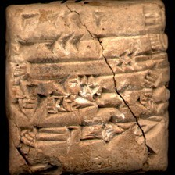 | 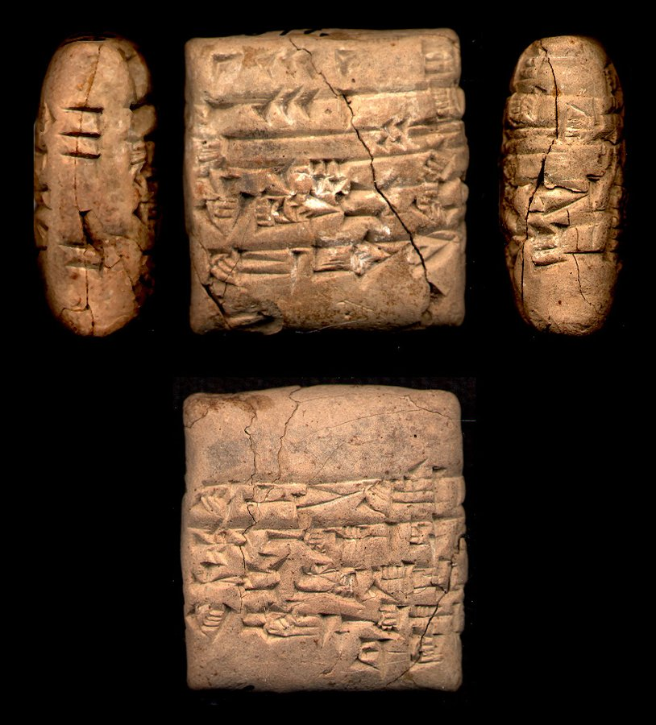 |

**Original text (transliteration):**
> 1geš₂ 3u 1diš u₈

**Cuneiform (Unicode signs, whole document, not position-aligned to the text above):**
> 𒐕 𒌍 𒁹 𒇇

**Masked input (1 positions):**
> 1geš₂ 3u [MASK] u₈

### Restoration (masked-token predictions)

| # | true token | text-only top-1 | text-only top-3 | vision top-1 | vision top-3 | text-only correct | vision correct |
|---|---|---|---|---|---|---|---|
| 1 | `1diš` | `5diš` | `5diš`, `1diš`, `3diš` | `5diš` | `5diš`, `1diš`, `2diš` | ❌ | ❌ |

Top-1 accuracy on this example: text-only 0/1 (0%), vision 0/1 (0%)

### Metadata predictions

| head | ground truth | text-only prediction | vision prediction |
|---|---|---|---|
| period | Ur III | Ur III (0.93) | Ur III (0.91) |
| genre | Administrative | Administrative (0.91) | Administrative (0.91) |
| language | Sumerian | Sumerian (0.94) | Sumerian (0.92) |
| provenience | Puzriš-Dagan | Puzriš-Dagan (0.92) | Puzriš-Dagan (0.90) |

---

## Example 5 — `P251690` (has photo: True)

| Model input (224x224 crop) | Full photo (all faces, reference only) |
|---|---|
| 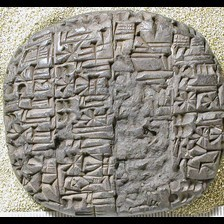 | 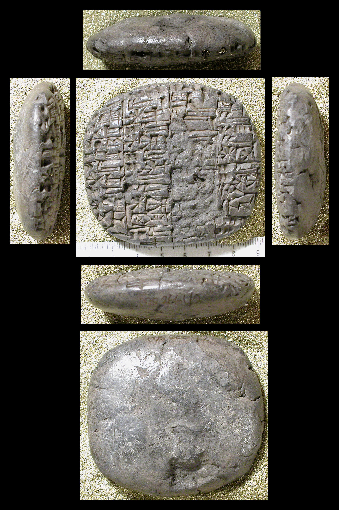 |

**Original text (transliteration):**
> 1bur₃ @ c GAN2 e₂ - hur - sag 1eše₃ @ c 1 / 2iku @ c 1 / 4iku @ c ur - D gidri

**Cuneiform (Unicode signs, whole document, not position-aligned to the text above):**
> 𒃷 𒂍 𒄯 𒊕 𒌨 <D> 𒉺

**Masked input (5 positions):**
> [MASK]bur₃ @ c GA [MASK]2 e₂ - hur - sag [MASK]še [MASK] @ c 1 / 2iku @ c 1 / [MASK]iku @ c ur - D gidri

### Restoration (masked-token predictions)

| # | true token | text-only top-1 | text-only top-3 | vision top-1 | vision top-3 | text-only correct | vision correct |
|---|---|---|---|---|---|---|---|
| 1 | `1` | `1` | `1`, `2`, `3` | `1` | `1`, `2`, `3` | ✅ | ✅ |
| 2 | `##N` | `##N` | `##N`, `##G`, `##R` | `##N` | `##N`, `##G`, `##R` | ✅ | ✅ |
| 3 | `1e` | `1e` | `1e`, `2e`, `an` | `1e` | `1e`, `2e`, `an` | ✅ | ✅ |
| 4 | `##₃` | `##₃` | `##₃`, `2u`, `1aš` | `##₃` | `##₃`, `1aš`, `1u` | ✅ | ✅ |
| 5 | `4` | `2` | `2`, `4`, `3` | `2` | `2`, `4`, `3` | ❌ | ❌ |

Top-1 accuracy on this example: text-only 4/5 (80%), vision 4/5 (80%)

### Metadata predictions

| head | ground truth | text-only prediction | vision prediction |
|---|---|---|---|
| period | Third Millennium | Third Millennium (0.86) | Third Millennium (0.93) |
| genre | Literary & Scholarly | Administrative (0.90) | Administrative (0.90) |
| language | Sumerian | Sumerian (0.96) | Sumerian (0.94) |
| provenience | Umma | Umma (0.33) | Umma (0.44) |

---

## Example 6 — `P315363` (has photo: True)

| Model input (224x224 crop) | Full photo (all faces, reference only) |
|---|---|
| 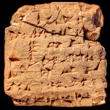 | 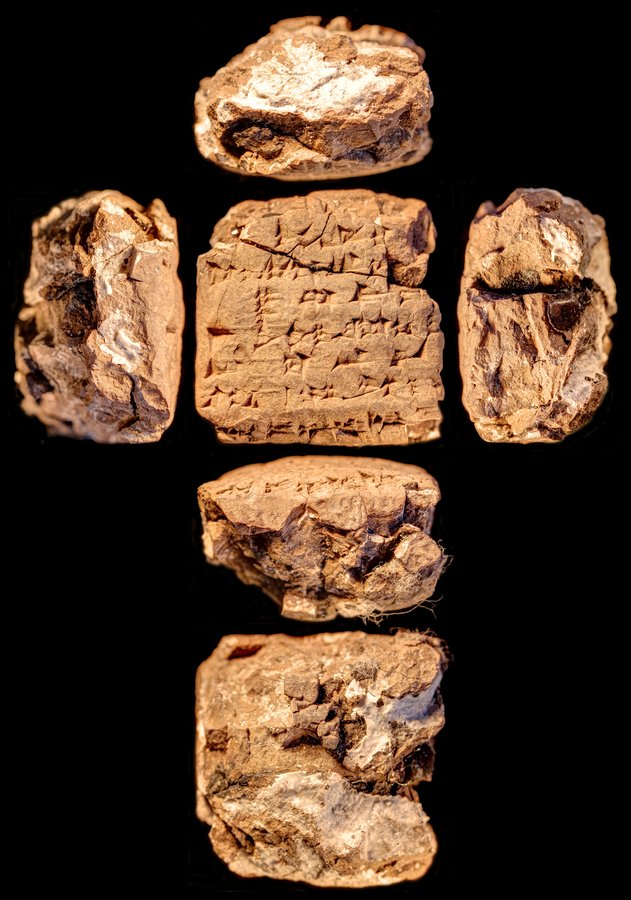 |

**Original text (transliteration):**
> ki šum - šu - nu ensi₂ a - na qa₂ - be₂ - e D ba - u₄ buru₁₄ - še₃ erin₂ še gur₁₀ - ku₅ i - il - - ul i - il - la - ak - ma

**Cuneiform (Unicode signs, whole document, not position-aligned to the text above):**
> 𒆠 𒋳 𒋗 𒉡 𒉺𒋼𒋛 𒀀 𒈾 𒂵 𒁉 𒂊 <D> 𒁀 𒌓 𒂙 𒂠 𒂟 𒊺 𒆥 𒋻 𒄿 𒅋 𒌌 𒄿 𒅋 𒆷 𒀝 𒈠

**Masked input (8 positions):**
> ki šum - šu - nu ensi₂ a - na qa₂ - [MASK]₂ - e D ba - u₄ buru₁₄ - še₃ erin [MASK] [MASK] gur [MASK] [MASK] [MASK] ku₅ i - il - [MASK] ul i [MASK] il - la - ak - ma

### Restoration (masked-token predictions)

| # | true token | text-only top-1 | text-only top-3 | vision top-1 | vision top-3 | text-only correct | vision correct |
|---|---|---|---|---|---|---|---|
| 1 | `be` | `be` | `be`, `ti`, `bi` | `be` | `be`, `ti`, `pi` | ✅ | ✅ |
| 2 | `##₂` | `##₂` | `##₂`, `-`, `ki` | `##₂` | `##₂`, `-`, `ki` | ✅ | ✅ |
| 3 | `še` | `-` | `-`, `še`, `gi` | `-` | `-`, `še`, `mu` | ❌ | ❌ |
| 4 | `##₁` | `##₁` | `##₁`, `##₈`, `-` | `##₁` | `##₁`, `-`, `##₈` | ✅ | ✅ |
| 5 | `##₀` | `##₂` | `##₂`, `ra`, `##₄` | `##₂` | `##₂`, `##₃`, `ra` | ❌ | ❌ |
| 6 | `-` | `-` | `-`, `##₂`, `##₃` | `-` | `-`, `##₃`, `##₂` | ✅ | ✅ |
| 7 | `-` | `šu` | `šu`, `lu`, `la` | `šu` | `šu`, `lu`, `lik` | ❌ | ❌ |
| 8 | `-` | `-` | `-`, `##₃`, `##₇` | `-` | `-`, `##₃`, `+` | ✅ | ✅ |

Top-1 accuracy on this example: text-only 5/8 (62%), vision 5/8 (62%)

### Metadata predictions

| head | ground truth | text-only prediction | vision prediction |
|---|---|---|---|
| period | Old Babylonian | Old Babylonian (0.93) | Old Babylonian (0.92) |
| genre | Legal | Administrative (0.75) | Administrative (0.48) |
| language | (no label) | Akkadian (0.57) | Akkadian (0.64) |
| provenience | (no label) | Nippur (0.47) | Sippar (0.26) **<- differs** |

---

## Example 7 — `P334122` (has photo: False)

**Original text (transliteration):**
> ARAD - ka id - din - ia aš - šur 15 AG AMAR. UTU ši - bu - tu₂ lit - tu - tu a - na LUGAL EN - ia lu - šab - bi - iu - u GU. ZA ša LUGAL EN - a a - na da - ra - a - te kun iš - di GU. ZA ša LUGAL EN - ia 15 ša [unused1] [unused1] [unused1] LUGAL be - li₂ u₂ - da o [unused1] [unused1] [unused1] E₂ tu₂ [unused1] [unused1] [unused1] [unused1] [unused1] [unused1] [unused1] - mu - te [unused1] [unused1] ina ši - a - ri ina li - di - iš LUGAL be - li₂ i - ša₂ - am - me ana - ku ina UGU - hi a - mu - at ma - a a - ta - a la tu - ša₂ - aš₂ - man - ni A. ŠA₃ E₂ UN - MEŠ DUMU - MEŠ še - lu - a - te ARAD - PA SANGA ina ŠA₃ un - qi is - sa - ṭar a - na ra - ma - ni - šu₂ ut - te - e - re u₃ a - na - ku ina UGU - hi la ša₂ - aš₂ - lu - ṭa - ku u₂ - ma - a a - na LUGAL EN - ia as - sap - ra LUGAL be - li₂ lu - u - di

**Cuneiform (Unicode signs, whole document, not position-aligned to the text above):**
> 𒀴 𒅗 𒁹 𒀉 𒁷 𒅀 𒀸 𒋩 𒀭 15 𒀭 𒀝 𒀭 𒀫 𒌓 𒅆 𒁍 𒌓 𒀖 𒌅 𒌅 𒀀 𒈾 𒈗 𒂗 𒅀 𒇻 𒉺𒅁 𒁉 𒅀 𒌋 𒄑 𒄖 𒍝 𒊭 𒈗 𒂗 𒀀 𒀀 𒈾 𒁕 𒊏 𒀀 𒋼 𒆲 𒅖 𒁲 𒄑 𒄖 𒍝 𒊭 𒈗 𒂗 𒅀 𒀭 15 𒊭 𒌷 x x x 𒈗 𒁁 𒉌 𒌑 𒁕 o x x x 𒂍 𒌓 x x x x x x x 𒈬 𒋼 x x 𒀸 𒅆 𒀀 𒊑 𒀸 𒇷 𒁲 𒅖 𒈗 𒁁 𒉌 𒄿 𒃻 𒄠 𒈨 𒁹 𒆪 𒀸 𒌋𒅗 𒄭 𒀀 𒈬 𒀜 𒈠 𒀀 𒀀 𒋫 𒀀 𒆷 𒌅 𒃻 𒀾 𒎙 𒉌 𒀀 𒊮 𒂍 𒌦 𒎌 𒌉 𒎌 𒊺 𒇻 𒀀 𒋼 𒁹 𒀴 𒀭 𒉺 𒇽 𒋃 𒀸 𒊮 𒌦 𒆥 𒄑 𒊓 𒋻 𒀀 𒈾 𒊏 𒈠 𒉌 𒋙 𒌓 𒋼 𒂊 𒊑 𒅇 𒀀 𒈾 𒆪 𒀸 𒌋𒅗 𒄭 𒆷 𒃻 𒀾 𒇻 𒁕 𒆪 𒌑 𒈠 𒀀 𒀀 𒈾 𒈗 𒂗 𒅀 𒊍 𒉺𒅁 𒊏 𒈗 𒁁 𒉌 𒇻 𒌋 𒁲

**Masked input (40 positions):**
> ARAD - ka id - din - ia aš - [MASK] [MASK] AG AMAR. [MASK]TU ši - bu - tu [MASK] lit - tu - [MASK] a - na LUGAL EN - [MASK] lu - šab - bi [MASK] iu - u GU. ZA ša [MASK] [MASK] - a a - na da - ra - a - te kun iš - di GU. ZA ša LUGAL [MASK] [MASK] ia [MASK] ša [unused1] [unused1] [unused1] [MASK] be - li₂ u [MASK] - [MASK] o [unused1] [unused1] [unused1] E₂ tu₂ [unused1] [unused1] [unused1] [unused1] [unused1] [unused1] [unused1] - mu - te [unused1] [unused1] ina ši - a - ri ina li - di - iš LUGAL [MASK] - li [MASK] [MASK] - ša₂ - [MASK] - [MASK] ana - ku ina UGU - hi [MASK] - mu - at ma - a a - ta - a la tu - ša₂ [MASK] aš₂ - man - ni A. ŠA₃ E₂ UN - MEŠ DUMU - MEŠ še - lu - a - [MASK] AR [MASK] - PA [MASK]NGA [MASK] ŠA [MASK] un - qi is [MASK] sa - ṭar a - na ra [MASK] ma - ni - šu₂ [MASK] - te - e [MASK] re u₃ a - na - ku ina UGU - hi la [MASK]₂ - aš₂ - lu - ṭ [MASK] - ku [MASK]₂ - ma - a a [MASK] na [MASK] EN - ia as [MASK] sap [MASK] ra LUGAL be - li₂ [MASK] - [MASK] - di

### Restoration (masked-token predictions)

| # | true token | text-only top-1 | text-only top-3 | vision top-1 | vision top-3 | text-only correct | vision correct |
|---|---|---|---|---|---|---|---|
| 1 | `šur` | `šur` | `šur`, `šum`, `ši` | `šur` | `šur`, `šum`, `ši` | ✅ | ✅ |
| 2 | `15` | `-` | `-`, `ša`, `LUGAL` | `-` | `-`, `EN`, `ša` | ❌ | ❌ |
| 3 | `U` | `U` | `U`, `DU`, `u` | `U` | `U`, `DU`, `GI` | ✅ | ✅ |
| 4 | `##₂` | `##₂` | `##₂`, `ša`, `ina` | `##₂` | `##₂`, `ša`, `ina` | ✅ | ✅ |
| 5 | `tu` | `u` | `u`, `ni`, `ma` | `u` | `u`, `ma`, `ni` | ❌ | ❌ |
| 6 | `ia` | `ia` | `ia`, `a`, `ka` | `ia` | `ia`, `ka`, `a` | ✅ | ✅ |
| 7 | `-` | `-` | `-`, `##₂`, `la` | `-` | `-`, `ša`, `LUGAL` | ✅ | ✅ |
| 8 | `LUGAL` | `LUGAL` | `LUGAL`, `##₂`, `-` | `LUGAL` | `LUGAL`, `-`, `##₂` | ✅ | ✅ |
| 9 | `EN` | `EN` | `EN`, `ma`, `la` | `EN` | `EN`, `ma`, `##₂` | ✅ | ✅ |
| 10 | `EN` | `EN` | `EN`, `be`, `BE` | `EN` | `EN`, `be`, `ki` | ✅ | ✅ |
| 11 | `-` | `-` | `-`, `##₂`, `.` | `-` | `-`, `##₂`, `a` | ✅ | ✅ |
| 12 | `15` | `##₂` | `##₂`, `o`, `u` | `##₂` | `##₂`, `o`, `ina` | ❌ | ❌ |
| 13 | `LUGAL` | `LUGAL` | `LUGAL`, `ša`, `KUR` | `LUGAL` | `LUGAL`, `KUR`, `ša` | ✅ | ✅ |
| 14 | `##₂` | `##₂` | `##₂`, `##₃`, `EN` | `##₂` | `##₂`, `##b`, `EN` | ✅ | ✅ |
| 15 | `da` | `a` | `a`, `ni`, `ia` | `a` | `a`, `ni`, `ia` | ❌ | ❌ |
| 16 | `be` | `be` | `be`, `BE`, `bu` | `be` | `be`, `BE`, `ba` | ✅ | ✅ |
| 17 | `##₂` | `##₂` | `##₂`, `la`, `-` | `##₂` | `##₂`, `##m`, `-` | ✅ | ✅ |
| 18 | `i` | `tu` | `tu`, `a`, `i` | `tu` | `tu`, `ta`, `a` | ❌ | ❌ |
| 19 | `am` | `man` | `man`, `an`, `a` | `man` | `man`, `an`, `ma` | ❌ | ❌ |
| 20 | `me` | `ni` | `ni`, `nu`, `na` | `ni` | `ni`, `nu`, `na` | ❌ | ❌ |
| 21 | `a` | `li` | `li`, `e`, `a` | `li` | `li`, `a`, `la` | ❌ | ❌ |
| 22 | `-` | `-` | `-`, `la`, `a` | `-` | `-`, `.`, `la` | ✅ | ✅ |
| 23 | `te` | `te` | `te`, `ni`, `ti` | `te` | `te`, `ni`, `ti` | ✅ | ✅ |
| 24 | `##AD` | `##AD` | `##AD`, `##₃`, `##A` | `##AD` | `##AD`, `##A`, `##B` | ✅ | ✅ |
| 25 | `SA` | `SA` | `SA`, `NI`, `LU` | `SA` | `SA`, `NI`, `LU` | ✅ | ✅ |
| 26 | `ina` | `.` | `.`, `ina`, `-` | `ina` | `ina`, `.`, `-` | ❌ | ✅ |
| 27 | `##₃` | `##₃` | `##₃`, `-`, `##B` | `##₃` | `##₃`, `-`, `##M` | ✅ | ✅ |
| 28 | `-` | `-` | `-`, `.`, `+` | `-` | `-`, `:`, `.` | ✅ | ✅ |
| 29 | `-` | `-` | `-`, `.`, `##₂` | `-` | `-`, `.`, `##₂` | ✅ | ✅ |
| 30 | `ut` | `e` | `e`, `ul`, `a` | `e` | `e`, `iš`, `i` | ❌ | ❌ |
| 31 | `-` | `-` | `-`, `.`, `la` | `-` | `-`, `.`, `/` | ✅ | ✅ |
| 32 | `ša` | `ša` | `ša`, `u`, `aš` | `ša` | `ša`, `u`, `aš` | ✅ | ✅ |
| 33 | `##a` | `##a` | `##a`, `##u`, `##i` | `##a` | `##a`, `##u`, `##₂` | ✅ | ✅ |
| 34 | `u` | `u` | `u`, `aš`, `šum` | `u` | `u`, `aš`, `sal` | ✅ | ✅ |
| 35 | `-` | `-` | `-`, `.`, `+` | `-` | `-`, `.`, `+` | ✅ | ✅ |
| 36 | `LUGAL` | `LUGAL` | `LUGAL`, `KUR`, `DUMU` | `LUGAL` | `LUGAL`, `KUR`, `ša` | ✅ | ✅ |
| 37 | `-` | `-` | `-`, `.`, `##₂` | `-` | `-`, `##₂`, `.` | ✅ | ✅ |
| 38 | `-` | `-` | `-`, `.`, `##₂` | `-` | `-`, `.`, `##₂` | ✅ | ✅ |
| 39 | `lu` | `a` | `a`, `i`, `an` | `a` | `a`, `i`, `ta` | ❌ | ❌ |
| 40 | `u` | `ta` | `ta`, `na`, `ma` | `na` | `na`, `ta`, `ma` | ❌ | ❌ |

Top-1 accuracy on this example: text-only 28/40 (70%), vision 29/40 (72%)

### Metadata predictions

| head | ground truth | text-only prediction | vision prediction |
|---|---|---|---|
| period | Neo-Assyrian | Neo-Assyrian (0.93) | Neo-Assyrian (0.94) |
| genre | Letters | Administrative (0.90) | Administrative (0.88) |
| language | Akkadian | Akkadian (0.92) | Akkadian (0.93) |
| provenience | Nineveh | Nineveh (0.72) | Nineveh (0.82) |

---

## Example 8 — `P110016` (has photo: True)

| Model input (224x224 crop) | Full photo (all faces, reference only) |
|---|---|
| 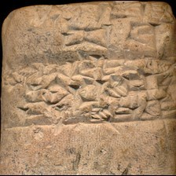 | 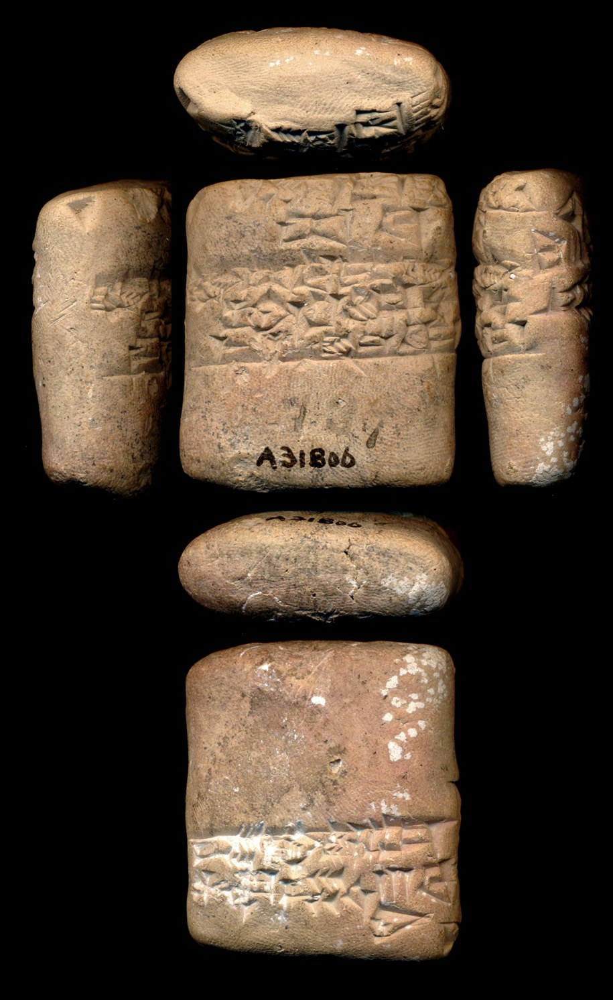 |

**Original text (transliteration):**
> 1diš a - tu ama lugal - ab - ba lugal - ab - ba dumu lu₂ ensi₂ - ka nu - me - a bi₂ - du₁₁ iti ezem - Dšul - gi u₄ 3diš ba - zal

**Cuneiform (Unicode signs, whole document, not position-aligned to the text above):**
> 𒁹 𒀀 𒌅 𒂼 𒈗 𒀊 𒁀 𒈗 𒀊 𒁀 𒌉 𒇽 𒑐𒋼𒋛 𒅗 𒉡 𒈨 𒀀 𒉈 𒅗 𒌚 𒂡 𒄀 𒌓 𒐈 𒁀 𒉌

**English translation (CDLI):**
> Atu is the mother of Lugal-abba. "Lugal-abba is not the son of the man of the governor" she said.

**Masked input (7 positions):**
> 1diš [MASK] - tu ama lugal [MASK] ab - ba [MASK] - ab - ba [MASK] lu₂ ensi₂ - [MASK] nu - me - a bi₂ - du₁₁ iti ezem - Dšul [MASK] gi [MASK]₄ 3diš ba - zal

### Restoration (masked-token predictions)

| # | true token | text-only top-1 | text-only top-3 | vision top-1 | vision top-3 | text-only correct | vision correct |
|---|---|---|---|---|---|---|---|
| 1 | `a` | `mar` | `mar`, `a`, `iš` | `mar` | `mar`, `a`, `iš` | ❌ | ❌ |
| 2 | `-` | `-` | `-`, `dumu`, `D` | `-` | `-`, `ki`, `D` | ✅ | ✅ |
| 3 | `lugal` | `lugal` | `lugal`, `dumu`, `ki` | `lugal` | `lugal`, `ur`, `a` | ✅ | ✅ |
| 4 | `dumu` | `dumu` | `dumu`, `ki`, `mu` | `mu` | `mu`, `dumu`, `ki` | ✅ | ❌ |
| 5 | `ka` | `ka` | `ka`, `e`, `ta` | `ka` | `ka`, `e`, `ra` | ✅ | ✅ |
| 6 | `-` | `-` | `-`, `##₂`, `##₃` | `-` | `-`, `##₂`, `##₃` | ✅ | ✅ |
| 7 | `u` | `u` | `u`, `gu`, `na` | `u` | `u`, `gu`, `na` | ✅ | ✅ |

Top-1 accuracy on this example: text-only 6/7 (86%), vision 5/7 (71%)

### Metadata predictions

| head | ground truth | text-only prediction | vision prediction |
|---|---|---|---|
| period | Ur III | Ur III (0.96) | Ur III (0.96) |
| genre | Administrative | Administrative (0.81) | Administrative (0.40) |
| language | Sumerian | Sumerian (0.96) | Sumerian (0.95) |
| provenience | Girsu | Girsu (0.32) | Girsu (0.48) |

---

## Example 9 — `P397213` (has photo: True)

| Model input (224x224 crop) | Full photo (all faces, reference only) |
|---|---|
| 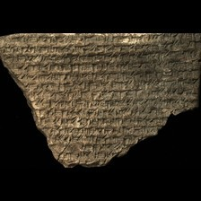 | 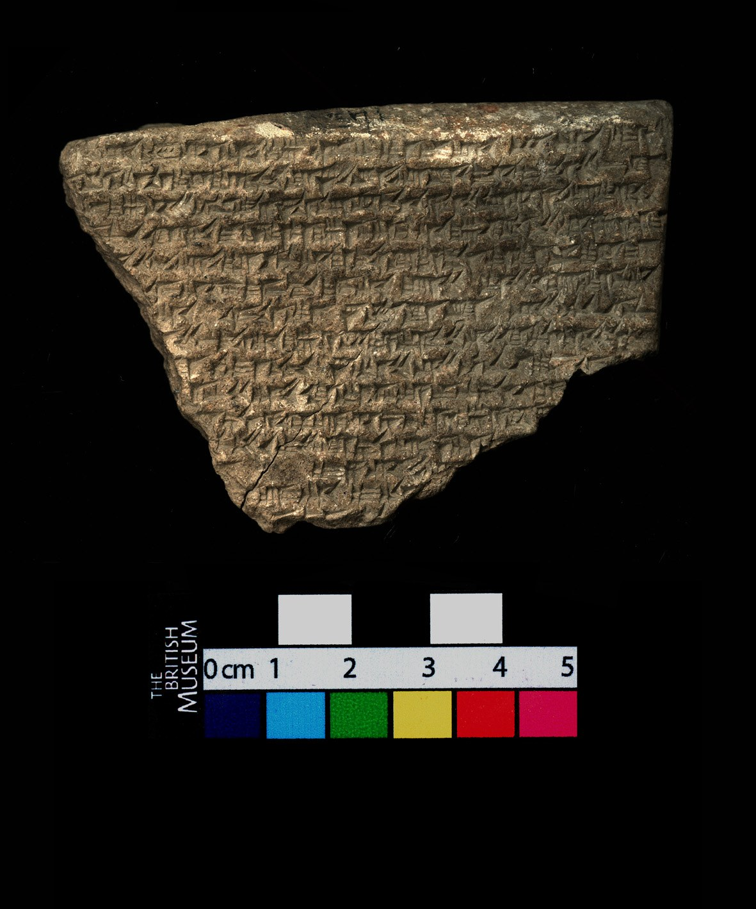 |

**Original text (transliteration):**
> na - ṣir zik - ri an - šar₂ lugal dingir - meš la pa - lih₃ en - ti - ia [unused1] hab - ba - tu₂ šar - ra - qu lu ša₂ hi - ṭu ih - ṭu - u da - mi it - bu - ku sag lu₂ nam ak - li ša₂ - pi - ru re - du - u a - na kur šub - ri - a ih - li - qu an - nu - u ki - i - am aš₂ - pur - šu - ma lu₂ - meš an - nu - ti lu₂ nimgir₂ ina kur - ka šul - si - ma - ti pu - uh - hi - ra - šu₂ - nu - ti - ma eṭ - lu e - du la tu - maš - šar - ma igi D pirig - gal gašan gal - ti e₂ - kur šu - uṣ - bit - su - nu - ti - ti ši - pir - tu ša₂ bul - lu - ṭu zi - ti₃ - šu₂ - nu [unused1] bu it - ti lu₂ a kin - ia iri kaskal kur an - šar₂ ki li - iṣ - bat - u - nim - ma ku dam - qu ša₂ ba - laṭ zi - ti₃ - šu₂ in - ši - - meš kur an - šar₂ ki ARAD2 - meš - ia pa - nu - uš - šu₂ e - [unused1] uš a - di u₂ - ri - ni ina šu - min lu₂ a kin ša₂ mim - mu - u i - pu - lu - uš u₂ - ša₂ - an - na - i - ṣa - ri - ih - u₂ - ti i - bala

**Cuneiform (Unicode signs, whole document, not position-aligned to the text above):**
> 𒈾 𒈲 𒍨 𒊑 𒀭 𒊹 𒈗 𒀭 𒈨𒌍 𒆷 𒉺 𒈛 𒂗 𒋾 𒅀 𒆸 𒁀 𒌓 𒊬 𒊏 𒄣 𒇻 𒃻 𒄭 𒂅 𒄴 𒂅 𒌋 𒁕 𒈪 𒀉 𒁍 𒆪 𒊕 𒇽 𒉆 𒀝 𒇷 𒃻 𒉿 𒊒 𒊑 𒁺 𒌋 𒀀 𒈾 𒆳 𒊒 𒊑 𒀀 𒄴 𒇷 𒄣 𒀭 𒉡 𒌋 𒆠 𒄿 𒄠 𒀾 𒁓 𒋗 𒈠 𒇽 𒈨𒌍 𒀭 𒉡 𒋾 𒇽 𒀸 𒆳 𒅗 𒂄 𒋛 𒈠 𒋾 𒁍 𒄴 𒄭 𒊏 𒋙 𒉡 𒋾 𒈠 𒀉 𒇻 𒂊 𒁺 𒆷 𒌅 𒈦 𒊬 𒈠 𒅆 <D> 𒊊 𒃲 𒃽 𒃲 𒋾 𒂍 𒆳 𒋗 𒊻 𒂍 𒋢 𒉡 𒋾 𒋾 𒅆 𒌓 𒌅 𒃻 𒇧 𒇻 𒂅 𒍣 𒁴 𒋙 𒉡 𒁍 𒀉 𒋾 𒇽 𒀀 𒆥 𒅀 𒌷 𒆜 𒆳 𒀭 𒊹 𒆠 𒇷 𒄑 𒁁 𒌋 𒉏 𒈠 𒆪 𒁮 𒄣 𒃻 𒁀 𒆳 𒍣 𒁴 𒋙 𒅔 𒅆 𒈨𒌍 𒆳 𒀭 𒊹 𒆠 𒀵 𒈨𒌍 𒅀 𒉺 𒉡 𒍑 𒋙 𒂊 𒍑 𒀀 𒁲 𒌑 𒊑 𒉌 𒀸 𒋗 𒈫 𒇽 𒀀 𒆥 𒃻 𒊩 𒈬 𒌋 𒄿 𒁍 𒇻 𒍑 𒌑 𒃻 𒀭 𒈾 𒄿 𒍝 𒊑 𒄴 𒌑 𒋾 𒄿 𒁄

**Masked input (54 positions):**
> na - [MASK]r zik - ri an - šar₂ lugal din [MASK] - meš la pa - lih₃ en - ti - ia [unused1] hab - ba [MASK] tu₂ šar - ra - qu lu ša₂ hi - ṭu ih - ṭu - [MASK] da - mi it - [MASK] - ku sag lu₂ nam ak - li ša₂ - pi - ru re - du - u a - [MASK] kur šub - ri - [MASK] [MASK] - li - qu [MASK] [MASK] nu - u ki [MASK] [MASK] - am aš [MASK] - pur - [MASK] - ma lu₂ - meš an [MASK] nu - ti lu₂ nimgir₂ ina kur - ka šul - [MASK] - ma - ti pu - u [MASK] - hi - ra - šu₂ - nu - ti - ma eṭ - lu [MASK] - du la tu - [MASK] - šar [MASK] ma igi D pirig - gal ga [MASK]n [MASK] - ti e₂ - kur [MASK] - uṣ - bit - su - nu - [MASK] [MASK] [MASK] ši [MASK] pir - tu [MASK]₂ bul - lu - ṭu zi - [MASK] [MASK] - [MASK]₂ - nu [unused1] bu it - ti lu [MASK] a kin - [MASK] iri [MASK]kal kur an - šar₂ ki li - iṣ - bat [MASK] u - nim - ma ku dam - qu ša₂ ba - [MASK]ṭ zi - ti₃ [MASK] šu₂ in [MASK] ši - - meš kur an [MASK] šar₂ ki [MASK]AD2 - meš - ia pa [MASK] nu - uš - [MASK]₂ e [MASK] [unused1] uš [MASK] - di u₂ - ri [MASK] ni [MASK] šu [MASK] min lu₂ a kin [MASK]₂ mim - [MASK] - u i - pu - lu - [MASK] u₂ - ša₂ - [MASK] [MASK] na - i - ṣa - ri - ih - u₂ - ti i [MASK] [MASK]

### Restoration (masked-token predictions)

| # | true token | text-only top-1 | text-only top-3 | vision top-1 | vision top-3 | text-only correct | vision correct |
|---|---|---|---|---|---|---|---|
| 1 | `ṣi` | `ṣi` | `ṣi`, `ši`, `qa` | `ṣi` | `ṣi`, `qa`, `ši` | ✅ | ✅ |
| 2 | `##gir` | `##gir` | `##gir`, `-`, `##₃` | `##gir` | `##gir`, `-`, `##₃` | ✅ | ✅ |
| 3 | `-` | `-` | `-`, `la`, `ina` | `-` | `-`, `lu`, `la` | ✅ | ✅ |
| 4 | `u` | `u` | `u`, `ru`, `ur` | `ru` | `ru`, `u`, `ur` | ✅ | ❌ |
| 5 | `bu` | `tal` | `tal`, `ti`, `tu` | `tal` | `tal`, `ti`, `ta` | ❌ | ❌ |
| 6 | `na` | `na` | `na`, `di`, `mat` | `na` | `na`, `di`, `a` | ✅ | ✅ |
| 7 | `a` | `ia` | `ia`, `ka`, `šu` | `ia` | `ia`, `ka`, `šu` | ❌ | ❌ |
| 8 | `ih` | `il` | `il`, `e`, `i` | `il` | `il`, `e`, `i` | ❌ | ❌ |
| 9 | `an` | `an` | `an`, `##₂`, `šu` | `an` | `an`, `##₂`, `a` | ✅ | ✅ |
| 10 | `-` | `-` | `-`, `##₂`, `a` | `-` | `-`, `##₂`, `a` | ✅ | ✅ |
| 11 | `-` | `-` | `-`, `##š`, `ša` | `-` | `-`, `##š`, `ša` | ✅ | ✅ |
| 12 | `i` | `a` | `a`, `ma`, `ra` | `a` | `a`, `ma`, `ra` | ❌ | ❌ |
| 13 | `##₂` | `##₂` | `##₂`, `##₃`, `-` | `##₂` | `##₂`, `##₃`, `##₈` | ✅ | ✅ |
| 14 | `šu` | `šu` | `šu`, `ti`, `su` | `šu` | `šu`, `nu`, `ti` | ✅ | ✅ |
| 15 | `-` | `-` | `-`, `.`, `##₂` | `-` | `-`, `##₂`, `.` | ✅ | ✅ |
| 16 | `si` | `lu` | `lu`, `la`, `li` | `la` | `la`, `lu`, `li` | ❌ | ❌ |
| 17 | `##h` | `##h` | `##h`, `##ṣ`, `##₂` | `##h` | `##h`, `##₂`, `##ṣ` | ✅ | ✅ |
| 18 | `e` | `##h` | `##h`, `##₂`, `##m` | `##₂` | `##₂`, `##m`, `##h` | ❌ | ❌ |
| 19 | `maš` | `up` | `up`, `aš`, `pa` | `pa` | `pa`, `aš`, `uš` | ❌ | ❌ |
| 20 | `-` | `-` | `-`, `##₂`, `.` | `-` | `-`, `##₂`, `.` | ✅ | ✅ |
| 21 | `##ša` | `##ša` | `##ša`, `##ši`, `##ppi` | `##ša` | `##ša`, `##ši`, `##ppi` | ✅ | ✅ |
| 22 | `gal` | `it` | `it`, `##₂`, `at` | `it` | `it`, `##₂`, `ki` | ❌ | ❌ |
| 23 | `šu` | `mu` | `mu`, `lu`, `pu` | `lu` | `lu`, `mu`, `tu` | ❌ | ❌ |
| 24 | `ti` | `ti` | `ti`, `ma`, `u` | `ti` | `ti`, `u`, `ma` | ✅ | ✅ |
| 25 | `-` | `-` | `-`, `u`, `i` | `-` | `-`, `i`, `u` | ✅ | ✅ |
| 26 | `ti` | `-` | `-`, `ma`, `##₂` | `-` | `-`, `ma`, `##₂` | ❌ | ❌ |
| 27 | `-` | `-` | `-`, `##m`, `##r` | `-` | `-`, `##m`, `##š` | ✅ | ✅ |
| 28 | `ša` | `lu` | `lu`, `ša`, `u` | `ša` | `ša`, `lu`, `u` | ❌ | ✅ |
| 29 | `ti` | `ti` | `ti`, `i`, `tu` | `ti` | `ti`, `i`, `ri` | ✅ | ✅ |
| 30 | `##₃` | `##₃` | `##₃`, `##₂`, `##r` | `##₃` | `##₃`, `##₂`, `##b` | ✅ | ✅ |
| 31 | `šu` | `šu` | `šu`, `u`, `tu` | `šu` | `šu`, `tu`, `u` | ✅ | ✅ |
| 32 | `##₂` | `##₂` | `##₂`, `-`, `'` | `##₂` | `##₂`, `-`, `'` | ✅ | ✅ |
| 33 | `ia` | `ti` | `ti`, `ka`, `na` | `ti` | `ti`, `ka`, `ia` | ❌ | ❌ |
| 34 | `kas` | `kas` | `kas`, `ak`, `ša` | `kas` | `kas`, `kan`, `iš` | ✅ | ✅ |
| 35 | `-` | `-` | `-`, `ki`, `la` | `-` | `-`, `##₂`, `ki` | ✅ | ✅ |
| 36 | `la` | `la` | `la`, `a`, `li` | `a` | `a`, `la`, `li` | ✅ | ❌ |
| 37 | `-` | `-` | `-`, `.`, `:` | `-` | `-`, `.`, `:` | ✅ | ✅ |
| 38 | `-` | `-` | `-`, `ki`, `##₂` | `-` | `-`, `ki`, `##₂` | ✅ | ✅ |
| 39 | `-` | `-` | `-`, `.`, `+` | `-` | `-`, `.`, `##₂` | ✅ | ✅ |
| 40 | `AR` | `AR` | `AR`, `AL`, `NI` | `AR` | `AR`, `AL`, `NI` | ✅ | ✅ |
| 41 | `-` | `-` | `-`, `##₂`, `a` | `-` | `-`, `##₂`, `##₃` | ✅ | ✅ |
| 42 | `šu` | `šu` | `šu`, `tu`, `ša` | `šu` | `šu`, `tu`, `ša` | ✅ | ✅ |
| 43 | `-` | `##₂` | `##₂`, `-`, `##gir` | `##₂` | `##₂`, `-`, `##₃` | ❌ | ❌ |
| 44 | `a` | `##₂` | `##₂`, `a`, `i` | `##₂` | `##₂`, `##u`, `i` | ❌ | ❌ |
| 45 | `-` | `-` | `-`, `##š`, `u` | `-` | `-`, `##š`, `##₂` | ✅ | ✅ |
| 46 | `ina` | `-` | `-`, `##š`, `ina` | `-` | `-`, `##š`, `ina` | ❌ | ❌ |
| 47 | `-` | `##₂` | `##₂`, `-`, `ina` | `##₂` | `##₂`, `-`, `ina` | ❌ | ❌ |
| 48 | `ša` | `lu` | `lu`, `ša`, `u` | `lu` | `lu`, `ša`, `u` | ❌ | ❌ |
| 49 | `mu` | `mu` | `mu`, `nu`, `ma` | `mu` | `mu`, `nu`, `ma` | ✅ | ✅ |
| 50 | `uš` | `ma` | `ma`, `ti`, `ni` | `ma` | `ma`, `u`, `ti` | ❌ | ❌ |
| 51 | `an` | `an` | `an`, `ad`, `a` | `an` | `an`, `a`, `ši` | ✅ | ✅ |
| 52 | `-` | `-` | `-`, `##₂`, `##b` | `-` | `-`, `##₂`, `##m` | ✅ | ✅ |
| 53 | `-` | `-` | `-`, `##q`, `##p` | `-` | `-`, `##q`, `##p` | ✅ | ✅ |
| 54 | `bala` | `na` | `na`, `di`, `-` | `na` | `na`, `di`, `-` | ❌ | ❌ |

Top-1 accuracy on this example: text-only 35/54 (65%), vision 34/54 (63%)

### Metadata predictions

| head | ground truth | text-only prediction | vision prediction |
|---|---|---|---|
| period | Neo-Assyrian | Neo-Assyrian (0.94) | Neo-Assyrian (0.93) |
| genre | Royal Inscriptions | Royal Inscriptions (0.93) | Royal Inscriptions (0.93) |
| language | Akkadian | Akkadian (0.91) | Akkadian (0.88) |
| provenience | Nineveh | Nineveh (0.84) | Nineveh (0.81) |

---

## Example 10 — `P346236` (has photo: True)

| Model input (224x224 crop) | Full photo (all faces, reference only) |
|---|---|
| 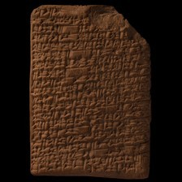 | 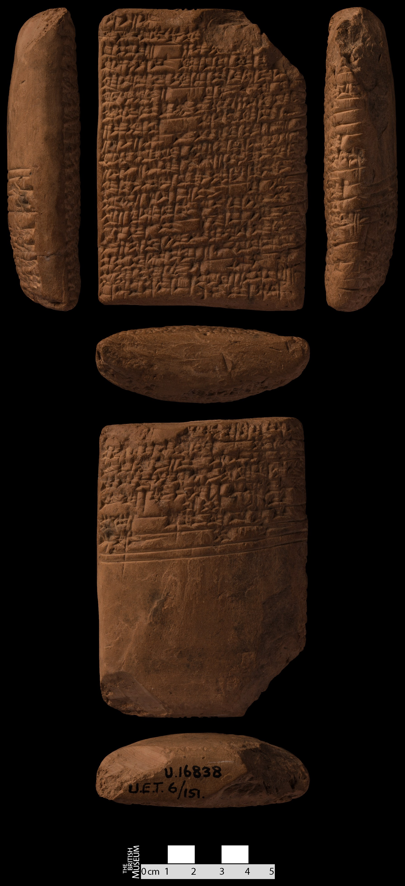 |

**Original text (transliteration):**
> a - na - aš - am₃ ur₅ - lu₂ lu₂ - u₃ za₃ in - ne - e₂ - dub - ba - a za - pa - ag₂ mu - [unused1] - ša₃ gin₆ - na - bi eme - gir₁₅ - ra bi₂ - in - sag - ki tum₂ a₂ ag₂ - ga₂ - ta ba - e - da - an - - še zar nu - ub - ra - ah - a [unused1] - ni nu - šub - ba a₂ u₄ - da - bi - še₃ he₂ - tud₂ - za - na SU KA he₂ - en - za - pa - ag₂ - e sa₂ nu - ub - du₁₁ - ga - am₃ u₃ nam - dub - sar - ra - ba diri - zu - uš an - zu - a sag in - ta - tum₂ aš₂ in - ne - mu₂ in in - ne - dub₂ um - mi - a nig₂ - na - me - a - bi ba - ak diri - še₃ sag ba - gid₂ nig₂ ša₃ - zu ak - mu - un tukumbi nig₂ ša₃ ak - en lu₂ za - e - gin₇ ak šeš - gal - la - na sag im - ta - de₆ - a - aš uruda šir₃ - šir₃ giri₃ - na u₃ - ub - si e₂ an - ni₁₀ - ni₁₀ - ma e₂ - dub - ba - a - ta iti min - am₃ nu - ub - ta - e₃ i₃ - - eš₂ nam - tag ba - e - ra - ab - duh u₄ - da - ta geš igi - ne - ne bi₂ - hur lu₂ - u₁₉ sikil - du₃ - a - bi na - an - ak - e šeš šeš - da nam - ba - an - ne₂ - ta - du₁₁ di nam - mu - e du₁₄ mu₂ diš giri₃ - ni - sa₆ diš D en - ki - ma - an - šum₂ e - ne - bi um - mi - a di in - ne - en - dab₅ - be₂

**Cuneiform (Unicode signs, whole document, not position-aligned to the text above):**
> 𒀀 𒈾 𒀸 𒀀𒀭 𒄯 𒇽 𒇽 𒅇 𒍠 𒅔 𒉈 𒂍 𒁾 𒁀 𒀀 𒍝 𒉺 𒉘 𒈬 𒊮 𒄀 𒈾 𒁉 𒅴 𒂠 𒊏 𒉈 𒅔 𒊕 𒆠 𒁺 𒀉 𒉘 𒂷 𒋫 𒁀 𒂊 𒁕 𒀭 𒊺 𒇡 𒉡 𒌒 𒊏 𒄴 𒀀 𒉌 𒉡 𒊒 𒁀 𒀉 𒌓 𒁕 𒁉 𒂠 𒃶 𒍝 𒈾 𒋢 𒅗 𒃶 𒂗 𒍝 𒉺 𒉘 𒂊 𒁲 𒉡 𒌒 𒅗 𒂵 𒀀𒀭 𒅇 𒉆 𒁾 𒊬 𒊏 𒁀 𒋛𒀀 𒍪 𒍑 𒀭 𒍪 𒀀 𒊕 𒅔 𒋫 𒁺 𒀾 𒅔 𒉈 𒊬 𒅔 𒅔 𒉈 𒂀 𒌝 𒈪 𒀀 𒃻 𒈾 𒈨 𒀀 𒁉 𒁀 𒀝 𒋛𒀀 𒂠 𒊕 𒁀 𒁍 𒃻 𒊮 𒍪 𒀝 𒈬 𒌦 𒋗𒃻𒌉𒇲𒁉 𒃻 𒊮 𒀝 𒂗 𒇽 𒍝 𒂊 𒁶 𒀝 𒋀 𒃲 𒆷 𒈾 𒊕 𒅎 𒋫 𒁺 𒀀 𒀸 𒍏 𒂡 𒂡 𒄊 𒈾 𒅇 𒌒 𒋛 𒂍 𒀭 𒆸 𒆸 𒈠 𒂍 𒁾 𒁀 𒀀 𒋫 𒌗 𒈫 𒀀𒀭 𒉡 𒌒 𒋫 𒌓𒁺 𒉌 𒂠 𒉆 𒋳 𒁀 𒂊 𒊏 𒀊 𒃮 𒌓 𒁕 𒋫 𒄑 𒅆 𒉈 𒉈 𒉈 𒄯 𒇽 𒌷 𒂖 𒆕 𒀀 𒁉 𒈾 𒀭 𒀝 𒂊 𒋀 𒋀 𒁕 𒉆 𒁀 𒀭 𒉌 𒋫 𒅗 𒁲 𒉆 𒈬 𒂊 𒈌 𒊬 𒁹 𒄊 𒉌 𒊷 𒁹 <D> 𒂗 𒆠 𒈠 𒀭 𒋧 𒂊 𒉈 𒁉 𒌝 𒈪 𒀀 𒁲 𒅔 𒉈 𒂗 𒆪 𒁉

**English translation (CDLI):**
> Why do you behave like this? One has rejected the other, cursed the other, insulted the other You put an outcry in the scribal school "By (the possessor of?) a truthful heart he been taught(?) Sumerian The one who, he ... away from(?) the assignment” it was said The sheaf that was not threshed, his ... which did not fall off(?) You should be beaten on account of (the output of) this daily assignment, ... The outcry has not(!) been a regular occurrence(?) Why, the one who is your “big brother” And the one who knows the scribal art better than you Why did you speak with (empty?) praise(?) You have offended(?) him, you have cursed him, you have insulted him The master did(?) everything And grew exceedingly angry (saying?) “do as you wish” If you do as you wish For this auxiliary construction see Attinger ZA 95, 244. Because of the fact that the one who acted like you offended(?) his “big brother” After being struck with the “tablet shaping board” (as) a weapon sixty times After chains were placed on his feet He was confined in the house and did not leave the scribal school for two months Now, the sin has been released for you From this day onwards, their faces have been incised Do not behave insultingly to each other(?) Do not speak out(?) brother with (against) brother, do not initiate legal proceedings (against each other) (As for) the quarrel of both Girini'isag and Enkimanšum The master arrives at a verdict(?) for them Nisaba, praise!

**Masked input (70 positions):**
> a - na - [MASK] - am₃ ur₅ - lu₂ lu₂ [MASK] [MASK]₃ za₃ in - ne - e₂ - [MASK] - ba - a za - pa - ag₂ mu - [unused1] - ša [MASK] [MASK]₆ - na - bi eme - gir₁₅ - ra bi₂ [MASK] [MASK] - sag - ki tum₂ a [MASK] [MASK] [MASK] [MASK] [MASK]₂ - ta ba - e - da - an - - [MASK] [MASK]r [MASK] - ub - [MASK] - [MASK] - a [unused1] - [MASK] nu - šub - ba a₂ u₄ - da [MASK] bi - [MASK]₃ he₂ - tud₂ [MASK] za - na SU KA he₂ - en - za - pa - ag₂ - [MASK] sa₂ nu - ub [MASK] du [MASK]₁ - [MASK] - am₃ [MASK]₃ nam - [MASK] [MASK] sar - ra - ba diri - zu - uš an - zu - a sag in - ta - [MASK]₂ aš₂ in - ne - [MASK]₂ in in - [MASK] - [MASK]₂ um - mi - a nig₂ - [MASK] - me [MASK] a [MASK] bi [MASK] - ak diri - še₃ sag ba - gi [MASK]₂ ni [MASK]₂ ša₃ - zu ak - mu - un tukumbi nig₂ ša [MASK] [MASK] [MASK] [MASK] lu [MASK] za - e - [MASK]₇ ak [MASK]š - gal - la - na sag im - ta - de [MASK] - a - aš uruda šir [MASK] - ši [MASK]₃ [MASK]₃ - na u [MASK] - ub - si e₂ [MASK] - ni [MASK]₀ - ni₁₀ - ma e [MASK] - dub [MASK] ba - a - ta iti [MASK] - am₃ nu [MASK] ub - [MASK] - e₃ i₃ - - eš₂ [MASK] - tag ba - e [MASK] ra - ab - [MASK]h u₄ - da - ta [MASK] igi - ne - ne bi₂ - hur lu₂ - u₁₉ sikil - du₃ - a - bi na [MASK] an - ak - e šeš šeš [MASK] da nam - ba - an - [MASK]₂ [MASK] ta - du₁₁ di nam [MASK] mu - e du₁₄ mu₂ diš giri₃ - [MASK] [MASK] sa₆ diš D en - ki - ma - an [MASK] šum₂ e - ne - bi um - mi - a di in - ne - en - dab₅ - be₂

### Restoration (masked-token predictions)

| # | true token | text-only top-1 | text-only top-3 | vision top-1 | vision top-3 | text-only correct | vision correct |
|---|---|---|---|---|---|---|---|
| 1 | `aš` | `bi` | `bi`, `ta`, `a` | `bi` | `bi`, `ta`, `a` | ❌ | ❌ |
| 2 | `-` | `-` | `-`, `ki`, `mu` | `-` | `-`, `mu`, `ki` | ✅ | ✅ |
| 3 | `u` | `še` | `še`, `u`, `am` | `še` | `še`, `am`, `e` | ❌ | ❌ |
| 4 | `dub` | `dub` | `dub`, `ab`, `tab` | `dub` | `dub`, `a`, `tab` | ✅ | ✅ |
| 5 | `##₃` | `##₃` | `##₃`, `-`, `##₂` | `##₃` | `##₃`, `-`, `##₂` | ✅ | ✅ |
| 6 | `gin` | `de` | `de`, `ge`, `sa` | `de` | `de`, `du`, `sa` | ❌ | ❌ |
| 7 | `-` | `-` | `-`, `u`, `e` | `-` | `-`, `u`, `i` | ✅ | ✅ |
| 8 | `in` | `in` | `in`, `hur`, `en` | `hur` | `hur`, `in`, `en` | ✅ | ❌ |
| 9 | `##₂` | `-` | `-`, `##₂`, `##₃` | `-` | `-`, `##₂`, `##₃` | ❌ | ❌ |
| 10 | `ag` | `-` | `-`, `na`, `bi` | `-` | `-`, `na`, `bi` | ❌ | ❌ |
| 11 | `##₂` | `-` | `-`, `##₂`, `##₃` | `-` | `-`, `##₃`, `##₂` | ❌ | ❌ |
| 12 | `-` | `-` | `-`, `ni`, `##₃` | `-` | `-`, `ni`, `##₃` | ✅ | ✅ |
| 13 | `ga` | `##g` | `##g`, `lu`, `la` | `lu` | `lu`, `ga`, `##g` | ❌ | ❌ |
| 14 | `še` | `bi` | `bi`, `ta`, `na` | `bi` | `bi`, `na`, `ne` | ❌ | ❌ |
| 15 | `za` | `saha` | `saha`, `sa`, `ni` | `sa` | `sa`, `saha`, `bu` | ❌ | ❌ |
| 16 | `nu` | `nu` | `nu`, `mu`, `hu` | `nu` | `nu`, `mu`, `##₂` | ✅ | ✅ |
| 17 | `ra` | `du` | `du`, `da`, `ba` | `da` | `da`, `ba`, `du` | ❌ | ❌ |
| 18 | `ah` | `ba` | `ba`, `a`, `na` | `ba` | `ba`, `a`, `ra` | ❌ | ❌ |
| 19 | `ni` | `bi` | `bi`, `ta`, `da` | `bi` | `bi`, `ta`, `ba` | ❌ | ❌ |
| 20 | `-` | `-` | `-`, `a`, `ki` | `-` | `-`, `a`, `ki` | ✅ | ✅ |
| 21 | `še` | `še` | `še`, `am`, `de` | `am` | `am`, `še`, `de` | ✅ | ❌ |
| 22 | `-` | `-` | `-`, `ki`, `mu` | `-` | `-`, `KA`, `mu` | ✅ | ✅ |
| 23 | `e` | `e` | `e`, `bi`, `a` | `e` | `e`, `bi`, `a` | ✅ | ✅ |
| 24 | `-` | `-` | `-`, `##₂`, `##₃` | `-` | `-`, `##₂`, `##₃` | ✅ | ✅ |
| 25 | `##₁` | `##₁` | `##₁`, `##₂`, `##l` | `##₁` | `##₁`, `##₂`, `##₀` | ✅ | ✅ |
| 26 | `ga` | `bi` | `bi`, `ga`, `ta` | `bi` | `bi`, `ga`, `ta` | ❌ | ❌ |
| 27 | `u` | `za` | `za`, `u`, `ša` | `za` | `za`, `u`, `ša` | ❌ | ❌ |
| 28 | `dub` | `dub` | `dub`, `e`, `bala` | `dub` | `dub`, `bala`, `e` | ✅ | ✅ |
| 29 | `-` | `-` | `-`, `##₂`, `##₃` | `-` | `-`, `##₂`, `##₃` | ✅ | ✅ |
| 30 | `tum` | `šum` | `šum`, `la`, `aš` | `šum` | `šum`, `la`, `aš` | ❌ | ❌ |
| 31 | `mu` | `šum` | `šum`, `e`, `aš` | `šum` | `šum`, `ag`, `eš` | ❌ | ❌ |
| 32 | `ne` | `ne` | `ne`, `ta`, `na` | `ne` | `ne`, `na`, `ta` | ✅ | ✅ |
| 33 | `dub` | `šum` | `šum`, `la`, `e` | `šum` | `šum`, `la`, `ag` | ❌ | ❌ |
| 34 | `na` | `bi` | `bi`, `na`, `ba` | `bi` | `bi`, `na`, `da` | ❌ | ❌ |
| 35 | `-` | `-` | `-`, `##š`, `##₃` | `-` | `-`, `##š`, `##₂` | ✅ | ✅ |
| 36 | `-` | `-` | `-`, `##₂`, `a` | `-` | `-`, `a`, `na` | ✅ | ✅ |
| 37 | `ba` | `na` | `na`, `an`, `a` | `in` | `in`, `na`, `a` | ❌ | ❌ |
| 38 | `##d` | `##d` | `##d`, `##l`, `##g` | `##d` | `##d`, `##g`, `##l` | ✅ | ✅ |
| 39 | `##g` | `##g` | `##g`, `##ŋ`, `##gu` | `##g` | `##g`, `##ŋ`, `##m` | ✅ | ✅ |
| 40 | `##₃` | `##₃` | `##₃`, `-`, `##₂` | `##₃` | `##₃`, `-`, `##₂` | ✅ | ✅ |
| 41 | `ak` | `-` | `-`, `##₂`, `##₃` | `-` | `-`, `##₂`, `##₃` | ❌ | ❌ |
| 42 | `-` | `zu` | `zu`, `-`, `bi` | `zu` | `zu`, `-`, `bi` | ❌ | ❌ |
| 43 | `en` | `-` | `-`, `##₂`, `##₃` | `-` | `-`, `##₂`, `##₃` | ❌ | ❌ |
| 44 | `##₂` | `##₂` | `##₂`, `-`, `##m` | `##₂` | `##₂`, `-`, `##m` | ✅ | ✅ |
| 45 | `gin` | `gin` | `gin`, `gen`, `gu` | `gin` | `gin`, `gu`, `du` | ✅ | ✅ |
| 46 | `še` | `še` | `še`, `tu`, `mu` | `še` | `še`, `tu`, `mu` | ✅ | ✅ |
| 47 | `##₆` | `##₃` | `##₃`, `##₆`, `##₂` | `##₃` | `##₃`, `##₆`, `##₂` | ❌ | ❌ |
| 48 | `##₃` | `##₃` | `##₃`, `##₂`, `##₄` | `##₃` | `##₃`, `##₂`, `##₇` | ✅ | ✅ |
| 49 | `##r` | `##r` | `##r`, `##ru`, `##l` | `##r` | `##r`, `u`, `i` | ✅ | ✅ |
| 50 | `giri` | `ša` | `ša`, `i`, `u` | `ša` | `ša`, `i`, `ku` | ❌ | ❌ |
| 51 | `##₃` | `##₃` | `##₃`, `##₂`, `nu` | `##₃` | `##₃`, `##₂`, `##₄` | ✅ | ✅ |
| 52 | `an` | `nam` | `nam`, `im`, `in` | `nam` | `nam`, `in`, `nu` | ❌ | ❌ |
| 53 | `##₁` | `##₁` | `##₁`, `##₂`, `##₀` | `##₁` | `##₁`, `##₂`, `##₀` | ✅ | ✅ |
| 54 | `##₂` | `##₂` | `##₂`, `##₃`, `##gir` | `##₂` | `##₂`, `##₃`, `##b` | ✅ | ✅ |
| 55 | `-` | `-` | `-`, `##₂`, `##₃` | `-` | `-`, `##₂`, `##₃` | ✅ | ✅ |
| 56 | `min` | `1diš` | `1diš`, `2diš`, `3diš` | `1diš` | `1diš`, `diri`, `ki` | ❌ | ❌ |
| 57 | `-` | `-` | `-`, `##₂`, `a` | `-` | `-`, `##₂`, `/` | ✅ | ✅ |
| 58 | `ta` | `ta` | `ta`, `ba`, `pa` | `ta` | `ta`, `pa`, `da` | ✅ | ✅ |
| 59 | `nam` | `nam` | `nam`, `ki`, `nu` | `nam` | `nam`, `tag`, `im` | ✅ | ✅ |
| 60 | `-` | `-` | `-`, `##₃`, `##₂` | `-` | `-`, `##₃`, `##₂` | ✅ | ✅ |
| 61 | `du` | `da` | `da`, `lu`, `du` | `da` | `da`, `lu`, `du` | ❌ | ❌ |
| 62 | `geš` | `-` | `-`, `dumu`, `mu` | `-` | `-`, `mu`, `ki` | ❌ | ❌ |
| 63 | `-` | `-` | `-`, `##₄`, `##₂` | `-` | `-`, `##₄`, `##₃` | ✅ | ✅ |
| 64 | `-` | `-` | `-`, `ki`, `mu` | `-` | `-`, `ki`, `mu` | ✅ | ✅ |
| 65 | `ne` | `šum` | `šum`, `ne`, `ga` | `šum` | `šum`, `ne`, `aš` | ❌ | ❌ |
| 66 | `-` | `-` | `-`, `dumu`, `sag` | `-` | `-`, `in`, `mu` | ✅ | ✅ |
| 67 | `-` | `-` | `-`, `##₂`, `ki` | `-` | `-`, `##₂`, `ki` | ✅ | ✅ |
| 68 | `ni` | `ni` | `ni`, `in`, `ba` | `ba` | `ba`, `ni`, `si` | ✅ | ❌ |
| 69 | `-` | `-` | `-`, `##₂`, `##₃` | `-` | `-`, `##₂`, `##₃` | ✅ | ✅ |
| 70 | `-` | `-` | `-`, `ki`, `##₂` | `-` | `-`, `ki`, `##₂` | ✅ | ✅ |

Top-1 accuracy on this example: text-only 41/70 (59%), vision 38/70 (54%)

### Metadata predictions

| head | ground truth | text-only prediction | vision prediction |
|---|---|---|---|
| period | Old Babylonian | Old Babylonian (0.94) | Old Babylonian (0.93) |
| genre | Literary & Scholarly | Literary & Scholarly (0.94) | Literary & Scholarly (0.94) |
| language | (no label) | Sumerian (0.94) | Sumerian (0.94) |
| provenience | Ur | Ur (0.66) | Ur (0.94) |

---

## Example 11 — `P330592` (has photo: True)

| Model input (224x224 crop) | Full photo (all faces, reference only) |
|---|---|
| 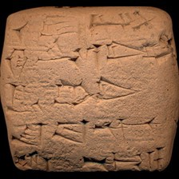 | 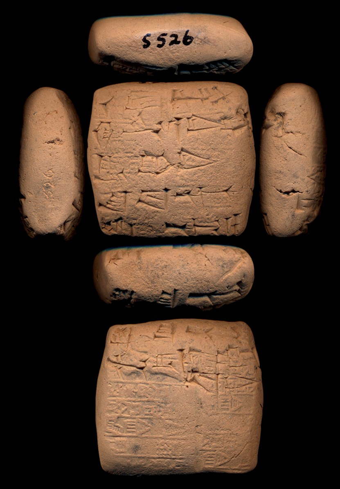 |

**Original text (transliteration):**
> - D šul - pa -

**Cuneiform (Unicode signs, whole document, not position-aligned to the text above):**
> <D> 𒂄 𒉺

**Masked input (1 positions):**
> - D šu [MASK] - pa -

### Restoration (masked-token predictions)

| # | true token | text-only top-1 | text-only top-3 | vision top-1 | vision top-3 | text-only correct | vision correct |
|---|---|---|---|---|---|---|---|
| 1 | `##l` | `##l` | `##l`, `-`, `##š` | `##l` | `##l`, `-`, `##ku` | ✅ | ✅ |

Top-1 accuracy on this example: text-only 1/1 (100%), vision 1/1 (100%)

### Metadata predictions

| head | ground truth | text-only prediction | vision prediction |
|---|---|---|---|
| period | Ur III | Ur III (0.57) | Ur III (0.77) |
| genre | Administrative | Administrative (0.80) | Administrative (0.82) |
| language | Sumerian | Sumerian (0.80) | Sumerian (0.91) |
| provenience | Umma | Umma (0.37) | Umma (0.45) |

---

## Example 12 — `P237141` (has photo: True)

| Model input (224x224 crop) | Full photo (all faces, reference only) |
|---|---|
| 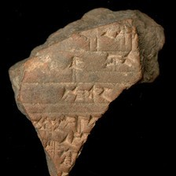 | 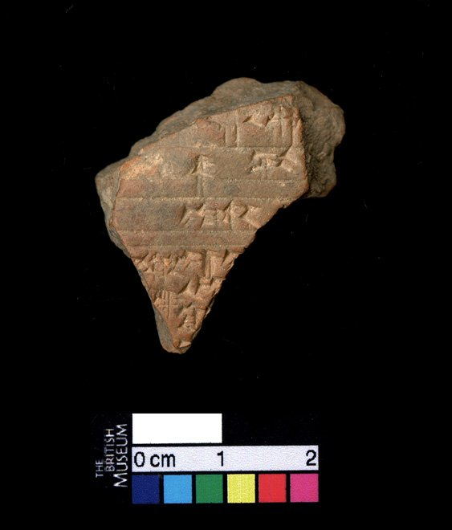 |

**Original text (transliteration):**
> EGIR - šu₂ [unused1] - ki pu - un - [unused1]

**Cuneiform (Unicode signs, whole document, not position-aligned to the text above):**
> 𒂕 𒋙 𒆠 𒁍 𒌦

**Masked input (2 positions):**
> EGIR - šu₂ [unused1] - ki [MASK] - [MASK] - [unused1]

### Restoration (masked-token predictions)

| # | true token | text-only top-1 | text-only top-3 | vision top-1 | vision top-3 | text-only correct | vision correct |
|---|---|---|---|---|---|---|---|
| 1 | `pu` | `##l` | `##l`, `##d`, `##š` | `##r` | `##r`, `##l`, `a` | ❌ | ❌ |
| 2 | `un` | `ti` | `ti`, `ma`, `nu` | `na` | `na`, `a`, `ti` | ❌ | ❌ |

Top-1 accuracy on this example: text-only 0/2 (0%), vision 0/2 (0%)

### Metadata predictions

| head | ground truth | text-only prediction | vision prediction |
|---|---|---|---|
| period | Neo-Assyrian | Neo-Assyrian (0.95) | Neo-Assyrian (0.81) |
| genre | (no label) | Royal Inscriptions (0.67) | Royal Inscriptions (0.71) |
| language | Akkadian | Akkadian (0.95) | Akkadian (0.96) |
| provenience | Nineveh | Nineveh (0.84) | Nineveh (0.88) |

---

## Example 13 — `P105707` (has photo: True)

| Model input (224x224 crop) | Full photo (all faces, reference only) |
|---|---|
| 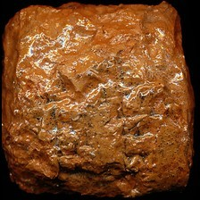 | 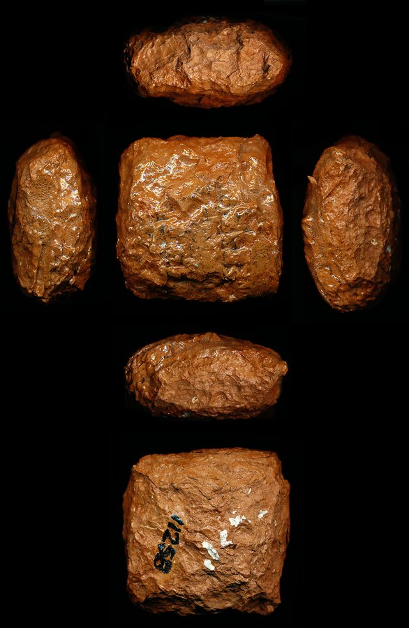 |

**Original text (transliteration):**
> 3ban₂ la₂ 2diš sila₃ še - geš - i₃ lugal

**Cuneiform (Unicode signs, whole document, not position-aligned to the text above):**
> 𒇲 𒈫 𒋡 𒊺 𒄑 𒉌 𒈗

**Masked input (2 positions):**
> 3ban₂ la₂ 2diš sila₃ [MASK] - geš - i₃ [MASK]

### Restoration (masked-token predictions)

| # | true token | text-only top-1 | text-only top-3 | vision top-1 | vision top-3 | text-only correct | vision correct |
|---|---|---|---|---|---|---|---|
| 1 | `še` | `ur` | `ur`, `lugal`, `še` | `ur` | `ur`, `lugal`, `še` | ❌ | ❌ |
| 2 | `lugal` | `-` | `-`, `gur`, `lugal` | `-` | `-`, `gur`, `ki` | ❌ | ❌ |

Top-1 accuracy on this example: text-only 0/2 (0%), vision 0/2 (0%)

### Metadata predictions

| head | ground truth | text-only prediction | vision prediction |
|---|---|---|---|
| period | Ur III | Ur III (0.91) | Ur III (0.90) |
| genre | Administrative | Administrative (0.93) | Administrative (0.95) |
| language | Sumerian | Sumerian (0.92) | Sumerian (0.92) |
| provenience | Nippur | Umma (0.89) | Umma (0.53) |

---

## Example 14 — `P272839` (has photo: True)

| Model input (224x224 crop) | Full photo (all faces, reference only) |
|---|---|
| 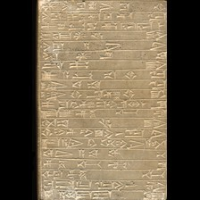 | 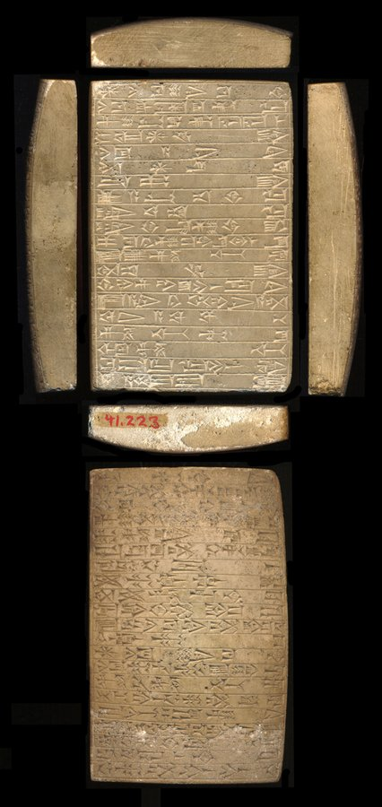 |

**Original text (transliteration):**
> sag - e - eš ha - ma - ab - rig₇ - ge u₄ - mu he - su₃ - su₃ - ud

**Cuneiform (Unicode signs, whole document, not position-aligned to the text above):**
> 𒊕 𒂊 𒌍 𒄩 𒈠 𒀊 𒉺𒄸𒁺 𒄀 𒌓 𒈬 𒄭 𒋤 𒋤 𒌓

**Masked input (4 positions):**
> sag - e [MASK] eš ha - ma [MASK] ab - rig₇ - ge u₄ [MASK] mu he - su₃ [MASK] su₃ - ud

### Restoration (masked-token predictions)

| # | true token | text-only top-1 | text-only top-3 | vision top-1 | vision top-3 | text-only correct | vision correct |
|---|---|---|---|---|---|---|---|
| 1 | `-` | `-` | `-`, `##₂`, `##₃` | `-` | `-`, `##₂`, `##₃` | ✅ | ✅ |
| 2 | `-` | `-` | `-`, `##₂`, `##₃` | `-` | `-`, `##₂`, `##₃` | ✅ | ✅ |
| 3 | `-` | `-` | `-`, `1diš`, `1u` | `-` | `-`, `1diš`, `mu` | ✅ | ✅ |
| 4 | `-` | `-` | `-`, `/`, `:` | `-` | `-`, `/`, `:` | ✅ | ✅ |

Top-1 accuracy on this example: text-only 4/4 (100%), vision 4/4 (100%)

### Metadata predictions

| head | ground truth | text-only prediction | vision prediction |
|---|---|---|---|
| period | Old Babylonian | Old Babylonian (0.72) | Old Babylonian (0.81) |
| genre | Royal Inscriptions | Literary & Scholarly (0.69) | Literary & Scholarly (0.74) |
| language | (no label) | Sumerian (0.78) | Sumerian (0.91) |
| provenience | (no label) | Nippur (0.75) | Ur (0.47) **<- differs** |

---

## Example 15 — `P388547` (has photo: True)

| Model input (224x224 crop) | Full photo (all faces, reference only) |
|---|---|
| 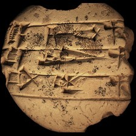 | 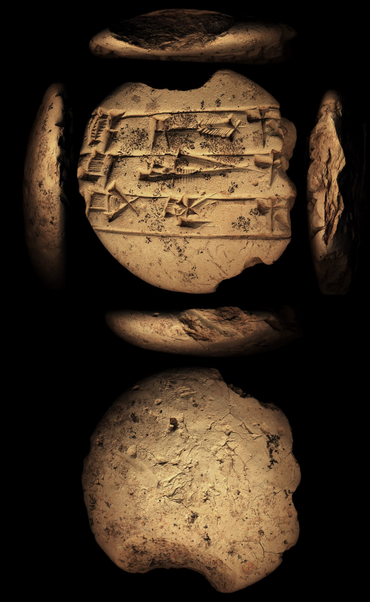 |

**Original text (transliteration):**
> e - sig₁₇ mušen ga - kad₄ mušen

**Cuneiform (Unicode signs, whole document, not position-aligned to the text above):**
> 𒂊 𒄀 𒄷 𒂵 𒆒 𒄷

**English translation (CDLI):**
> the esig bird; the shulu bird; the gakad bird

**Masked input (2 positions):**
> e - sig₁₇ [MASK]šen ga [MASK] kad₄ mušen

### Restoration (masked-token predictions)

| # | true token | text-only top-1 | text-only top-3 | vision top-1 | vision top-3 | text-only correct | vision correct |
|---|---|---|---|---|---|---|---|
| 1 | `mu` | `mu` | `mu`, `su`, `##mu` | `mu` | `mu`, `##mu`, `tu` | ✅ | ✅ |
| 2 | `-` | `-` | `-`, `##₂`, `##g` | `-` | `-`, `##₂`, `##₆` | ✅ | ✅ |

Top-1 accuracy on this example: text-only 2/2 (100%), vision 2/2 (100%)

### Metadata predictions

| head | ground truth | text-only prediction | vision prediction |
|---|---|---|---|
| period | Old Babylonian | Old Babylonian (0.72) | Old Babylonian (0.78) |
| genre | Lexical | Administrative (0.43) | Lexical (0.82) **<- differs** |
| language | (no label) | Sumerian (0.78) | Sumerian (0.85) |
| provenience | (no label) | Puzriš-Dagan (0.38) | Ur (0.62) **<- differs** |

---

## Example 16 — `P330613` (has photo: False)

**Original text (transliteration):**
> a - ša₃ an - ne₂ - [unused1] - [unused1] u₃ iti nesag

**Cuneiform (Unicode signs, whole document, not position-aligned to the text above):**
> 𒀀 𒊮 𒀭 𒉌 𒅇 𒌗

**Masked input (2 positions):**
> a [MASK] ša₃ an - ne₂ - [unused1] - [unused1] u₃ [MASK]i nesag

### Restoration (masked-token predictions)

| # | true token | text-only top-1 | text-only top-3 | vision top-1 | vision top-3 | text-only correct | vision correct |
|---|---|---|---|---|---|---|---|
| 1 | `-` | `-` | `-`, `##₂`, `##₃` | `-` | `-`, `##₂`, `##₃` | ✅ | ✅ |
| 2 | `it` | `it` | `it`, `sik`, `gaz` | `it` | `it`, `sik`, `gaz` | ✅ | ✅ |

Top-1 accuracy on this example: text-only 2/2 (100%), vision 2/2 (100%)

### Metadata predictions

| head | ground truth | text-only prediction | vision prediction |
|---|---|---|---|
| period | Ur III | Ur III (0.95) | Ur III (0.94) |
| genre | Administrative | Administrative (0.90) | Administrative (0.93) |
| language | Sumerian | Sumerian (0.94) | Sumerian (0.94) |
| provenience | Umma | Umma (0.90) | Umma (0.94) |

---

## Example 17 — `P281816` (has photo: True)

| Model input (224x224 crop) | Full photo (all faces, reference only) |
|---|---|
| 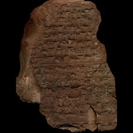 | 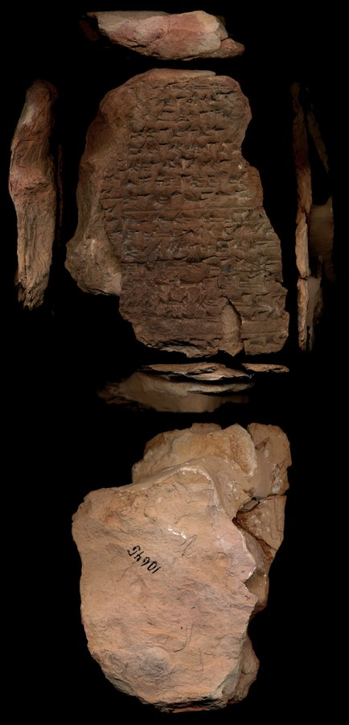 |

**Original text (transliteration):**
> ši - pir mi - šit - - šu - hi u ri - mu - numun u₂ - ra - a - nu - šim ku₇ - ku₇ šim šim še - li šu₂ - ur - tu - bal te - sek - ina a gazi sar kum₂ - ta - la - aš nig₂ - la₂ - meš DIŠ lu₂ ši - pir mi - šit - ti šu - up - šu - hi u ri - mu - ti za₃ - hi - li še - sa - la na - pa - te geš šinig ta - haš - šal ki zi₃ imgaga hi - hi ina kaš tu - šab - šal - lal - meš - ma ti - uṭ [unused1] qa - meš ti

**Cuneiform (Unicode signs, whole document, not position-aligned to the text above):**
> 𒅆 𒌓 𒈪 𒋃 𒋗 𒄭 𒌋 𒊑 𒈬 𒆰 𒌑 𒊏 𒀀 𒉡 𒋆 𒆯 𒆯 𒋆 𒋆 𒊺 𒇷 𒋙 𒌨 𒌅 𒁄 𒋼 𒀸 𒀀 𒓊 𒊬 𒉈 𒋫 𒆷 𒀸 𒃻 𒇲 𒈨𒌍 𒁹 𒇽 𒅆 𒌓 𒈪 𒋃 𒋾 𒋗 𒌒 𒋗 𒄭 𒌋 𒊑 𒈬 𒋾 𒍠 𒄭 𒇷 𒊺 𒊓 𒆷 𒈾 𒉺 𒋼 𒄑 𒋒 𒋫 𒋻 𒊩 𒆠 𒍥 𒄭 𒄭 𒀸 𒁉 𒌅 𒉺𒅁 𒊩 𒇲 𒈨𒌍 𒈠 𒋾 𒌓 𒋡 𒈨𒌍 𒋾

**Masked input (25 positions):**
> ši - pir mi - šit [MASK] - šu - hi u ri [MASK] mu - numun u₂ [MASK] ra - a [MASK] nu - ši [MASK] ku₇ - ku [MASK] šim šim še - [MASK] šu₂ - ur - tu - bal te [MASK] [MASK]k [MASK] ina a gazi [MASK]r ku [MASK]₂ - ta [MASK] la - aš nig₂ - la [MASK] - meš DIŠ lu₂ ši - pir mi [MASK] šit - ti šu - up - šu - hi u ri - mu - ti za [MASK] [MASK] hi - [MASK] še - [MASK] - la na - pa - te geš šinig ta - haš - šal ki zi₃ imgaga [MASK] - hi ina kaš tu - [MASK]b - [MASK] [MASK] - lal - meš [MASK] ma ti - uṭ [unused1] qa - meš [MASK]

### Restoration (masked-token predictions)

| # | true token | text-only top-1 | text-only top-3 | vision top-1 | vision top-3 | text-only correct | vision correct |
|---|---|---|---|---|---|---|---|
| 1 | `-` | `##₂` | `##₂`, `##₃`, `ti` | `##₂` | `##₂`, `pu`, `##₃` | ❌ | ❌ |
| 2 | `-` | `-` | `-`, `##₂`, `.` | `-` | `-`, `.`, `/` | ✅ | ✅ |
| 3 | `-` | `-` | `-`, `u`, `ina` | `-` | `-`, `.`, `a` | ✅ | ✅ |
| 4 | `-` | `-` | `-`, `ina`, `u` | `-` | `-`, `ina`, `u` | ✅ | ✅ |
| 5 | `##m` | `##m` | `##m`, `-`, `##t` | `##m` | `##m`, `-`, `##t` | ✅ | ✅ |
| 6 | `##₇` | `##₇` | `##₇`, `##₅`, `##₃` | `##₇` | `##₇`, `##₅`, `##₃` | ✅ | ✅ |
| 7 | `li` | `bi` | `bi`, `li`, `ri` | `bi` | `bi`, `me`, `ep` | ❌ | ❌ |
| 8 | `-` | `-` | `-`, `##š`, `##₂` | `-` | `-`, `##š`, `##₂` | ✅ | ✅ |
| 9 | `se` | `la` | `la`, `ri`, `ša` | `ri` | `ri`, `la`, `še` | ❌ | ❌ |
| 10 | `-` | `##₂` | `##₂`, `-`, `ki` | `##₂` | `##₂`, `ki`, `-` | ❌ | ❌ |
| 11 | `sa` | `sa` | `sa`, `pi`, `ki` | `sa` | `sa`, `pi`, `bu` | ✅ | ✅ |
| 12 | `##m` | `u` | `u`, `##l`, `##š` | `u` | `u`, `##l`, `##š` | ❌ | ❌ |
| 13 | `-` | `-` | `-`, `##₂`, `##š` | `-` | `-`, `##₂`, `##š` | ✅ | ✅ |
| 14 | `##₂` | `##l` | `##l`, `##₂`, `##m` | `##₂` | `##₂`, `##l`, `##m` | ❌ | ✅ |
| 15 | `-` | `-` | `-`, `.`, `##₂` | `-` | `-`, `.`, `##₂` | ✅ | ✅ |
| 16 | `##₃` | `##h` | `##h`, `##r`, `##₃` | `##r` | `##r`, `##h`, `##₃` | ❌ | ❌ |
| 17 | `-` | `-` | `-`, `na`, `a` | `-` | `-`, `a`, `na` | ✅ | ✅ |
| 18 | `li` | `a` | `a`, `li`, `i` | `a` | `a`, `ir`, `i` | ❌ | ❌ |
| 19 | `sa` | `bi` | `bi`, `ba`, `e` | `bi` | `bi`, `ba`, `bu` | ❌ | ❌ |
| 20 | `hi` | `##₃` | `##₃`, `##g`, `##š` | `##₃` | `##₃`, `##₄`, `a` | ❌ | ❌ |
| 21 | `ša` | `u` | `u`, `ša`, `šu` | `u` | `u`, `ša`, `šu` | ❌ | ❌ |
| 22 | `ša` | `bi` | `bi`, `ba`, `ta` | `bi` | `bi`, `ba`, `bu` | ❌ | ❌ |
| 23 | `##l` | `##₂` | `##₂`, `ki`, `##l` | `ta` | `ta`, `##₂`, `ka` | ❌ | ❌ |
| 24 | `-` | `-` | `-`, `u`, `ina` | `-` | `-`, `ki`, `ina` | ✅ | ✅ |
| 25 | `ti` | `ina` | `ina`, `ana`, `u` | `ki` | `ki`, `ina`, `-` | ❌ | ❌ |

Top-1 accuracy on this example: text-only 11/25 (44%), vision 12/25 (48%)

### Metadata predictions

| head | ground truth | text-only prediction | vision prediction |
|---|---|---|---|
| period | Middle Assyrian | Neo-Assyrian (0.84) | Neo-Assyrian (0.88) |
| genre | Literary & Scholarly | Literary & Scholarly (0.72) | Literary & Scholarly (0.81) |
| language | (no label) | Akkadian (0.95) | Akkadian (0.94) |
| provenience | (no label) | Assur (0.63) | Assur (0.58) |

---

## Example 18 — `P272556` (has photo: True)

| Model input (224x224 crop) | Full photo (all faces, reference only) |
|---|---|
| 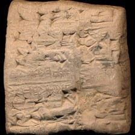 | 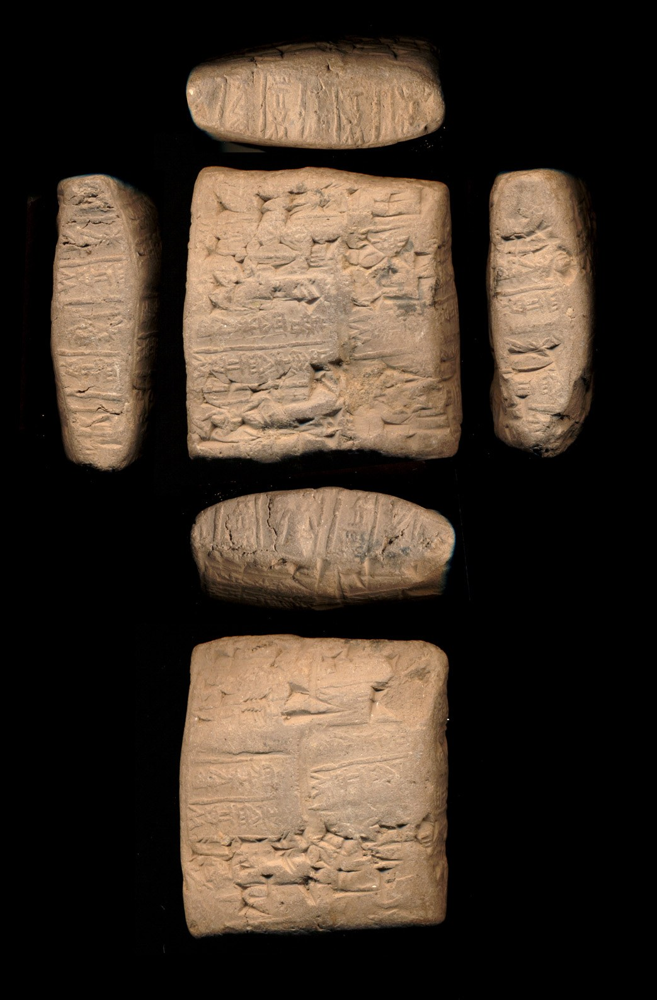 |

**Original text (transliteration):**
> maš₂ - bi - še₃ gu - ru - dumu puzur₄ - zi - da

**Cuneiform (Unicode signs, whole document, not position-aligned to the text above):**
> 𒈧 𒁉 𒂠 𒄖 𒊒 𒌉 𒅤𒊭 𒍣 𒁕

**Masked input (3 positions):**
> maš₂ - bi - [MASK]₃ gu [MASK] ru - dumu puzur₄ - zi [MASK] da

### Restoration (masked-token predictions)

| # | true token | text-only top-1 | text-only top-3 | vision top-1 | vision top-3 | text-only correct | vision correct |
|---|---|---|---|---|---|---|---|
| 1 | `še` | `še` | `še`, `am`, `de` | `še` | `še`, `de`, `am` | ✅ | ✅ |
| 2 | `-` | `-` | `-`, `##₂`, `##₄` | `-` | `-`, `##₂`, `##₄` | ✅ | ✅ |
| 3 | `-` | `-` | `-`, `##₂`, `##₃` | `-` | `-`, `:`, `+` | ✅ | ✅ |

Top-1 accuracy on this example: text-only 3/3 (100%), vision 3/3 (100%)

### Metadata predictions

| head | ground truth | text-only prediction | vision prediction |
|---|---|---|---|
| period | Ur III | Ur III (0.91) | Ur III (0.92) |
| genre | Administrative | Administrative (0.91) | Administrative (0.92) |
| language | Sumerian | Sumerian (0.94) | Sumerian (0.94) |
| provenience | Girsu | Umma (0.63) | Umma (0.41) |

---

## Example 19 — `P269086` (has photo: False)

**Original text (transliteration):**
> [unused2] - za nar - e - [unused2] [unused2] UR ŠID. ŠID - na [unused2] [unused2] - ŋal₂ - u₃ du₁₄ ga - e - [unused1] - [unused1] [unused2] is - hab₂ lu₂ enim - ma teš₂ nu - tuku di - še₃ gu₂ [unused2] ki - ma - an - zi₂ - ir lu₂ kal - e nu - zu saŋ erin₂ - na [unused2] lu₂ izim nu - KU šaha₂ lu - hu - um - ma su₃ - ga [unused2] engar du₁₀ gu - du keše₂ eme ḪAR dim₂ - ma a - ha [unused2] lu₂ [unused1] nu - tuku kuŋ₂ ka - bi - še₃ šub - ba niŋ₂ ni₂ - [unused2] eh₃ eheh e - sir₂ daŋal - la lu₂ nam - [unused2] enim si₃ - si₃ umuš dim₂ - ma MUNUS ka tar - re [unused2] lu₂ - ra ge₁₇ gala muš lah₅ - e tub₂ - tub₂ [unused2] [unused1] gu₃ de₂ za₃ - za₃ a nu - ŋal₂ gu₃ [unused2] [unused2] ni un - zi e₂ [unused2] kar he₂ - en - du₃ tilla₂ iri [unused1] ; hu - mu - ni - in - TUG₂

**Cuneiform (Unicode signs, whole document, not position-aligned to the text above):**
> [#] 𒍝 𒈜 𒂊 [#] [#] 𒌨 𒋃 𒋃 𒈾 [#] [#] 𒅅 𒅇 𒈌 𒂵 𒂊 X X [#] 𒄑 𒇥 𒇽 𒅗 𒈠 𒌨 𒉡 𒌇 𒁲 𒂠 𒄘 [#] 𒆠 𒈠 𒀭 𒍢 𒅕 𒇽 𒆗 𒂊 𒉡 𒍪 𒊕 𒂟 𒈾 [#] 𒇽 𒂡 𒉡 𒆪 𒂄 𒇻 𒄷 𒌝 𒈠 𒋤 𒂵 [#] 𒁹 𒀳 𒄭 𒄖 𒁺 𒆟 𒅴 𒄯 𒁶 𒈠 𒀀 𒄩 [#] 𒇽 X 𒉡 𒌇 𒆲 𒅗 𒁉 𒂠 𒊒 𒁀 𒃻 𒉎 [#] 𒆪𒆪 𒆪𒆪𒆪 𒂊 𒁍 𒂼 𒆷 𒇽 𒉆 [#] 𒅗 𒋧 𒋧 𒌆 𒁶 𒈠 𒊩 𒅗 𒋻 𒊑 [#] 𒇽 𒊏 𒍼 𒍑𒆪 𒈲 𒁺𒁺 𒂊 𒂀 𒂀 [#] X 𒅗 𒌤 𒄑 𒍠 𒍠 𒀀 𒉡 𒅅 𒅗 [#] [#] 𒉌 𒌦 𒍣 𒂍 [#] 𒋼𒀀 𒃶 𒂗 𒆕 𒀭𒀸𒀭 𒌷 X 𒄷 𒈬 𒉌 𒅔 𒌆

**Masked input (38 positions):**
> [unused2] - za nar - e - [unused2] [unused2] UR ŠID. ŠID - na [unused2] [unused2] - [MASK]al₂ - u₃ du₁₄ [MASK] - e - [unused1] - [unused1] [unused2] is - hab [MASK] [MASK] [MASK] enim [MASK] ma teš₂ nu - tuku di - še₃ gu₂ [unused2] ki - ma - an - zi₂ - ir lu [MASK] kal - e [MASK] - [MASK] saŋ eri [MASK]₂ - na [unused2] lu₂ izim [MASK] - KU šaha₂ lu - hu - um - ma su₃ - ga [unused2] engar [MASK]₁₀ gu - [MASK] keše₂ eme ḪAR dim₂ - ma a - ha [unused2] lu₂ [unused1] nu - [MASK]ku kuŋ₂ ka [MASK] bi - še₃ šub - ba niŋ₂ ni₂ - [unused2] [MASK]h₃ eheh e - sir₂ daŋal - la lu₂ nam - [unused2] enim si [MASK] - si₃ umu [MASK] dim₂ - ma [MASK] [MASK]US [MASK] tar - re [unused2] lu₂ - ra ge₁ [MASK] gala [MASK]š lah₅ - e tu [MASK]₂ - tub₂ [unused2] [unused1] gu [MASK] de₂ za [MASK] - za [MASK] a nu - [MASK]al [MASK] gu₃ [unused2] [unused2] ni un [MASK] zi e₂ [unused2] [MASK] he [MASK] - en [MASK] du₃ tilla₂ iri [unused1] [MASK] [MASK] - mu - ni - in [MASK] TU [MASK] [MASK]

### Restoration (masked-token predictions)

| # | true token | text-only top-1 | text-only top-3 | vision top-1 | vision top-3 | text-only correct | vision correct |
|---|---|---|---|---|---|---|---|
| 1 | `ŋ` | `ŋ` | `ŋ`, `dag`, `kis` | `ŋ` | `ŋ`, `kis`, `##ŋ` | ✅ | ✅ |
| 2 | `ga` | `nar` | `nar`, `kar`, `me` | `nar` | `nar`, `ur`, `me` | ❌ | ❌ |
| 3 | `##₂` | `-` | `-`, `##₂`, `##₃` | `##₂` | `##₂`, `-`, `##₃` | ❌ | ✅ |
| 4 | `lu` | `-` | `-`, `še`, `lu` | `-` | `-`, `še`, `lu` | ❌ | ❌ |
| 5 | `##₂` | `##₂` | `##₂`, `##₃`, `-` | `##₂` | `##₂`, `-`, `ra` | ✅ | ✅ |
| 6 | `-` | `-` | `-`, `ki`, `##₂` | `-` | `-`, `##₂`, `ki` | ✅ | ✅ |
| 7 | `##₂` | `##₂` | `##₂`, `-`, `##₃` | `##₂` | `##₂`, `-`, `##₃` | ✅ | ✅ |
| 8 | `nu` | `##₃` | `##₃`, `##₂`, `##b` | `##₃` | `##₃`, `##₂`, `##b` | ❌ | ❌ |
| 9 | `zu` | `a` | `a`, `na`, `bi` | `a` | `a`, `na`, `la` | ❌ | ❌ |
| 10 | `##n` | `##n` | `##n`, `##m`, `##d` | `##n` | `##n`, `##m`, `##d` | ✅ | ✅ |
| 11 | `nu` | `##₃` | `##₃`, `##₂`, `nu` | `##₃` | `##₃`, `##₂`, `##₆` | ❌ | ❌ |
| 12 | `du` | `du` | `du`, `sa`, `gu` | `du` | `du`, `sa`, `gu` | ✅ | ✅ |
| 13 | `du` | `za` | `za`, `la`, `ba` | `za` | `za`, `la`, `un` | ❌ | ❌ |
| 14 | `tu` | `tu` | `tu`, `šu`, `ti` | `tu` | `tu`, `šu`, `mu` | ✅ | ✅ |
| 15 | `-` | `-` | `-`, `##₂`, `##š` | `-` | `-`, `##l`, `##₂` | ✅ | ✅ |
| 16 | `e` | `za` | `za`, `su`, `u` | `za` | `za`, `u`, `su` | ❌ | ❌ |
| 17 | `##₃` | `##₃` | `##₃`, `##₂`, `##₄` | `##₃` | `##₃`, `##₂`, `##₄` | ✅ | ✅ |
| 18 | `##š` | `##₄` | `##₄`, `##₃`, `##₂` | `##₂` | `##₂`, `##₃`, `##₄` | ❌ | ❌ |
| 19 | `MU` | `B` | `B`, `H`, `MU` | `B` | `B`, `MU`, `U` | ❌ | ❌ |
| 20 | `##N` | `##N` | `##N`, `##R`, `##G` | `##N` | `##N`, `##R`, `##G` | ✅ | ✅ |
| 21 | `ka` | `-` | `-`, `ki`, `.` | `-` | `-`, `ki`, `KA` | ❌ | ❌ |
| 22 | `##₇` | `##₁` | `##₁`, `##₇`, `##₀` | `##₁` | `##₁`, `##₀`, `##₇` | ❌ | ❌ |
| 23 | `mu` | `tu` | `tu`, `ku`, `še` | `ku` | `ku`, `ka`, `mu` | ❌ | ❌ |
| 24 | `##b` | `##b` | `##b`, `##l`, `##d` | `##b` | `##b`, `##ba`, `##l` | ✅ | ✅ |
| 25 | `##₃` | `##₃` | `##₃`, `##₂`, `-` | `##₃` | `##₃`, `##₂`, `-` | ✅ | ✅ |
| 26 | `##₃` | `##₃` | `##₃`, `##r`, `##bar` | `##₃` | `##₃`, `za`, `##r` | ✅ | ✅ |
| 27 | `##₃` | `-` | `-`, `##₂`, `ki` | `-` | `-`, `##₂`, `ki` | ❌ | ❌ |
| 28 | `ŋ` | `ŋ` | `ŋ`, `dag`, `kis` | `ŋ` | `ŋ`, `dag`, `kis` | ✅ | ✅ |
| 29 | `##₂` | `##₂` | `##₂`, `-`, `##₃` | `##₂` | `##₂`, `-`, `##₃` | ✅ | ✅ |
| 30 | `-` | `-` | `-`, `##₃`, `##₂` | `-` | `-`, `##₂`, `##₃` | ✅ | ✅ |
| 31 | `kar` | `-` | `-`, `mu`, `ni` | `-` | `-`, `ni`, `mu` | ❌ | ❌ |
| 32 | `##₂` | `##₂` | `##₂`, `##₃`, `##š` | `##₂` | `##₂`, `##₃`, `##š` | ✅ | ✅ |
| 33 | `-` | `-` | `-`, `##₂`, `##₃` | `-` | `-`, `##₂`, `##₆` | ✅ | ✅ |
| 34 | `;` | `-` | `-`, `i`, `ni` | `-` | `-`, `e`, `ni` | ❌ | ❌ |
| 35 | `hu` | `##₂` | `##₂`, `##₃`, `nu` | `##₂` | `##₂`, `##₃`, `a` | ❌ | ❌ |
| 36 | `-` | `-` | `-`, `ki`, `mu` | `-` | `-`, `ki`, `mu` | ✅ | ✅ |
| 37 | `##G` | `##K` | `##K`, `##G`, `##R` | `##K` | `##K`, `##G`, `##R` | ❌ | ❌ |
| 38 | `##₂` | `##₂` | `##₂`, `##2`, `-` | `##2` | `##2`, `-`, `##U` | ✅ | ❌ |

Top-1 accuracy on this example: text-only 20/38 (53%), vision 20/38 (53%)

### Metadata predictions

| head | ground truth | text-only prediction | vision prediction |
|---|---|---|---|
| period | Old Babylonian | Old Babylonian (0.93) | Old Babylonian (0.91) |
| genre | Literary & Scholarly | Literary & Scholarly (0.93) | Literary & Scholarly (0.95) |
| language | Sumerian | Sumerian (0.92) | Sumerian (0.91) |
| provenience | Nippur | Nippur (0.75) | Nippur (0.67) |

---

## Example 20 — `P121408` (has photo: False)

**Original text (transliteration):**
> ku₃ ARAD2 - da 3diš gin₂ ku₃ NI u₄ - du₈ - a sa₁₀ 1u še ku₃ NI ša₃ 1diš ma - na šunigin 1u 1 / 2diš gin₂ 1u še ku₃ - babbar ki ad - [unused1] - ta

**Cuneiform (Unicode signs, whole document, not position-aligned to the text above):**
> 𒆬 𒀵 𒁕 𒐈 𒂆 𒆬 𒉌 𒌓 𒃮 𒀀 𒉚 𒌋 𒊺 𒆬 𒉌 𒊮 𒁹 𒈠 𒈾 𒋗𒃸 𒌋 𒈦 𒂆 𒌋 𒊺 𒆬 𒌓 𒆠 𒀜 𒋫

**Masked input (8 positions):**
> ku₃ ARAD2 - da 3diš gin [MASK] ku₃ NI u₄ - du [MASK] - a sa₁₀ 1u [MASK] ku [MASK] NI [MASK]₃ 1diš ma - na šunig [MASK] 1u 1 / [MASK] gin₂ 1u še ku₃ - babbar ki ad [MASK] [unused1] - ta

### Restoration (masked-token predictions)

| # | true token | text-only top-1 | text-only top-3 | vision top-1 | vision top-3 | text-only correct | vision correct |
|---|---|---|---|---|---|---|---|
| 1 | `##₂` | `##₂` | `##₂`, `##₃`, `-` | `##₂` | `##₂`, `##₃`, `-` | ✅ | ✅ |
| 2 | `##₈` | `##₈` | `##₈`, `##₃`, `##₇` | `##₈` | `##₈`, `##₃`, `##₇` | ✅ | ✅ |
| 3 | `še` | `še` | `še`, `5diš`, `2diš` | `5diš` | `5diš`, `še`, `2diš` | ✅ | ❌ |
| 4 | `##₃` | `##₃` | `##₃`, `-`, `##₂` | `##₃` | `##₃`, `-`, `##š` | ✅ | ✅ |
| 5 | `ša` | `u` | `u`, `ku`, `ša` | `u` | `u`, `ku`, `ša` | ❌ | ❌ |
| 6 | `##in` | `##in` | `##in`, `##n`, `##i` | `##in` | `##in`, `##n`, `##i` | ✅ | ✅ |
| 7 | `2diš` | `2diš` | `2diš`, `3diš`, `4diš` | `2diš` | `2diš`, `3diš`, `4diš` | ✅ | ✅ |
| 8 | `-` | `-` | `-`, `##₂`, `##₃` | `-` | `-`, `##₂`, `D` | ✅ | ✅ |

Top-1 accuracy on this example: text-only 7/8 (88%), vision 6/8 (75%)

### Metadata predictions

| head | ground truth | text-only prediction | vision prediction |
|---|---|---|---|
| period | Ur III | Ur III (0.93) | Ur III (0.90) |
| genre | Administrative | Administrative (0.90) | Administrative (0.88) |
| language | Sumerian | Sumerian (0.93) | Sumerian (0.94) |
| provenience | Nippur | Umma (0.74) | Umma (0.59) |

---
