# Prediction demo: text-only vs vision (provenience) model

8 hand-picked tablet(s) (`--tablet_ids`). Both models see the exact same masked positions per example (`[MASK]` shown at every chosen position, 15% of eligible tokens) -- differences in restoration come only from the two models' separately trained weights, not from the image itself (the image only reaches `provenience_head`, see module docstring). The metadata table's `provenience` row is where the image can actually change an answer.

## Example 1 — `P273207` (has photo: True)

| Model input (224x224 crop) | Full photo (all faces, reference only) |
|---|---|
| 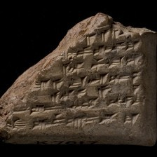 | 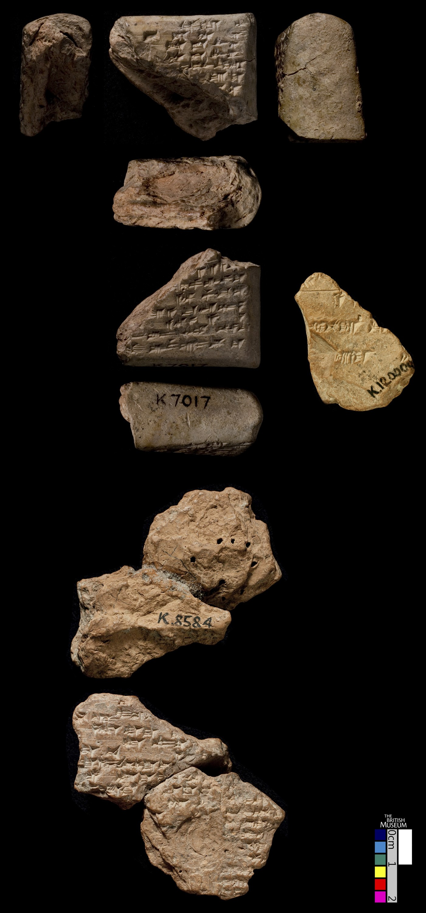 |

**Original text (transliteration):**
> [unused1] [unused1] pi e taš - hu [unused1] im - mar [unused1] ib - bu - u [unused1] ib - ši šu i - nak - kir [unused1]

**Cuneiform (Unicode signs, whole document, not position-aligned to the text above):**
> x x 𒉿 𒂊 𒌨 𒄷 x 𒅎 𒈥 x 𒅁 𒁍 𒌋 x 𒅁 𒅆 𒋗 𒄿 𒅘 𒄫 x

**Masked input (4 positions):**
> [unused1] [unused1] [MASK] e ta [MASK] - hu [unused1] im - mar [unused1] ib - bu - u [unused1] ib - ši šu i - [MASK] - ki [MASK] [unused1]

### Restoration (masked-token predictions)

| # | true token | text-only top-1 | text-only top-3 | vision top-1 | vision top-3 | text-only correct | vision correct |
|---|---|---|---|---|---|---|---|
| 1 | `pi` | `-` | `-`, `a`, `ki` | `-` | `-`, `šu`, `a` | ❌ | ❌ |
| 2 | `##š` | `##h` | `##h`, `##š`, `##q` | `##h` | `##h`, `##š`, `##q` | ❌ | ❌ |
| 3 | `nak` | `na` | `na`, `nu`, `ta` | `na` | `na`, `nu`, `la` | ❌ | ❌ |
| 4 | `##r` | `-` | `-`, `##š`, `##r` | `-` | `-`, `##š`, `šu` | ❌ | ❌ |

Top-1 accuracy on this example: text-only 0/4 (0%), vision 0/4 (0%)

### Metadata predictions

| head | ground truth | text-only prediction | vision prediction |
|---|---|---|---|
| period | Neo-Assyrian | Neo-Assyrian (0.64) | Neo-Assyrian (0.75) |
| genre | Literary & Scholarly | Literary & Scholarly (0.61) | Letters (0.40) **<- differs** |
| language | Akkadian | Akkadian (0.89) | Akkadian (0.94) |
| provenience | Nineveh | Nineveh (0.85) | Nineveh (0.96) |

---

## Example 2 — `P285823` (has photo: True)

| Model input (224x224 crop) | Full photo (all faces, reference only) |
|---|---|
| 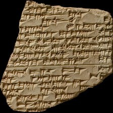 | 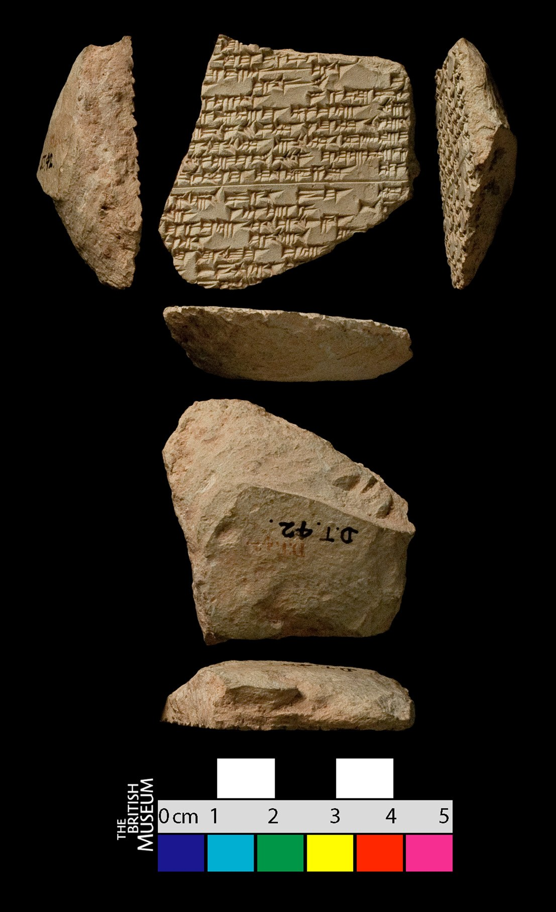 |

**Original text (transliteration):**
> [unused1] lu - u [unused1] [unused1] ki - ma kip - pa - ti₃ [unused1] u da - an e - liš u š [unused1] - e pe - hi giš a - dan - na ša₂ a - šap - pa - rak - e - ru - um - ma KA₂ giš MA₂ tir - ib₃ - bi - ša₂ ŠE. BAR - ka NIG₂. ŠU - ka u NIG₂. GA - a ki - mat - ka sa - lat - ka u DUMU - MEŠ um - m DIN u₂ - ma - am EDIN ma - la U₂. ŠIM me - er - a - rak - kum₂ - ma i - na - aṣ - ṣa - ru KA₂ - k a - ha - sis pa - a - šu₂ DU₃ - ma DUG₄. G - kar ana De₂ - a be - li₂ - i - ma - a giš MA₂ ul e - pu - uš [unused1] a - ri e - ṣir u₂ - ṣ r - tu lu - mur - ma giš MA₂ - a ina qaq - qa - ri e - e - li₂ ša₂ taq - ba - a

**Cuneiform (Unicode signs, whole document, not position-aligned to the text above):**
> x 𒇻 𒌋 x x 𒆠 𒈠 𒄒 𒉺 x 𒌋 𒁕 𒀭 𒂊 𒇺 𒌋 š 𒂊 𒉿 𒄭 𒄑 𒀀 𒄨 𒈾 𒃻 𒀀 𒉺𒅁 𒉺 𒊩 𒂊 𒊒 𒌝 𒈠 𒄑 𒌁 𒁉 𒃻 𒅗 𒅗 𒌋 𒀀 𒆠 𒆳 𒅗 𒊓 𒆳 𒅗 𒌋 𒌉 𒈨𒌍 𒌝 𒁹 𒁷 𒌑 𒈠 𒄠 𒂔 𒈠 𒆷 𒈨 𒅕 𒀀 𒊩 𒈠 𒄿 𒈾 𒊍 𒍝 𒊒 𒀀 𒄩 𒋀 𒉺 𒀀 𒋙 𒈠 𒋼𒀀 𒁹 𒀀 𒁁 𒉌 𒄿 𒈠 𒀀 𒄑 𒌌 𒂊 𒁍 𒍑 x 𒀀 𒊑 𒂊 𒈲 𒌑 ṣ 𒌅 𒇻 𒄯 𒈠 𒄑 𒀀 𒀸 𒆕 𒋡 𒊑 𒂊 𒂊 𒉌 𒃻 𒋳 𒁀 𒀀

**Masked input (37 positions):**
> [unused1] lu [MASK] u [unused1] [unused1] ki - ma [MASK] [MASK] [MASK] pa - ti₃ [unused1] u da - an e - liš u [MASK] [unused1] [MASK] e pe [MASK] hi giš a - dan - na [MASK]₂ a - ša [MASK] - pa - rak - e - ru - [MASK] - ma KA₂ [MASK] [MASK] [MASK]₂ [MASK] - ib [MASK] - bi - ša₂ ŠE [MASK] [MASK]R - ka NIG₂. ŠU - ka u NIG₂. GA - a ki - mat - ka sa - lat - ka u DUMU - MEŠ um - m [MASK] [MASK]₂ - ma - am [MASK]IN ma - la U₂. ŠIM me - er - a [MASK] rak - kum₂ - ma i - [MASK] - aṣ [MASK] ṣa - ru KA₂ - [MASK] [MASK] - ha [MASK] sis pa - a - šu₂ DU₃ - ma [MASK]G₄. G - kar [MASK] De₂ - a be [MASK] li₂ - [MASK] - ma - a [MASK] [MASK] MA₂ ul e [MASK] pu - uš [unused1] a - ri e - ṣir u [MASK] [MASK] ṣ r - tu lu - mur - ma giš MA₂ - a ina qaq - qa [MASK] ri e - e - [MASK]₂ ša₂ taq - ba - a

### Restoration (masked-token predictions)

| # | true token | text-only top-1 | text-only top-3 | vision top-1 | vision top-3 | text-only correct | vision correct |
|---|---|---|---|---|---|---|---|
| 1 | `-` | `-` | `-`, `##₂`, `lu` | `-` | `-`, `##₂`, `##m` | ✅ | ✅ |
| 2 | `ki` | `-` | `-`, `ša`, `a` | `-` | `-`, `ša`, `u` | ❌ | ❌ |
| 3 | `##p` | `##₂` | `##₂`, `-`, `##p` | `##₂` | `##₂`, `-`, `##p` | ❌ | ❌ |
| 4 | `-` | `-` | `-`, `na`, `ina` | `-` | `-`, `ina`, `na` | ✅ | ✅ |
| 5 | `š` | `##₃` | `##₃`, `##₂`, `-` | `##₃` | `##₃`, `##₂`, `-` | ❌ | ❌ |
| 6 | `-` | `-` | `-`, `lu`, `la` | `-` | `-`, `ša`, `la` | ✅ | ✅ |
| 7 | `-` | `-` | `-`, `##₂`, `##š` | `-` | `-`, `##₂`, `##š` | ✅ | ✅ |
| 8 | `ša` | `ša` | `ša`, `E`, `MA` | `ša` | `ša`, `MA`, `E` | ✅ | ✅ |
| 9 | `##p` | `##₂` | `##₂`, `##p`, `##l` | `##₂` | `##₂`, `##p`, `##l` | ❌ | ❌ |
| 10 | `um` | `um` | `um`, `uk`, `uš` | `um` | `um`, `uk`, `ti` | ✅ | ✅ |
| 11 | `gi` | `-` | `-`, `.`, `u` | `-` | `-`, `.`, `u` | ❌ | ❌ |
| 12 | `##š` | `MEŠ` | `MEŠ`, `ka`, `ia` | `MEŠ` | `MEŠ`, `ia`, `a` | ❌ | ❌ |
| 13 | `MA` | `ša` | `ša`, `E`, `KA` | `ša` | `ša`, `E`, `KA` | ❌ | ❌ |
| 14 | `tir` | `li` | `li`, `ši`, `zi` | `li` | `li`, `zi`, `ti` | ❌ | ❌ |
| 15 | `##₃` | `##₂` | `##₂`, `a`, `##₃` | `##₂` | `##₂`, `a`, `##₃` | ❌ | ❌ |
| 16 | `.` | `.` | `.`, `-`, `u` | `.` | `.`, `-`, `##₂` | ✅ | ✅ |
| 17 | `BA` | `BA` | `BA`, `GA`, `GU` | `BA` | `BA`, `GA`, `GU` | ✅ | ✅ |
| 18 | `DIN` | `-` | `-`, `ina`, `ša` | `-` | `-`, `ša`, `ṭ` | ❌ | ❌ |
| 19 | `u` | `aš` | `aš`, `##l`, `u` | `u` | `u`, `##l`, `aš` | ❌ | ✅ |
| 20 | `ED` | `ED` | `ED`, `T`, `ER` | `ED` | `ED`, `T`, `ER` | ✅ | ✅ |
| 21 | `-` | `-` | `-`, `ina`, `u` | `-` | `-`, `ina`, `u` | ✅ | ✅ |
| 22 | `na` | `na` | `na`, `ta`, `ba` | `na` | `na`, `ta`, `ba` | ✅ | ✅ |
| 23 | `-` | `-` | `-`, `.`, `##₂` | `-` | `-`, `.`, `##₂` | ✅ | ✅ |
| 24 | `k` | `MEŠ` | `MEŠ`, `ka`, `ia` | `MEŠ` | `MEŠ`, `ia`, `ma` | ❌ | ❌ |
| 25 | `a` | `a` | `a`, `i`, `ma` | `a` | `a`, `ma`, `i` | ✅ | ✅ |
| 26 | `-` | `-` | `-`, `.`, `##₂` | `-` | `-`, `.`, `##₂` | ✅ | ✅ |
| 27 | `DU` | `DU` | `DU`, `SI`, `NI` | `DU` | `DU`, `SI`, `NI` | ✅ | ✅ |
| 28 | `ana` | `##₂` | `##₂`, `-`, `ina` | `##₂` | `##₂`, `-`, `ina` | ❌ | ❌ |
| 29 | `-` | `-` | `-`, `##₂`, `.` | `-` | `-`, `##₂`, `.` | ✅ | ✅ |
| 30 | `i` | `šu` | `šu`, `ia`, `ka` | `ka` | `ka`, `šu`, `ia` | ❌ | ❌ |
| 31 | `gi` | `-` | `-`, `gi`, `.` | `-` | `-`, `gi`, `u` | ❌ | ❌ |
| 32 | `##š` | `a` | `a`, `ti`, `-` | `##₂` | `##₂`, `a`, `ma` | ❌ | ❌ |
| 33 | `-` | `-` | `-`, `##₂`, `.` | `-` | `-`, `##₂`, `.` | ✅ | ✅ |
| 34 | `##₂` | `##₂` | `##₂`, `a`, `##ṣ` | `##₂` | `##₂`, `a`, `ma` | ✅ | ✅ |
| 35 | `-` | `-` | `-`, `u`, `a` | `-` | `-`, `a`, `u` | ✅ | ✅ |
| 36 | `-` | `-` | `-`, `##r`, `##₂` | `-` | `-`, `##r`, `##₂` | ✅ | ✅ |
| 37 | `li` | `šu` | `šu`, `tu`, `ša` | `šu` | `šu`, `tu`, `ša` | ❌ | ❌ |

Top-1 accuracy on this example: text-only 20/37 (54%), vision 21/37 (57%)

### Metadata predictions

| head | ground truth | text-only prediction | vision prediction |
|---|---|---|---|
| period | Old Babylonian | Neo-Assyrian (0.70) | Neo-Assyrian (0.67) |
| genre | Literary & Scholarly | Literary & Scholarly (0.40) | Literary & Scholarly (0.83) |
| language | Akkadian | Akkadian (0.94) | Akkadian (0.95) |
| provenience | (no label) | Nineveh (0.66) | Nineveh (0.95) |

---

## Example 3 — `P273223` (has photo: True)

| Model input (224x224 crop) | Full photo (all faces, reference only) |
|---|---|
| 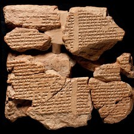 | 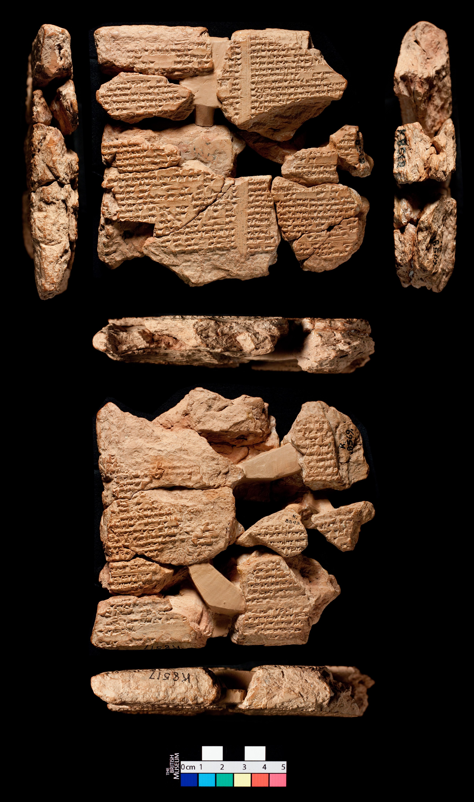 |

**Original text (transliteration):**
> i - pa - da - aš₂ - š IM mušen u₂ - maš - š - ri - ba u₂ - ar - ri ul

**Cuneiform (Unicode signs, whole document, not position-aligned to the text above):**
> 𒄿 𒉺 𒀾 š 𒅎 𒄷 𒌑 𒈦 š 𒊑 𒁀 𒌑 𒅈 𒊑 𒌌

**Masked input (4 positions):**
> i - pa - da - aš₂ [MASK] š [MASK] mušen [MASK]₂ - maš - š - ri - [MASK] u₂ - ar - ri ul

### Restoration (masked-token predictions)

| # | true token | text-only top-1 | text-only top-3 | vision top-1 | vision top-3 | text-only correct | vision correct |
|---|---|---|---|---|---|---|---|
| 1 | `-` | `-` | `-`, `ša`, `ul` | `-` | `-`, `ul`, `ina` | ✅ | ✅ |
| 2 | `IM` | `-` | `-`, `##₂`, `##₃` | `-` | `-`, `##₂`, `##₃` | ❌ | ❌ |
| 3 | `u` | `u` | `u`, `e`, `ša` | `u` | `u`, `e`, `ša` | ✅ | ✅ |
| 4 | `ba` | `im` | `im`, `iš`, `šu` | `im` | `im`, `iš`, `šu` | ❌ | ❌ |

Top-1 accuracy on this example: text-only 2/4 (50%), vision 2/4 (50%)

### Metadata predictions

| head | ground truth | text-only prediction | vision prediction |
|---|---|---|---|
| period | Neo-Assyrian | Late Antiquity (0.36) | Neo-Babylonian (0.45) **<- differs** |
| genre | Literary & Scholarly | Administrative (0.50) | Literary & Scholarly (0.47) **<- differs** |
| language | Akkadian | Akkadian (0.57) | Akkadian (0.65) |
| provenience | Nineveh | Nineveh (0.28) | Nineveh (0.87) |

---

## Example 4 — `P402919` (has photo: True)

| Model input (224x224 crop) | Full photo (all faces, reference only) |
|---|---|
| 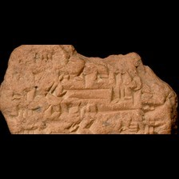 |  |

**Original text (transliteration):**
> mul - lil a - na du - un - n - bit DINGIR - MEŠ ša₂

**Cuneiform (Unicode signs, whole document, not position-aligned to the text above):**
> 𒀯 𒇸 𒀀 𒈾 𒁺 𒌦 𒂍 𒀭 𒈨𒌍 𒃻

**Masked input (3 positions):**
> mul - li [MASK] a [MASK] na du - [MASK] - n - bit DINGIR - MEŠ ša₂

### Restoration (masked-token predictions)

| # | true token | text-only top-1 | text-only top-3 | vision top-1 | vision top-3 | text-only correct | vision correct |
|---|---|---|---|---|---|---|---|
| 1 | `##l` | `##m` | `##m`, `##₂`, `##l` | `##m` | `##m`, `##l`, `##₂` | ❌ | ❌ |
| 2 | `-` | `-` | `-`, `.`, `+` | `-` | `-`, `+`, `.` | ✅ | ✅ |
| 3 | `un` | `u` | `u`, `na`, `du` | `u` | `u`, `un`, `du` | ❌ | ❌ |

Top-1 accuracy on this example: text-only 1/3 (33%), vision 1/3 (33%)

### Metadata predictions

| head | ground truth | text-only prediction | vision prediction |
|---|---|---|---|
| period | Neo-Assyrian | Neo-Assyrian (0.80) | Neo-Assyrian (0.92) |
| genre | Literary & Scholarly | Letters (0.34) | Literary & Scholarly (0.35) **<- differs** |
| language | Akkadian | Akkadian (0.97) | Akkadian (0.97) |
| provenience | Nineveh | Nineveh (0.75) | Nineveh (0.94) |

---

## Example 5 — `ebl:BM.42004` (has photo: False)

**Original text (transliteration):**
> [unused1] giš TUKUL i - [unused1] ina giš GU. ZA [unused1] il₂ KA - šu₂ D zag - ga - [unused1] [unused1]

**Cuneiform (Unicode signs, whole document, not position-aligned to the text above):**
> x 𒄑 𒆪 𒄿 x 𒀸 𒄑 x 𒅍 𒅗 𒋙 𒀭 𒍠 𒂵 x

**Masked input (4 positions):**
> [unused1] giš [MASK] [MASK]UL i - [unused1] ina giš GU [MASK] [MASK]A [unused1] il₂ KA - šu₂ D zag - ga - [unused1] [unused1]

### Restoration (masked-token predictions)

| # | true token | text-only top-1 | text-only top-3 | vision top-1 | vision top-3 | text-only correct | vision correct |
|---|---|---|---|---|---|---|---|
| 1 | `TU` | `TU` | `TU`, `MU`, `U` | `TU` | `TU`, `KI`, `MU` | ✅ | ✅ |
| 2 | `##K` | `##K` | `##K`, `H`, `##H` | `##K` | `##K`, `H`, `##G` | ✅ | ✅ |
| 3 | `.` | `.` | `.`, `##R`, `##D` | `.` | `.`, `##R`, `##D` | ✅ | ✅ |
| 4 | `Z` | `Z` | `Z`, `H`, `AM` | `Z` | `Z`, `##UL`, `H` | ✅ | ✅ |

Top-1 accuracy on this example: text-only 4/4 (100%), vision 4/4 (100%)

### Metadata predictions

| head | ground truth | text-only prediction | vision prediction |
|---|---|---|---|
| period | (no label) | Neo-Assyrian (0.40) | Neo-Assyrian (0.70) |
| genre | (no label) | Literary & Scholarly (0.69) | Literary & Scholarly (0.51) |
| language | (no label) | Akkadian (0.80) | Akkadian (0.94) |
| provenience | (no label) | Nineveh (0.63) | Nineveh (0.75) |

---

## Example 6 — `P404643` (has photo: True)

| Model input (224x224 crop) | Full photo (all faces, reference only) |
|---|---|
| 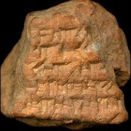 | 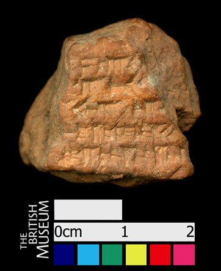 |

**Original text (transliteration):**
> - zu - uz - [unused1] mu e - eh - r š - ša - tum la a - li - at ši₂ - t

**Cuneiform (Unicode signs, whole document, not position-aligned to the text above):**
> 𒍪 𒊻 x 𒈬 𒂊 𒄴 š 𒊭 𒌈 𒆷 𒀀 𒇷 𒀜

**Masked input (4 positions):**
> - zu - uz - [unused1] mu e - [MASK]h - [MASK] š - ša - tum la a [MASK] li - at ši₂ [MASK] t

### Restoration (masked-token predictions)

| # | true token | text-only top-1 | text-only top-3 | vision top-1 | vision top-3 | text-only correct | vision correct |
|---|---|---|---|---|---|---|---|
| 1 | `e` | `e` | `e`, `ta`, `mu` | `e` | `e`, `ta`, `mu` | ✅ | ✅ |
| 2 | `r` | `ri` | `ri`, `ti`, `hi` | `ri` | `ri`, `ti`, `hi` | ❌ | ❌ |
| 3 | `-` | `-` | `-`, `##₂`, `a` | `-` | `-`, `##₂`, `a` | ✅ | ✅ |
| 4 | `-` | `-` | `-`, `\`, `la` | `-` | `-`, `\`, `@` | ✅ | ✅ |

Top-1 accuracy on this example: text-only 3/4 (75%), vision 3/4 (75%)

### Metadata predictions

| head | ground truth | text-only prediction | vision prediction |
|---|---|---|---|
| period | Neo-Assyrian | Neo-Assyrian (0.56) | Old Babylonian (0.33) **<- differs** |
| genre | (no label) | Letters (0.59) | Letters (0.41) |
| language | Akkadian | Akkadian (0.97) | Akkadian (0.96) |
| provenience | Nineveh | Nineveh (0.73) | Nineveh (0.83) |

---

## Example 7 — `P402685` (has photo: True)

| Model input (224x224 crop) | Full photo (all faces, reference only) |
|---|---|
| 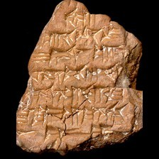 | 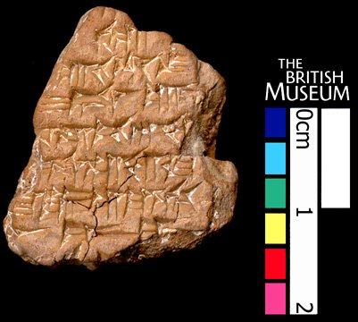 |

**Original text (transliteration):**
> qa₂ - ti - šu i - du - u₂ i - ib - bi DIŠK i - na uru IM ki i - in si - ma - tim - u₄ - gal - gal

**Cuneiform (Unicode signs, whole document, not position-aligned to the text above):**
> 𒋾 𒋗 𒄿 𒁺 𒌑 𒄿 𒅁 𒁉 𒄿 𒈾 𒌷 𒅎 𒆠 𒄿 𒅔 𒋛 𒈠 𒁴 𒌓 𒃲 𒃲

**Masked input (6 positions):**
> qa₂ [MASK] ti - [MASK] i [MASK] du - u₂ i - ib - bi DIŠK i - na ur [MASK] IM ki i - [MASK] si - ma - [MASK] - u₄ - gal - gal

### Restoration (masked-token predictions)

| # | true token | text-only top-1 | text-only top-3 | vision top-1 | vision top-3 | text-only correct | vision correct |
|---|---|---|---|---|---|---|---|
| 1 | `-` | `-` | `-`, `a`, `:` | `-` | `-`, `a`, `/` | ✅ | ✅ |
| 2 | `šu` | `šu` | `šu`, `ma`, `im` | `šu` | `šu`, `ia`, `ma` | ✅ | ✅ |
| 3 | `-` | `-` | `-`, `##₃`, `+` | `-` | `-`, `##₃`, `+` | ✅ | ✅ |
| 4 | `##u` | `-` | `-`, `##uda`, `##₂` | `##uda` | `##uda`, `-`, `##udu` | ❌ | ❌ |
| 5 | `in` | `na` | `na`, `di`, `-` | `na` | `na`, `di`, `ša` | ❌ | ❌ |
| 6 | `tim` | `an` | `an`, `nu`, `a` | `an` | `an`, `nu`, `at` | ❌ | ❌ |

Top-1 accuracy on this example: text-only 3/6 (50%), vision 3/6 (50%)

### Metadata predictions

| head | ground truth | text-only prediction | vision prediction |
|---|---|---|---|
| period | Neo-Assyrian | Third Millennium (0.41) | Neo-Babylonian (0.51) **<- differs** |
| genre | (no label) | Literary & Scholarly (0.46) | Literary & Scholarly (0.79) |
| language | Akkadian | Akkadian (0.52) | Akkadian (0.70) |
| provenience | Nineveh | Nippur (0.71) | Nippur (0.40) |

---

## Example 8 — `P387407` (has photo: True)

| Model input (224x224 crop) | Full photo (all faces, reference only) |
|---|---|
| 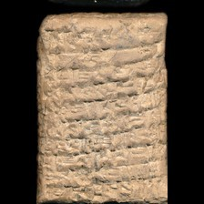 | 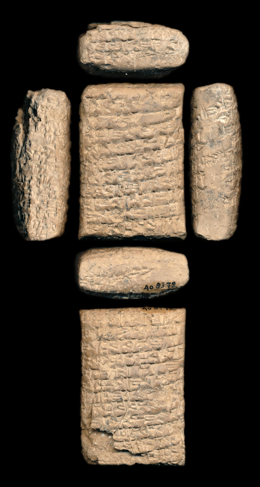 |

**Original text (transliteration):**
> um - ma i - din - Dsuen - ma Dutu Dmarduk u₃ Dnin - šubur tug₂ ṣu₂ - ba - a - at a - wi - le - e ša - at - tam a - na ša - at - tim i - da - am - mi - qu₂ at - ti tug₂ ṣu₂ - ba - a - ti tu - qa₂ - al - la - li i - na tug₂ ṣu₂ - ba - ti - ia qu₃ - ul - lu - lim u₃ ku - uz - zi ta - aš - ta - ri - i i - na siki hi - a i - na bi - ti - ni ki - ma a - ka - lim in - na - ka - la at - ti tug₂ ṣu₂ - ba - ti tu - qa₂ - al - li - li dumu diš Diškur - i - di₂ - nam ša a - bu - šu ṣu₂ - ha - ar a - bi - ia ši - na tug₂ ṣu₂ - ba - te - e eš - šu - tim - bi - iš at - a - na tug₂ ṣu₂ - ba - ti - ia - te - en ta - ta - na - ah - da - ri ki - ma at - ti ia - ti tu - ul - di - in - ni ša - a - ti um - ma - šu a - na le - qi₂ - tim u₃ ki - ma ša - a - ti um - ma - šu i - ra - a - mu - šu at - ti - a - ti u₂ - ul ta - ra - am - mi - in - ni

**Cuneiform (Unicode signs, whole document, not position-aligned to the text above):**
> 𒌝 𒈠 𒄿 𒁷 𒈠 𒅇 𒋚 𒌆 𒍪 𒁀 𒀀 𒀜 𒀀 𒉿 𒇷 𒂊 𒊭 𒀜 𒌓 𒀀 𒈾 𒊭 𒀜 𒁴 𒄿 𒁕 𒄠 𒈪 𒆪 𒀜 𒋾 𒌆 𒍪 𒁀 𒀀 𒋾 𒌅 𒂵 𒀠 𒆷 𒇷 𒄿 𒈾 𒌆 𒍪 𒁀 𒋾 𒅀 𒄖 𒌌 𒇻 𒅆 𒅇 𒆪 𒊻 𒍣 𒋫 𒀸 𒋫 𒊑 𒄿 𒄿 𒈾 𒋠 𒄭 𒀀 𒄿 𒈾 𒁉 𒋾 𒉌 𒆠 𒈠 𒀀 𒅗 𒅆 𒅔 𒈾 𒅗 𒆷 𒀜 𒋾 𒌆 𒍪 𒁀 𒋾 𒌅 𒂵 𒀠 𒇷 𒇷 𒌉 𒁹 𒄿 𒊹 𒉆 𒊭 𒀀 𒁍 𒋗 𒍪 𒄩 𒅈 𒀀 𒁉 𒅀 𒅆 𒈾 𒌆 𒍪 𒁀 𒋼 𒂊 𒌍 𒋗 𒁴 𒁉 𒅖 𒀜 𒀀 𒈾 𒌆 𒍪 𒁀 𒋾 𒅀 𒋼 𒂗 𒋫 𒋫 𒈾 𒄴 𒁕 𒊑 𒆠 𒈠 𒀜 𒋾 𒅀 𒋾 𒌅 𒌌 𒁲 𒅔 𒉌 𒊭 𒀀 𒋾 𒌝 𒈠 𒋗 𒀀 𒈾 𒇷 𒆠 𒁴 𒅇 𒆠 𒈠 𒊭 𒀀 𒋾 𒌝 𒈠 𒋗 𒄿 𒊏 𒀀 𒈬 𒋗 𒀜 𒋾 𒀀 𒋾 𒌑 𒌌 𒋫 𒊏 𒄠 𒈪 𒅔 𒉌

**English translation (CDLI):**
> To Zinu speak, thus Iddin-Sin: May Shamash, Marduk, and Ninshubur for my sake forever sustain you! The garments of others year for year are improving, but as for you, my garments year for year you reduce! In my garments reducing and ...-ing, you have become rich! With respect to the wool in our estate, which like bread is being consumed, my garments you reduce! The son of Adad-iddinam, whose father is an underling of my father, two new garments, wears, but as for you, about my single garment you keep obsessing! Although you to me gave birth, and as to him, his mother in adoption adopted him, yet although as to him, his mother loves him, you, you do not really love me.

**Masked input (52 positions):**
> um - ma i - din - Dsuen - ma Dutu Dmar [MASK] u₃ Dnin - šu [MASK] tug₂ ṣu [MASK] - ba - a [MASK] at [MASK] [MASK] wi - le [MASK] e ša - at - tam a - na ša [MASK] at - tim i - da - am - mi - qu₂ at - ti tug₂ ṣu₂ - ba - a - ti tu - qa₂ [MASK] al - la [MASK] li i - na tug₂ ṣu₂ - [MASK] - ti - ia qu₃ - ul [MASK] [MASK] - lim [MASK]₃ ku - [MASK] [MASK] zi [MASK] - aš - ta - [MASK] - i i - na siki hi - a [MASK] [MASK] [MASK] bi - ti [MASK] ni ki - ma a [MASK] ka [MASK] lim in - na - ka - la at [MASK] ti tug₂ ṣ [MASK]₂ - ba - ti tu - qa₂ - al - li - [MASK] dumu diš Di [MASK] [MASK] - i [MASK] di₂ - nam [MASK] a - bu - šu ṣu [MASK] - ha [MASK] ar a - bi - ia ši - na tug₂ ṣu₂ - ba - te - e eš - šu - tim - [MASK] - [MASK] at [MASK] a - na tug₂ ṣu₂ - ba - ti - ia - te - en [MASK] - ta - na - ah - da - ri ki - ma at - ti ia [MASK] ti tu - ul - di - in [MASK] ni ša [MASK] a - ti um [MASK] ma - šu a [MASK] na le - qi₂ - tim u₃ ki - ma ša - a [MASK] ti um - ma [MASK] šu i - ra [MASK] a - mu [MASK] šu [MASK] - [MASK] - [MASK] - ti u [MASK] - ul [MASK] - ra - am [MASK] mi - in - ni

### Restoration (masked-token predictions)

| # | true token | text-only top-1 | text-only top-3 | vision top-1 | vision top-3 | text-only correct | vision correct |
|---|---|---|---|---|---|---|---|
| 1 | `##duk` | `##duk` | `##duk`, `-`, `tu` | `##duk` | `##duk`, `-`, `##du` | ✅ | ✅ |
| 2 | `##bur` | `##bur` | `##bur`, `##b`, `##bar` | `##bur` | `##bur`, `##bar`, `-` | ✅ | ✅ |
| 3 | `##₂` | `##₂` | `##₂`, `##₃`, `##₄` | `##₂` | `##₂`, `##₃`, `##₄` | ✅ | ✅ |
| 4 | `-` | `-` | `-`, `.`, `:` | `-` | `-`, `.`, `:` | ✅ | ✅ |
| 5 | `a` | `a` | `a`, `na`, `i` | `a` | `a`, `i`, `li` | ✅ | ✅ |
| 6 | `-` | `-` | `-`, `##₃`, `ma` | `-` | `-`, `##₃`, `ma` | ✅ | ✅ |
| 7 | `-` | `-` | `-`, `##₂`, `##₃` | `-` | `-`, `##₂`, `.` | ✅ | ✅ |
| 8 | `-` | `-` | `-`, `##₂`, `.` | `-` | `-`, `.`, `##₂` | ✅ | ✅ |
| 9 | `-` | `-` | `-`, `/`, `.` | `-` | `-`, `.`, `/` | ✅ | ✅ |
| 10 | `-` | `-` | `-`, `##₂`, `##m` | `-` | `-`, `##₂`, `##m` | ✅ | ✅ |
| 11 | `ba` | `ba` | `ba`, `bu`, `a` | `ba` | `ba`, `bu`, `a` | ✅ | ✅ |
| 12 | `-` | `-` | `-`, `ša`, `u` | `-` | `-`, `u`, `ša` | ✅ | ✅ |
| 13 | `lu` | `li` | `li`, `ša`, `be` | `ša` | `ša`, `be`, `li` | ❌ | ❌ |
| 14 | `u` | `u` | `u`, `ša`, `giri` | `u` | `u`, `ša`, `giri` | ✅ | ✅ |
| 15 | `uz` | `ul` | `ul`, `nu`, `ta` | `nu` | `nu`, `ta`, `un` | ❌ | ❌ |
| 16 | `-` | `-` | `-`, `##₂`, `##₃` | `-` | `-`, `##₂`, `##₃` | ✅ | ✅ |
| 17 | `ta` | `ta` | `ta`, `na`, `wa` | `ta` | `ta`, `wa`, `na` | ✅ | ✅ |
| 18 | `ri` | `ki` | `ki`, `ni`, `li` | `ki` | `ki`, `ni`, `ri` | ❌ | ❌ |
| 19 | `i` | `ša` | `ša`, `dumu`, `la` | `ša` | `ša`, `u`, `i` | ❌ | ❌ |
| 20 | `-` | `a` | `a`, `##₂`, `##₃` | `a` | `a`, `##₂`, `##₃` | ❌ | ❌ |
| 21 | `na` | `-` | `-`, `na`, `ma` | `-` | `-`, `na`, `a` | ❌ | ❌ |
| 22 | `-` | `-` | `-`, `.`, `/` | `-` | `-`, `.`, `/` | ✅ | ✅ |
| 23 | `-` | `-` | `-`, `##₂`, `.` | `-` | `-`, `.`, `##₂` | ✅ | ✅ |
| 24 | `-` | `-` | `-`, `##l`, `##₃` | `-` | `-`, `##l`, `##₃` | ✅ | ✅ |
| 25 | `-` | `-` | `-`, `.`, `a` | `-` | `-`, `.`, `:` | ✅ | ✅ |
| 26 | `##u` | `##u` | `##u`, `##e`, `##a` | `##u` | `##u`, `##e`, `##a` | ✅ | ✅ |
| 27 | `li` | `li` | `li`, `lu`, `i` | `li` | `li`, `i`, `lu` | ✅ | ✅ |
| 28 | `##šku` | `##šku` | `##šku`, `-`, `##Š` | `##šku` | `##šku`, `-`, `##ška` | ✅ | ✅ |
| 29 | `##r` | `##r` | `##r`, `##ru`, `##bur` | `##r` | `##r`, `##bur`, `##ar` | ✅ | ✅ |
| 30 | `-` | `-` | `-`, `##₇`, `##₃` | `-` | `-`, `##₃`, `##₇` | ✅ | ✅ |
| 31 | `ša` | `dumu` | `dumu`, `-`, `diš` | `-` | `-`, `ša`, `dumu` | ❌ | ❌ |
| 32 | `##₂` | `##₂` | `##₂`, `##₃`, `##₄` | `##₂` | `##₂`, `##₃`, `##₄` | ✅ | ✅ |
| 33 | `-` | `-` | `-`, `/`, `.` | `-` | `-`, `.`, `/` | ✅ | ✅ |
| 34 | `bi` | `šu` | `šu`, `ma`, `ki` | `ma` | `ma`, `šu`, `a` | ❌ | ❌ |
| 35 | `iš` | `ma` | `ma`, `na`, `ni` | `ma` | `ma`, `na`, `ni` | ❌ | ❌ |
| 36 | `-` | `-` | `-`, `ša`, `##₃` | `-` | `-`, `ša`, `ki` | ✅ | ✅ |
| 37 | `ta` | `i` | `i`, `it`, `iš` | `i` | `i`, `it`, `a` | ❌ | ❌ |
| 38 | `-` | `-` | `-`, `a`, `.` | `-` | `-`, `.`, `/` | ✅ | ✅ |
| 39 | `-` | `-` | `-`, `.`, `/` | `-` | `-`, `.`, `/` | ✅ | ✅ |
| 40 | `-` | `-` | `-`, `##₂`, `.` | `-` | `-`, `.`, `##₂` | ✅ | ✅ |
| 41 | `-` | `-` | `-`, `.`, `/` | `-` | `-`, `.`, `/` | ✅ | ✅ |
| 42 | `-` | `-` | `-`, `##₂`, `.` | `-` | `-`, `##₂`, `+` | ✅ | ✅ |
| 43 | `-` | `-` | `-`, `.`, `/` | `-` | `-`, `.`, `/` | ✅ | ✅ |
| 44 | `-` | `-` | `-`, `.`, `:` | `-` | `-`, `.`, `:` | ✅ | ✅ |
| 45 | `-` | `-` | `-`, `##₂`, `/` | `-` | `-`, `##₂`, `.` | ✅ | ✅ |
| 46 | `-` | `-` | `-`, `/`, `##₂` | `-` | `-`, `/`, `##₂` | ✅ | ✅ |
| 47 | `at` | `i` | `i`, `tu`, `ša` | `i` | `i`, `ša`, `a` | ❌ | ❌ |
| 48 | `ti` | `na` | `na`, `ta`, `ba` | `ša` | `ša`, `na`, `ba` | ❌ | ❌ |
| 49 | `a` | `a` | `a`, `at`, `nu` | `a` | `a`, `at`, `nu` | ✅ | ✅ |
| 50 | `##₂` | `##₂` | `##₂`, `##₃`, `##₄` | `##₂` | `##₂`, `##₃`, `##₄` | ✅ | ✅ |
| 51 | `ta` | `i` | `i`, `ta`, `tu` | `i` | `i`, `tu`, `ta` | ❌ | ❌ |
| 52 | `-` | `-` | `-`, `.`, `/` | `-` | `-`, `.`, `/` | ✅ | ✅ |

Top-1 accuracy on this example: text-only 39/52 (75%), vision 39/52 (75%)

### Metadata predictions

| head | ground truth | text-only prediction | vision prediction |
|---|---|---|---|
| period | Old Babylonian | Old Babylonian (0.95) | Old Babylonian (0.94) |
| genre | Letters | Letters (0.97) | Letters (0.96) |
| language | Akkadian | Akkadian (0.96) | Akkadian (0.94) |
| provenience | (no label) | Sippar (0.76) | Sippar (0.82) |

---
